# Projects and dependencies analysis

This document provides a comprehensive overview of the projects and their dependencies in the context of upgrading to .NETCoreApp,Version=v10.0.

## Table of Contents

- [Executive Summary](#executive-Summary)
  - [Highlevel Metrics](#highlevel-metrics)
  - [Projects Compatibility](#projects-compatibility)
  - [Package Compatibility](#package-compatibility)
  - [API Compatibility](#api-compatibility)
- [Aggregate NuGet packages details](#aggregate-nuget-packages-details)
- [Top API Migration Challenges](#top-api-migration-challenges)
  - [Technologies and Features](#technologies-and-features)
  - [Most Frequent API Issues](#most-frequent-api-issues)
- [Projects Relationship Graph](#projects-relationship-graph)
- [Project Details](#project-details)

  - [modules\Nblity.Abp.Account\src\Nblity.Abp.Account.Application.Contracts\Nblity.Abp.Account.Application.Contracts.csproj](#modulesvoloabpaccountsrcvoloabpaccountapplicationcontractsvoloabpaccountapplicationcontractscsproj)
  - [modules\Nblity.Abp.Account\src\Nblity.Abp.Account.Application\Nblity.Abp.Account.Application.csproj](#modulesvoloabpaccountsrcvoloabpaccountapplicationvoloabpaccountapplicationcsproj)
  - [modules\Nblity.Abp.Account\src\Nblity.Abp.Account.Blazor\Nblity.Abp.Account.Blazor.csproj](#modulesvoloabpaccountsrcvoloabpaccountblazorvoloabpaccountblazorcsproj)
  - [modules\Nblity.Abp.Account\src\Nblity.Abp.Account.HttpApi.Client\Nblity.Abp.Account.HttpApi.Client.csproj](#modulesvoloabpaccountsrcvoloabpaccounthttpapiclientvoloabpaccounthttpapiclientcsproj)
  - [modules\Nblity.Abp.Account\src\Nblity.Abp.Account.HttpApi\Nblity.Abp.Account.HttpApi.csproj](#modulesvoloabpaccountsrcvoloabpaccounthttpapivoloabpaccounthttpapicsproj)
  - [modules\Nblity.Abp.Account\src\Nblity.Abp.Account.Installer\Nblity.Abp.Account.Installer.csproj](#modulesvoloabpaccountsrcvoloabpaccountinstallervoloabpaccountinstallercsproj)
  - [modules\Nblity.Abp.Account\src\Nblity.Abp.Account.Web.IdentityServer\Nblity.Abp.Account.Web.IdentityServer.csproj](#modulesvoloabpaccountsrcvoloabpaccountwebidentityservervoloabpaccountwebidentityservercsproj)
  - [modules\Nblity.Abp.Account\src\Nblity.Abp.Account.Web.OpenIddict\Nblity.Abp.Account.Web.OpenIddict.csproj](#modulesvoloabpaccountsrcvoloabpaccountwebopeniddictvoloabpaccountwebopeniddictcsproj)
  - [modules\Nblity.Abp.Account\src\Nblity.Abp.Account.Web\Nblity.Abp.Account.Web.csproj](#modulesvoloabpaccountsrcvoloabpaccountwebvoloabpaccountwebcsproj)
  - [modules\Nblity.Abp.FeatureManagement\src\Nblity.Abp.FeatureManagement.Application.Contracts\Nblity.Abp.FeatureManagement.Application.Contracts.csproj](#modulesvoloabpfeaturemanagementsrcvoloabpfeaturemanagementapplicationcontractsvoloabpfeaturemanagementapplicationcontractscsproj)
  - [modules\Nblity.Abp.FeatureManagement\src\Nblity.Abp.FeatureManagement.Application\Nblity.Abp.FeatureManagement.Application.csproj](#modulesvoloabpfeaturemanagementsrcvoloabpfeaturemanagementapplicationvoloabpfeaturemanagementapplicationcsproj)
  - [modules\Nblity.Abp.FeatureManagement\src\Nblity.Abp.FeatureManagement.Blazor.Server\Nblity.Abp.FeatureManagement.Blazor.Server.csproj](#modulesvoloabpfeaturemanagementsrcvoloabpfeaturemanagementblazorservervoloabpfeaturemanagementblazorservercsproj)
  - [modules\Nblity.Abp.FeatureManagement\src\Nblity.Abp.FeatureManagement.Blazor.WebAssembly\Nblity.Abp.FeatureManagement.Blazor.WebAssembly.csproj](#modulesvoloabpfeaturemanagementsrcvoloabpfeaturemanagementblazorwebassemblyvoloabpfeaturemanagementblazorwebassemblycsproj)
  - [modules\Nblity.Abp.FeatureManagement\src\Nblity.Abp.FeatureManagement.Blazor\Nblity.Abp.FeatureManagement.Blazor.csproj](#modulesvoloabpfeaturemanagementsrcvoloabpfeaturemanagementblazorvoloabpfeaturemanagementblazorcsproj)
  - [modules\Nblity.Abp.FeatureManagement\src\Nblity.Abp.FeatureManagement.Domain.Shared\Nblity.Abp.FeatureManagement.Domain.Shared.csproj](#modulesvoloabpfeaturemanagementsrcvoloabpfeaturemanagementdomainsharedvoloabpfeaturemanagementdomainsharedcsproj)
  - [modules\Nblity.Abp.FeatureManagement\src\Nblity.Abp.FeatureManagement.Domain\Nblity.Abp.FeatureManagement.Domain.csproj](#modulesvoloabpfeaturemanagementsrcvoloabpfeaturemanagementdomainvoloabpfeaturemanagementdomaincsproj)
  - [modules\Nblity.Abp.FeatureManagement\src\Nblity.Abp.FeatureManagement.EntityFrameworkCore\Nblity.Abp.FeatureManagement.EntityFrameworkCore.csproj](#modulesvoloabpfeaturemanagementsrcvoloabpfeaturemanagemententityframeworkcorevoloabpfeaturemanagemententityframeworkcorecsproj)
  - [modules\Nblity.Abp.FeatureManagement\src\Nblity.Abp.FeatureManagement.HttpApi.Client\Nblity.Abp.FeatureManagement.HttpApi.Client.csproj](#modulesvoloabpfeaturemanagementsrcvoloabpfeaturemanagementhttpapiclientvoloabpfeaturemanagementhttpapiclientcsproj)
  - [modules\Nblity.Abp.FeatureManagement\src\Nblity.Abp.FeatureManagement.HttpApi\Nblity.Abp.FeatureManagement.HttpApi.csproj](#modulesvoloabpfeaturemanagementsrcvoloabpfeaturemanagementhttpapivoloabpfeaturemanagementhttpapicsproj)
  - [modules\Nblity.Abp.FeatureManagement\src\Nblity.Abp.FeatureManagement.Installer\Nblity.Abp.FeatureManagement.Installer.csproj](#modulesvoloabpfeaturemanagementsrcvoloabpfeaturemanagementinstallervoloabpfeaturemanagementinstallercsproj)
  - [modules\Nblity.Abp.FeatureManagement\src\Nblity.Abp.FeatureManagement.MongoDB\Nblity.Abp.FeatureManagement.MongoDB.csproj](#modulesvoloabpfeaturemanagementsrcvoloabpfeaturemanagementmongodbvoloabpfeaturemanagementmongodbcsproj)
  - [modules\Nblity.Abp.FeatureManagement\src\Nblity.Abp.FeatureManagement.Web\Nblity.Abp.FeatureManagement.Web.csproj](#modulesvoloabpfeaturemanagementsrcvoloabpfeaturemanagementwebvoloabpfeaturemanagementwebcsproj)
  - [modules\Nblity.Abp.Identity\src\Nblity.Abp.Identity.Application.Contracts\Nblity.Abp.Identity.Application.Contracts.csproj](#modulesvoloabpidentitysrcvoloabpidentityapplicationcontractsvoloabpidentityapplicationcontractscsproj)
  - [modules\Nblity.Abp.Identity\src\Nblity.Abp.Identity.Application\Nblity.Abp.Identity.Application.csproj](#modulesvoloabpidentitysrcvoloabpidentityapplicationvoloabpidentityapplicationcsproj)
  - [modules\Nblity.Abp.Identity\src\Nblity.Abp.Identity.AspNetCore\Nblity.Abp.Identity.AspNetCore.csproj](#modulesvoloabpidentitysrcvoloabpidentityaspnetcorevoloabpidentityaspnetcorecsproj)
  - [modules\Nblity.Abp.Identity\src\Nblity.Abp.Identity.Blazor.Server\Nblity.Abp.Identity.Blazor.Server.csproj](#modulesvoloabpidentitysrcvoloabpidentityblazorservervoloabpidentityblazorservercsproj)
  - [modules\Nblity.Abp.Identity\src\Nblity.Abp.Identity.Blazor.WebAssembly\Nblity.Abp.Identity.Blazor.WebAssembly.csproj](#modulesvoloabpidentitysrcvoloabpidentityblazorwebassemblyvoloabpidentityblazorwebassemblycsproj)
  - [modules\Nblity.Abp.Identity\src\Nblity.Abp.Identity.Blazor\Nblity.Abp.Identity.Blazor.csproj](#modulesvoloabpidentitysrcvoloabpidentityblazorvoloabpidentityblazorcsproj)
  - [modules\Nblity.Abp.Identity\src\Nblity.Abp.Identity.Domain.Shared\Nblity.Abp.Identity.Domain.Shared.csproj](#modulesvoloabpidentitysrcvoloabpidentitydomainsharedvoloabpidentitydomainsharedcsproj)
  - [modules\Nblity.Abp.Identity\src\Nblity.Abp.Identity.Domain\Nblity.Abp.Identity.Domain.csproj](#modulesvoloabpidentitysrcvoloabpidentitydomainvoloabpidentitydomaincsproj)
  - [modules\Nblity.Abp.Identity\src\Nblity.Abp.Identity.EntityFrameworkCore\Nblity.Abp.Identity.EntityFrameworkCore.csproj](#modulesvoloabpidentitysrcvoloabpidentityentityframeworkcorevoloabpidentityentityframeworkcorecsproj)
  - [modules\Nblity.Abp.Identity\src\Nblity.Abp.Identity.HttpApi.Client\Nblity.Abp.Identity.HttpApi.Client.csproj](#modulesvoloabpidentitysrcvoloabpidentityhttpapiclientvoloabpidentityhttpapiclientcsproj)
  - [modules\Nblity.Abp.Identity\src\Nblity.Abp.Identity.HttpApi\Nblity.Abp.Identity.HttpApi.csproj](#modulesvoloabpidentitysrcvoloabpidentityhttpapivoloabpidentityhttpapicsproj)
  - [modules\Nblity.Abp.Identity\src\Nblity.Abp.Identity.Installer\Nblity.Abp.Identity.Installer.csproj](#modulesvoloabpidentitysrcvoloabpidentityinstallervoloabpidentityinstallercsproj)
  - [modules\Nblity.Abp.Identity\src\Nblity.Abp.Identity.MongoDB\Nblity.Abp.Identity.MongoDB.csproj](#modulesvoloabpidentitysrcvoloabpidentitymongodbvoloabpidentitymongodbcsproj)
  - [modules\Nblity.Abp.Identity\src\Nblity.Abp.Identity.Web\Nblity.Abp.Identity.Web.csproj](#modulesvoloabpidentitysrcvoloabpidentitywebvoloabpidentitywebcsproj)
  - [modules\Nblity.Abp.Identity\src\Nblity.Abp.PermissionManagement.Domain.Identity\Nblity.Abp.PermissionManagement.Domain.Identity.csproj](#modulesvoloabpidentitysrcvoloabppermissionmanagementdomainidentityvoloabppermissionmanagementdomainidentitycsproj)
  - [modules\Nblity.Abp.MudblazorTheme\src\Nblity.Abp.AspNetCore.Components.Server.MudblazorTheme\Nblity.Abp.AspNetCore.Components.Server.MudblazorTheme.csproj](#modulesvoloabpleptonxlitethemesrcvoloabpaspnetcorecomponentsserverleptonxlitethemevoloabpaspnetcorecomponentsserverleptonxlitethemecsproj)
  - [modules\Nblity.Abp.MudblazorTheme\src\Nblity.Abp.AspNetCore.Components.Web.MudblazorTheme\Nblity.Abp.AspNetCore.Components.Web.MudblazorTheme.csproj](#modulesvoloabpleptonxlitethemesrcvoloabpaspnetcorecomponentswebleptonxlitethemevoloabpaspnetcorecomponentswebleptonxlitethemecsproj)
  - [modules\Nblity.Abp.MudblazorTheme\src\Nblity.Abp.AspNetCore.Components.WebAssembly.MudblazorTheme.Bundling\Nblity.Abp.AspNetCore.Components.WebAssembly.MudblazorTheme.Bundling.csproj](#modulesvoloabpleptonxlitethemesrcvoloabpaspnetcorecomponentswebassemblyleptonxlitethemebundlingvoloabpaspnetcorecomponentswebassemblyleptonxlitethemebundlingcsproj)
  - [modules\Nblity.Abp.MudblazorTheme\src\Nblity.Abp.AspNetCore.Components.WebAssembly.MudblazorTheme\Nblity.Abp.AspNetCore.Components.WebAssembly.MudblazorTheme.csproj](#modulesvoloabpleptonxlitethemesrcvoloabpaspnetcorecomponentswebassemblyleptonxlitethemevoloabpaspnetcorecomponentswebassemblyleptonxlitethemecsproj)
  - [modules\Nblity.Abp.MudblazorTheme\src\Nblity.Abp.AspNetCore.Mvc.UI.Theme.Mudblazor\Nblity.Abp.AspNetCore.Mvc.UI.Theme.Mudblazor.csproj](#modulesvoloabpleptonxlitethemesrcvoloabpaspnetcoremvcuithemeleptonxlitevoloabpaspnetcoremvcuithemeleptonxlitecsproj)
  - [modules\Nblity.Abp.MudblazorTheme\src\Nblity.Abp.MudblazorTheme.Installer\Nblity.Abp.MudblazorTheme.Installer.csproj](#modulesvoloabpleptonxlitethemesrcvoloabpleptonxlitethemeinstallervoloabpleptonxlitethemeinstallercsproj)
  - [modules\Nblity.Abp.PermissionManagement\src\Nblity.Abp.PermissionManagement.Application.Contracts\Nblity.Abp.PermissionManagement.Application.Contracts.csproj](#modulesvoloabppermissionmanagementsrcvoloabppermissionmanagementapplicationcontractsvoloabppermissionmanagementapplicationcontractscsproj)
  - [modules\Nblity.Abp.PermissionManagement\src\Nblity.Abp.PermissionManagement.Application\Nblity.Abp.PermissionManagement.Application.csproj](#modulesvoloabppermissionmanagementsrcvoloabppermissionmanagementapplicationvoloabppermissionmanagementapplicationcsproj)
  - [modules\Nblity.Abp.PermissionManagement\src\Nblity.Abp.PermissionManagement.Blazor.Server\Nblity.Abp.PermissionManagement.Blazor.Server.csproj](#modulesvoloabppermissionmanagementsrcvoloabppermissionmanagementblazorservervoloabppermissionmanagementblazorservercsproj)
  - [modules\Nblity.Abp.PermissionManagement\src\Nblity.Abp.PermissionManagement.Blazor.WebAssembly\Nblity.Abp.PermissionManagement.Blazor.WebAssembly.csproj](#modulesvoloabppermissionmanagementsrcvoloabppermissionmanagementblazorwebassemblyvoloabppermissionmanagementblazorwebassemblycsproj)
  - [modules\Nblity.Abp.PermissionManagement\src\Nblity.Abp.PermissionManagement.Blazor\Nblity.Abp.PermissionManagement.Blazor.csproj](#modulesvoloabppermissionmanagementsrcvoloabppermissionmanagementblazorvoloabppermissionmanagementblazorcsproj)
  - [modules\Nblity.Abp.PermissionManagement\src\Nblity.Abp.PermissionManagement.Domain.Shared\Nblity.Abp.PermissionManagement.Domain.Shared.csproj](#modulesvoloabppermissionmanagementsrcvoloabppermissionmanagementdomainsharedvoloabppermissionmanagementdomainsharedcsproj)
  - [modules\Nblity.Abp.PermissionManagement\src\Nblity.Abp.PermissionManagement.Domain\Nblity.Abp.PermissionManagement.Domain.csproj](#modulesvoloabppermissionmanagementsrcvoloabppermissionmanagementdomainvoloabppermissionmanagementdomaincsproj)
  - [modules\Nblity.Abp.PermissionManagement\src\Nblity.Abp.PermissionManagement.EntityFrameworkCore\Nblity.Abp.PermissionManagement.EntityFrameworkCore.csproj](#modulesvoloabppermissionmanagementsrcvoloabppermissionmanagemententityframeworkcorevoloabppermissionmanagemententityframeworkcorecsproj)
  - [modules\Nblity.Abp.PermissionManagement\src\Nblity.Abp.PermissionManagement.HttpApi.Client\Nblity.Abp.PermissionManagement.HttpApi.Client.csproj](#modulesvoloabppermissionmanagementsrcvoloabppermissionmanagementhttpapiclientvoloabppermissionmanagementhttpapiclientcsproj)
  - [modules\Nblity.Abp.PermissionManagement\src\Nblity.Abp.PermissionManagement.HttpApi\Nblity.Abp.PermissionManagement.HttpApi.csproj](#modulesvoloabppermissionmanagementsrcvoloabppermissionmanagementhttpapivoloabppermissionmanagementhttpapicsproj)
  - [modules\Nblity.Abp.PermissionManagement\src\Nblity.Abp.PermissionManagement.Installer\Nblity.Abp.PermissionManagement.Installer.csproj](#modulesvoloabppermissionmanagementsrcvoloabppermissionmanagementinstallervoloabppermissionmanagementinstallercsproj)
  - [modules\Nblity.Abp.PermissionManagement\src\Nblity.Abp.PermissionManagement.MongoDB\Nblity.Abp.PermissionManagement.MongoDB.csproj](#modulesvoloabppermissionmanagementsrcvoloabppermissionmanagementmongodbvoloabppermissionmanagementmongodbcsproj)
  - [modules\Nblity.Abp.PermissionManagement\src\Nblity.Abp.PermissionManagement.Web\Nblity.Abp.PermissionManagement.Web.csproj](#modulesvoloabppermissionmanagementsrcvoloabppermissionmanagementwebvoloabppermissionmanagementwebcsproj)
  - [modules\Nblity.Abp.SettingManagement\src\Nblity.Abp.SettingManagement.Application.Contracts\Nblity.Abp.SettingManagement.Application.Contracts.csproj](#modulesvoloabpsettingmanagementsrcvoloabpsettingmanagementapplicationcontractsvoloabpsettingmanagementapplicationcontractscsproj)
  - [modules\Nblity.Abp.SettingManagement\src\Nblity.Abp.SettingManagement.Application\Nblity.Abp.SettingManagement.Application.csproj](#modulesvoloabpsettingmanagementsrcvoloabpsettingmanagementapplicationvoloabpsettingmanagementapplicationcsproj)
  - [modules\Nblity.Abp.SettingManagement\src\Nblity.Abp.SettingManagement.Blazor.Server\Nblity.Abp.SettingManagement.Blazor.Server.csproj](#modulesvoloabpsettingmanagementsrcvoloabpsettingmanagementblazorservervoloabpsettingmanagementblazorservercsproj)
  - [modules\Nblity.Abp.SettingManagement\src\Nblity.Abp.SettingManagement.Blazor.WebAssembly\Nblity.Abp.SettingManagement.Blazor.WebAssembly.csproj](#modulesvoloabpsettingmanagementsrcvoloabpsettingmanagementblazorwebassemblyvoloabpsettingmanagementblazorwebassemblycsproj)
  - [modules\Nblity.Abp.SettingManagement\src\Nblity.Abp.SettingManagement.Blazor\Nblity.Abp.SettingManagement.Blazor.csproj](#modulesvoloabpsettingmanagementsrcvoloabpsettingmanagementblazorvoloabpsettingmanagementblazorcsproj)
  - [modules\Nblity.Abp.SettingManagement\src\Nblity.Abp.SettingManagement.Domain.Shared\Nblity.Abp.SettingManagement.Domain.Shared.csproj](#modulesvoloabpsettingmanagementsrcvoloabpsettingmanagementdomainsharedvoloabpsettingmanagementdomainsharedcsproj)
  - [modules\Nblity.Abp.SettingManagement\src\Nblity.Abp.SettingManagement.Domain\Nblity.Abp.SettingManagement.Domain.csproj](#modulesvoloabpsettingmanagementsrcvoloabpsettingmanagementdomainvoloabpsettingmanagementdomaincsproj)
  - [modules\Nblity.Abp.SettingManagement\src\Nblity.Abp.SettingManagement.EntityFrameworkCore\Nblity.Abp.SettingManagement.EntityFrameworkCore.csproj](#modulesvoloabpsettingmanagementsrcvoloabpsettingmanagemententityframeworkcorevoloabpsettingmanagemententityframeworkcorecsproj)
  - [modules\Nblity.Abp.SettingManagement\src\Nblity.Abp.SettingManagement.HttpApi.Client\Nblity.Abp.SettingManagement.HttpApi.Client.csproj](#modulesvoloabpsettingmanagementsrcvoloabpsettingmanagementhttpapiclientvoloabpsettingmanagementhttpapiclientcsproj)
  - [modules\Nblity.Abp.SettingManagement\src\Nblity.Abp.SettingManagement.HttpApi\Nblity.Abp.SettingManagement.HttpApi.csproj](#modulesvoloabpsettingmanagementsrcvoloabpsettingmanagementhttpapivoloabpsettingmanagementhttpapicsproj)
  - [modules\Nblity.Abp.SettingManagement\src\Nblity.Abp.SettingManagement.Installer\Nblity.Abp.SettingManagement.Installer.csproj](#modulesvoloabpsettingmanagementsrcvoloabpsettingmanagementinstallervoloabpsettingmanagementinstallercsproj)
  - [modules\Nblity.Abp.SettingManagement\src\Nblity.Abp.SettingManagement.MongoDB\Nblity.Abp.SettingManagement.MongoDB.csproj](#modulesvoloabpsettingmanagementsrcvoloabpsettingmanagementmongodbvoloabpsettingmanagementmongodbcsproj)
  - [modules\Nblity.Abp.SettingManagement\src\Nblity.Abp.SettingManagement.Web\Nblity.Abp.SettingManagement.Web.csproj](#modulesvoloabpsettingmanagementsrcvoloabpsettingmanagementwebvoloabpsettingmanagementwebcsproj)
  - [modules\Nblity.Abp.TenantManagement\src\Nblity.Abp.TenantManagement.Application.Contracts\Nblity.Abp.TenantManagement.Application.Contracts.csproj](#modulesvoloabptenantmanagementsrcvoloabptenantmanagementapplicationcontractsvoloabptenantmanagementapplicationcontractscsproj)
  - [modules\Nblity.Abp.TenantManagement\src\Nblity.Abp.TenantManagement.Application\Nblity.Abp.TenantManagement.Application.csproj](#modulesvoloabptenantmanagementsrcvoloabptenantmanagementapplicationvoloabptenantmanagementapplicationcsproj)
  - [modules\Nblity.Abp.TenantManagement\src\Nblity.Abp.TenantManagement.Blazor.Server\Nblity.Abp.TenantManagement.Blazor.Server.csproj](#modulesvoloabptenantmanagementsrcvoloabptenantmanagementblazorservervoloabptenantmanagementblazorservercsproj)
  - [modules\Nblity.Abp.TenantManagement\src\Nblity.Abp.TenantManagement.Blazor.WebAssembly\Nblity.Abp.TenantManagement.Blazor.WebAssembly.csproj](#modulesvoloabptenantmanagementsrcvoloabptenantmanagementblazorwebassemblyvoloabptenantmanagementblazorwebassemblycsproj)
  - [modules\Nblity.Abp.TenantManagement\src\Nblity.Abp.TenantManagement.Blazor\Nblity.Abp.TenantManagement.Blazor.csproj](#modulesvoloabptenantmanagementsrcvoloabptenantmanagementblazorvoloabptenantmanagementblazorcsproj)
  - [modules\Nblity.Abp.TenantManagement\src\Nblity.Abp.TenantManagement.Domain.Shared\Nblity.Abp.TenantManagement.Domain.Shared.csproj](#modulesvoloabptenantmanagementsrcvoloabptenantmanagementdomainsharedvoloabptenantmanagementdomainsharedcsproj)
  - [modules\Nblity.Abp.TenantManagement\src\Nblity.Abp.TenantManagement.Domain\Nblity.Abp.TenantManagement.Domain.csproj](#modulesvoloabptenantmanagementsrcvoloabptenantmanagementdomainvoloabptenantmanagementdomaincsproj)
  - [modules\Nblity.Abp.TenantManagement\src\Nblity.Abp.TenantManagement.EntityFrameworkCore\Nblity.Abp.TenantManagement.EntityFrameworkCore.csproj](#modulesvoloabptenantmanagementsrcvoloabptenantmanagemententityframeworkcorevoloabptenantmanagemententityframeworkcorecsproj)
  - [modules\Nblity.Abp.TenantManagement\src\Nblity.Abp.TenantManagement.HttpApi.Client\Nblity.Abp.TenantManagement.HttpApi.Client.csproj](#modulesvoloabptenantmanagementsrcvoloabptenantmanagementhttpapiclientvoloabptenantmanagementhttpapiclientcsproj)
  - [modules\Nblity.Abp.TenantManagement\src\Nblity.Abp.TenantManagement.HttpApi\Nblity.Abp.TenantManagement.HttpApi.csproj](#modulesvoloabptenantmanagementsrcvoloabptenantmanagementhttpapivoloabptenantmanagementhttpapicsproj)
  - [modules\Nblity.Abp.TenantManagement\src\Nblity.Abp.TenantManagement.Installer\Nblity.Abp.TenantManagement.Installer.csproj](#modulesvoloabptenantmanagementsrcvoloabptenantmanagementinstallervoloabptenantmanagementinstallercsproj)
  - [modules\Nblity.Abp.TenantManagement\src\Nblity.Abp.TenantManagement.MongoDB\Nblity.Abp.TenantManagement.MongoDB.csproj](#modulesvoloabptenantmanagementsrcvoloabptenantmanagementmongodbvoloabptenantmanagementmongodbcsproj)
  - [modules\Nblity.Abp.TenantManagement\src\Nblity.Abp.TenantManagement.Web\Nblity.Abp.TenantManagement.Web.csproj](#modulesvoloabptenantmanagementsrcvoloabptenantmanagementwebvoloabptenantmanagementwebcsproj)
  - [src\Nblity.Application.Contracts\Nblity.Application.Contracts.csproj](#srcnblityapplicationcontractsnblityapplicationcontractscsproj)
  - [src\Nblity.Application\Nblity.Application.csproj](#srcnblityapplicationnblityapplicationcsproj)
  - [src\Nblity.Blazor.Client\Nblity.Blazor.Client.csproj](#srcnblityblazorclientnblityblazorclientcsproj)
  - [src\Nblity.Blazor\Nblity.Blazor.csproj](#srcnblityblazornblityblazorcsproj)
  - [src\Nblity.DbMigrator\Nblity.DbMigrator.csproj](#srcnblitydbmigratornblitydbmigratorcsproj)
  - [src\Nblity.Domain.Shared\Nblity.Domain.Shared.csproj](#srcnblitydomainsharednblitydomainsharedcsproj)
  - [src\Nblity.Domain\Nblity.Domain.csproj](#srcnblitydomainnblitydomaincsproj)
  - [src\Nblity.EntityFrameworkCore\Nblity.EntityFrameworkCore.csproj](#srcnblityentityframeworkcorenblityentityframeworkcorecsproj)
  - [src\Nblity.HttpApi.Client\Nblity.HttpApi.Client.csproj](#srcnblityhttpapiclientnblityhttpapiclientcsproj)
  - [src\Nblity.HttpApi\Nblity.HttpApi.csproj](#srcnblityhttpapinblityhttpapicsproj)


## Executive Summary

### Highlevel Metrics

| Metric | Count | Status |
| :--- | :---: | :--- |
| Total Projects | 92 | 24 require upgrade |
| Total NuGet Packages | 83 | 1 need upgrade |
| Total Code Files | 875 |  |
| Total Code Files with Incidents | 36 |  |
| Total Lines of Code | 49594 |  |
| Total Number of Issues | 54 |  |
| Estimated LOC to modify | 24+ | at least 0.0% of codebase |

### Projects Compatibility

| Project | Target Framework | Difficulty | Package Issues | API Issues | Est. LOC Impact | Description |
| :--- | :---: | :---: | :---: | :---: | :---: | :--- |
| [modules\Nblity.Abp.Account\src\Nblity.Abp.Account.Application.Contracts\Nblity.Abp.Account.Application.Contracts.csproj](#modulesvoloabpaccountsrcvoloabpaccountapplicationcontractsvoloabpaccountapplicationcontractscsproj) | netstandard2.0;netstandard2.1;net8.0;net9.0;net10.0 | 🟢 Low | 1 | 0 |  | ClassLibrary, Sdk Style = True |
| [modules\Nblity.Abp.Account\src\Nblity.Abp.Account.Application\Nblity.Abp.Account.Application.csproj](#modulesvoloabpaccountsrcvoloabpaccountapplicationvoloabpaccountapplicationcsproj) | net10.0 | ✅ None | 0 | 0 |  | ClassLibrary, Sdk Style = True |
| [modules\Nblity.Abp.Account\src\Nblity.Abp.Account.Blazor\Nblity.Abp.Account.Blazor.csproj](#modulesvoloabpaccountsrcvoloabpaccountblazorvoloabpaccountblazorcsproj) | net10.0 | ✅ None | 0 | 0 |  | ClassLibrary, Sdk Style = True |
| [modules\Nblity.Abp.Account\src\Nblity.Abp.Account.HttpApi.Client\Nblity.Abp.Account.HttpApi.Client.csproj](#modulesvoloabpaccountsrcvoloabpaccounthttpapiclientvoloabpaccounthttpapiclientcsproj) | netstandard2.0;netstandard2.1;net8.0;net9.0;net10.0 | 🟢 Low | 0 | 0 |  | ClassLibrary, Sdk Style = True |
| [modules\Nblity.Abp.Account\src\Nblity.Abp.Account.HttpApi\Nblity.Abp.Account.HttpApi.csproj](#modulesvoloabpaccountsrcvoloabpaccounthttpapivoloabpaccounthttpapicsproj) | net10.0 | ✅ None | 0 | 0 |  | ClassLibrary, Sdk Style = True |
| [modules\Nblity.Abp.Account\src\Nblity.Abp.Account.Installer\Nblity.Abp.Account.Installer.csproj](#modulesvoloabpaccountsrcvoloabpaccountinstallervoloabpaccountinstallercsproj) | net10.0 | ✅ None | 0 | 0 |  | ClassLibrary, Sdk Style = True |
| [modules\Nblity.Abp.Account\src\Nblity.Abp.Account.Web.IdentityServer\Nblity.Abp.Account.Web.IdentityServer.csproj](#modulesvoloabpaccountsrcvoloabpaccountwebidentityservervoloabpaccountwebidentityservercsproj) | net10.0 | ✅ None | 0 | 0 |  | AspNetCore, Sdk Style = True |
| [modules\Nblity.Abp.Account\src\Nblity.Abp.Account.Web.OpenIddict\Nblity.Abp.Account.Web.OpenIddict.csproj](#modulesvoloabpaccountsrcvoloabpaccountwebopeniddictvoloabpaccountwebopeniddictcsproj) | net10.0 | ✅ None | 0 | 0 |  | AspNetCore, Sdk Style = True |
| [modules\Nblity.Abp.Account\src\Nblity.Abp.Account.Web\Nblity.Abp.Account.Web.csproj](#modulesvoloabpaccountsrcvoloabpaccountwebvoloabpaccountwebcsproj) | net10.0 | ✅ None | 0 | 0 |  | AspNetCore, Sdk Style = True |
| [modules\Nblity.Abp.FeatureManagement\src\Nblity.Abp.FeatureManagement.Application.Contracts\Nblity.Abp.FeatureManagement.Application.Contracts.csproj](#modulesvoloabpfeaturemanagementsrcvoloabpfeaturemanagementapplicationcontractsvoloabpfeaturemanagementapplicationcontractscsproj) | netstandard2.0;netstandard2.1;net8.0;net9.0;net10.0 | 🟢 Low | 0 | 0 |  | ClassLibrary, Sdk Style = True |
| [modules\Nblity.Abp.FeatureManagement\src\Nblity.Abp.FeatureManagement.Application\Nblity.Abp.FeatureManagement.Application.csproj](#modulesvoloabpfeaturemanagementsrcvoloabpfeaturemanagementapplicationvoloabpfeaturemanagementapplicationcsproj) | net10.0 | ✅ None | 0 | 0 |  | ClassLibrary, Sdk Style = True |
| [modules\Nblity.Abp.FeatureManagement\src\Nblity.Abp.FeatureManagement.Blazor.Server\Nblity.Abp.FeatureManagement.Blazor.Server.csproj](#modulesvoloabpfeaturemanagementsrcvoloabpfeaturemanagementblazorservervoloabpfeaturemanagementblazorservercsproj) | net10.0 | ✅ None | 0 | 0 |  | ClassLibrary, Sdk Style = True |
| [modules\Nblity.Abp.FeatureManagement\src\Nblity.Abp.FeatureManagement.Blazor.WebAssembly\Nblity.Abp.FeatureManagement.Blazor.WebAssembly.csproj](#modulesvoloabpfeaturemanagementsrcvoloabpfeaturemanagementblazorwebassemblyvoloabpfeaturemanagementblazorwebassemblycsproj) | net10.0 | ✅ None | 0 | 0 |  | ClassLibrary, Sdk Style = True |
| [modules\Nblity.Abp.FeatureManagement\src\Nblity.Abp.FeatureManagement.Blazor\Nblity.Abp.FeatureManagement.Blazor.csproj](#modulesvoloabpfeaturemanagementsrcvoloabpfeaturemanagementblazorvoloabpfeaturemanagementblazorcsproj) | net10.0 | ✅ None | 0 | 0 |  | ClassLibrary, Sdk Style = True |
| [modules\Nblity.Abp.FeatureManagement\src\Nblity.Abp.FeatureManagement.Domain.Shared\Nblity.Abp.FeatureManagement.Domain.Shared.csproj](#modulesvoloabpfeaturemanagementsrcvoloabpfeaturemanagementdomainsharedvoloabpfeaturemanagementdomainsharedcsproj) | netstandard2.0;netstandard2.1;net8.0;net9.0;net10.0 | 🟢 Low | 1 | 6 | 6+ | ClassLibrary, Sdk Style = True |
| [modules\Nblity.Abp.FeatureManagement\src\Nblity.Abp.FeatureManagement.Domain\Nblity.Abp.FeatureManagement.Domain.csproj](#modulesvoloabpfeaturemanagementsrcvoloabpfeaturemanagementdomainvoloabpfeaturemanagementdomaincsproj) | netstandard2.0;netstandard2.1;net8.0;net9.0;net10.0 | 🟢 Low | 0 | 6 | 6+ | ClassLibrary, Sdk Style = True |
| [modules\Nblity.Abp.FeatureManagement\src\Nblity.Abp.FeatureManagement.EntityFrameworkCore\Nblity.Abp.FeatureManagement.EntityFrameworkCore.csproj](#modulesvoloabpfeaturemanagementsrcvoloabpfeaturemanagemententityframeworkcorevoloabpfeaturemanagemententityframeworkcorecsproj) | net10.0 | ✅ None | 0 | 0 |  | ClassLibrary, Sdk Style = True |
| [modules\Nblity.Abp.FeatureManagement\src\Nblity.Abp.FeatureManagement.HttpApi.Client\Nblity.Abp.FeatureManagement.HttpApi.Client.csproj](#modulesvoloabpfeaturemanagementsrcvoloabpfeaturemanagementhttpapiclientvoloabpfeaturemanagementhttpapiclientcsproj) | netstandard2.0;netstandard2.1;net8.0;net9.0;net10.0 | 🟢 Low | 0 | 0 |  | ClassLibrary, Sdk Style = True |
| [modules\Nblity.Abp.FeatureManagement\src\Nblity.Abp.FeatureManagement.HttpApi\Nblity.Abp.FeatureManagement.HttpApi.csproj](#modulesvoloabpfeaturemanagementsrcvoloabpfeaturemanagementhttpapivoloabpfeaturemanagementhttpapicsproj) | net10.0 | ✅ None | 0 | 0 |  | ClassLibrary, Sdk Style = True |
| [modules\Nblity.Abp.FeatureManagement\src\Nblity.Abp.FeatureManagement.Installer\Nblity.Abp.FeatureManagement.Installer.csproj](#modulesvoloabpfeaturemanagementsrcvoloabpfeaturemanagementinstallervoloabpfeaturemanagementinstallercsproj) | net10.0 | ✅ None | 0 | 0 |  | ClassLibrary, Sdk Style = True |
| [modules\Nblity.Abp.FeatureManagement\src\Nblity.Abp.FeatureManagement.MongoDB\Nblity.Abp.FeatureManagement.MongoDB.csproj](#modulesvoloabpfeaturemanagementsrcvoloabpfeaturemanagementmongodbvoloabpfeaturemanagementmongodbcsproj) | netstandard2.0;netstandard2.1;net8.0;net9.0;net10.0 | 🟢 Low | 0 | 0 |  | ClassLibrary, Sdk Style = True |
| [modules\Nblity.Abp.FeatureManagement\src\Nblity.Abp.FeatureManagement.Web\Nblity.Abp.FeatureManagement.Web.csproj](#modulesvoloabpfeaturemanagementsrcvoloabpfeaturemanagementwebvoloabpfeaturemanagementwebcsproj) | net10.0 | ✅ None | 0 | 0 |  | AspNetCore, Sdk Style = True |
| [modules\Nblity.Abp.Identity\src\Nblity.Abp.Identity.Application.Contracts\Nblity.Abp.Identity.Application.Contracts.csproj](#modulesvoloabpidentitysrcvoloabpidentityapplicationcontractsvoloabpidentityapplicationcontractscsproj) | netstandard2.0;netstandard2.1;net8.0;net9.0;net10.0 | 🟢 Low | 0 | 0 |  | ClassLibrary, Sdk Style = True |
| [modules\Nblity.Abp.Identity\src\Nblity.Abp.Identity.Application\Nblity.Abp.Identity.Application.csproj](#modulesvoloabpidentitysrcvoloabpidentityapplicationvoloabpidentityapplicationcsproj) | net10.0 | ✅ None | 0 | 0 |  | ClassLibrary, Sdk Style = True |
| [modules\Nblity.Abp.Identity\src\Nblity.Abp.Identity.AspNetCore\Nblity.Abp.Identity.AspNetCore.csproj](#modulesvoloabpidentitysrcvoloabpidentityaspnetcorevoloabpidentityaspnetcorecsproj) | net10.0 | ✅ None | 0 | 0 |  | AspNetCore, Sdk Style = True |
| [modules\Nblity.Abp.Identity\src\Nblity.Abp.Identity.Blazor.Server\Nblity.Abp.Identity.Blazor.Server.csproj](#modulesvoloabpidentitysrcvoloabpidentityblazorservervoloabpidentityblazorservercsproj) | net10.0 | ✅ None | 0 | 0 |  | ClassLibrary, Sdk Style = True |
| [modules\Nblity.Abp.Identity\src\Nblity.Abp.Identity.Blazor.WebAssembly\Nblity.Abp.Identity.Blazor.WebAssembly.csproj](#modulesvoloabpidentitysrcvoloabpidentityblazorwebassemblyvoloabpidentityblazorwebassemblycsproj) | net10.0 | ✅ None | 0 | 0 |  | ClassLibrary, Sdk Style = True |
| [modules\Nblity.Abp.Identity\src\Nblity.Abp.Identity.Blazor\Nblity.Abp.Identity.Blazor.csproj](#modulesvoloabpidentitysrcvoloabpidentityblazorvoloabpidentityblazorcsproj) | net10.0 | ✅ None | 0 | 0 |  | ClassLibrary, Sdk Style = True |
| [modules\Nblity.Abp.Identity\src\Nblity.Abp.Identity.Domain.Shared\Nblity.Abp.Identity.Domain.Shared.csproj](#modulesvoloabpidentitysrcvoloabpidentitydomainsharedvoloabpidentitydomainsharedcsproj) | netstandard2.0;netstandard2.1;net8.0;net9.0;net10.0 | 🟢 Low | 1 | 0 |  | ClassLibrary, Sdk Style = True |
| [modules\Nblity.Abp.Identity\src\Nblity.Abp.Identity.Domain\Nblity.Abp.Identity.Domain.csproj](#modulesvoloabpidentitysrcvoloabpidentitydomainvoloabpidentitydomaincsproj) | net10.0 | ✅ None | 0 | 0 |  | ClassLibrary, Sdk Style = True |
| [modules\Nblity.Abp.Identity\src\Nblity.Abp.Identity.EntityFrameworkCore\Nblity.Abp.Identity.EntityFrameworkCore.csproj](#modulesvoloabpidentitysrcvoloabpidentityentityframeworkcorevoloabpidentityentityframeworkcorecsproj) | net10.0 | ✅ None | 0 | 0 |  | ClassLibrary, Sdk Style = True |
| [modules\Nblity.Abp.Identity\src\Nblity.Abp.Identity.HttpApi.Client\Nblity.Abp.Identity.HttpApi.Client.csproj](#modulesvoloabpidentitysrcvoloabpidentityhttpapiclientvoloabpidentityhttpapiclientcsproj) | netstandard2.0;netstandard2.1;net8.0;net9.0;net10.0 | 🟢 Low | 0 | 0 |  | ClassLibrary, Sdk Style = True |
| [modules\Nblity.Abp.Identity\src\Nblity.Abp.Identity.HttpApi\Nblity.Abp.Identity.HttpApi.csproj](#modulesvoloabpidentitysrcvoloabpidentityhttpapivoloabpidentityhttpapicsproj) | net10.0 | ✅ None | 0 | 0 |  | AspNetCore, Sdk Style = True |
| [modules\Nblity.Abp.Identity\src\Nblity.Abp.Identity.Installer\Nblity.Abp.Identity.Installer.csproj](#modulesvoloabpidentitysrcvoloabpidentityinstallervoloabpidentityinstallercsproj) | net10.0 | ✅ None | 0 | 0 |  | ClassLibrary, Sdk Style = True |
| [modules\Nblity.Abp.Identity\src\Nblity.Abp.Identity.MongoDB\Nblity.Abp.Identity.MongoDB.csproj](#modulesvoloabpidentitysrcvoloabpidentitymongodbvoloabpidentitymongodbcsproj) | net10.0 | ✅ None | 0 | 0 |  | ClassLibrary, Sdk Style = True |
| [modules\Nblity.Abp.Identity\src\Nblity.Abp.Identity.Web\Nblity.Abp.Identity.Web.csproj](#modulesvoloabpidentitysrcvoloabpidentitywebvoloabpidentitywebcsproj) | net10.0 | ✅ None | 0 | 0 |  | AspNetCore, Sdk Style = True |
| [modules\Nblity.Abp.Identity\src\Nblity.Abp.PermissionManagement.Domain.Identity\Nblity.Abp.PermissionManagement.Domain.Identity.csproj](#modulesvoloabpidentitysrcvoloabppermissionmanagementdomainidentityvoloabppermissionmanagementdomainidentitycsproj) | netstandard2.0;netstandard2.1;net8.0;net9.0;net10.0 | 🟢 Low | 0 | 0 |  | ClassLibrary, Sdk Style = True |
| [modules\Nblity.Abp.MudblazorTheme\src\Nblity.Abp.AspNetCore.Components.Server.MudblazorTheme\Nblity.Abp.AspNetCore.Components.Server.MudblazorTheme.csproj](#modulesvoloabpleptonxlitethemesrcvoloabpaspnetcorecomponentsserverleptonxlitethemevoloabpaspnetcorecomponentsserverleptonxlitethemecsproj) | net10.0 | ✅ None | 0 | 0 |  | ClassLibrary, Sdk Style = True |
| [modules\Nblity.Abp.MudblazorTheme\src\Nblity.Abp.AspNetCore.Components.Web.MudblazorTheme\Nblity.Abp.AspNetCore.Components.Web.MudblazorTheme.csproj](#modulesvoloabpleptonxlitethemesrcvoloabpaspnetcorecomponentswebleptonxlitethemevoloabpaspnetcorecomponentswebleptonxlitethemecsproj) | net10.0 | ✅ None | 0 | 0 |  | ClassLibrary, Sdk Style = True |
| [modules\Nblity.Abp.MudblazorTheme\src\Nblity.Abp.AspNetCore.Components.WebAssembly.MudblazorTheme.Bundling\Nblity.Abp.AspNetCore.Components.WebAssembly.MudblazorTheme.Bundling.csproj](#modulesvoloabpleptonxlitethemesrcvoloabpaspnetcorecomponentswebassemblyleptonxlitethemebundlingvoloabpaspnetcorecomponentswebassemblyleptonxlitethemebundlingcsproj) | net10.0 | ✅ None | 0 | 0 |  | ClassLibrary, Sdk Style = True |
| [modules\Nblity.Abp.MudblazorTheme\src\Nblity.Abp.AspNetCore.Components.WebAssembly.MudblazorTheme\Nblity.Abp.AspNetCore.Components.WebAssembly.MudblazorTheme.csproj](#modulesvoloabpleptonxlitethemesrcvoloabpaspnetcorecomponentswebassemblyleptonxlitethemevoloabpaspnetcorecomponentswebassemblyleptonxlitethemecsproj) | net10.0 | ✅ None | 0 | 0 |  | ClassLibrary, Sdk Style = True |
| [modules\Nblity.Abp.MudblazorTheme\src\Nblity.Abp.AspNetCore.Mvc.UI.Theme.Mudblazor\Nblity.Abp.AspNetCore.Mvc.UI.Theme.Mudblazor.csproj](#modulesvoloabpleptonxlitethemesrcvoloabpaspnetcoremvcuithemeleptonxlitevoloabpaspnetcoremvcuithemeleptonxlitecsproj) | net10.0 | ✅ None | 0 | 0 |  | AspNetCore, Sdk Style = True |
| [modules\Nblity.Abp.MudblazorTheme\src\Nblity.Abp.MudblazorTheme.Installer\Nblity.Abp.MudblazorTheme.Installer.csproj](#modulesvoloabpleptonxlitethemesrcvoloabpleptonxlitethemeinstallervoloabpleptonxlitethemeinstallercsproj) | net10.0 | ✅ None | 0 | 0 |  | ClassLibrary, Sdk Style = True |
| [modules\Nblity.Abp.PermissionManagement\src\Nblity.Abp.PermissionManagement.Application.Contracts\Nblity.Abp.PermissionManagement.Application.Contracts.csproj](#modulesvoloabppermissionmanagementsrcvoloabppermissionmanagementapplicationcontractsvoloabppermissionmanagementapplicationcontractscsproj) | netstandard2.0;netstandard2.1;net8.0;net9.0;net10.0 | 🟢 Low | 0 | 0 |  | ClassLibrary, Sdk Style = True |
| [modules\Nblity.Abp.PermissionManagement\src\Nblity.Abp.PermissionManagement.Application\Nblity.Abp.PermissionManagement.Application.csproj](#modulesvoloabppermissionmanagementsrcvoloabppermissionmanagementapplicationvoloabppermissionmanagementapplicationcsproj) | net10.0 | ✅ None | 0 | 0 |  | ClassLibrary, Sdk Style = True |
| [modules\Nblity.Abp.PermissionManagement\src\Nblity.Abp.PermissionManagement.Blazor.Server\Nblity.Abp.PermissionManagement.Blazor.Server.csproj](#modulesvoloabppermissionmanagementsrcvoloabppermissionmanagementblazorservervoloabppermissionmanagementblazorservercsproj) | net10.0 | ✅ None | 0 | 0 |  | ClassLibrary, Sdk Style = True |
| [modules\Nblity.Abp.PermissionManagement\src\Nblity.Abp.PermissionManagement.Blazor.WebAssembly\Nblity.Abp.PermissionManagement.Blazor.WebAssembly.csproj](#modulesvoloabppermissionmanagementsrcvoloabppermissionmanagementblazorwebassemblyvoloabppermissionmanagementblazorwebassemblycsproj) | net10.0 | ✅ None | 0 | 0 |  | ClassLibrary, Sdk Style = True |
| [modules\Nblity.Abp.PermissionManagement\src\Nblity.Abp.PermissionManagement.Blazor\Nblity.Abp.PermissionManagement.Blazor.csproj](#modulesvoloabppermissionmanagementsrcvoloabppermissionmanagementblazorvoloabppermissionmanagementblazorcsproj) | net10.0 | ✅ None | 0 | 0 |  | ClassLibrary, Sdk Style = True |
| [modules\Nblity.Abp.PermissionManagement\src\Nblity.Abp.PermissionManagement.Domain.Shared\Nblity.Abp.PermissionManagement.Domain.Shared.csproj](#modulesvoloabppermissionmanagementsrcvoloabppermissionmanagementdomainsharedvoloabppermissionmanagementdomainsharedcsproj) | netstandard2.0;netstandard2.1;net8.0;net9.0;net10.0 | 🟢 Low | 1 | 0 |  | ClassLibrary, Sdk Style = True |
| [modules\Nblity.Abp.PermissionManagement\src\Nblity.Abp.PermissionManagement.Domain\Nblity.Abp.PermissionManagement.Domain.csproj](#modulesvoloabppermissionmanagementsrcvoloabppermissionmanagementdomainvoloabppermissionmanagementdomaincsproj) | netstandard2.0;netstandard2.1;net8.0;net9.0;net10.0 | 🟢 Low | 0 | 6 | 6+ | ClassLibrary, Sdk Style = True |
| [modules\Nblity.Abp.PermissionManagement\src\Nblity.Abp.PermissionManagement.EntityFrameworkCore\Nblity.Abp.PermissionManagement.EntityFrameworkCore.csproj](#modulesvoloabppermissionmanagementsrcvoloabppermissionmanagemententityframeworkcorevoloabppermissionmanagemententityframeworkcorecsproj) | net10.0 | ✅ None | 0 | 0 |  | ClassLibrary, Sdk Style = True |
| [modules\Nblity.Abp.PermissionManagement\src\Nblity.Abp.PermissionManagement.HttpApi.Client\Nblity.Abp.PermissionManagement.HttpApi.Client.csproj](#modulesvoloabppermissionmanagementsrcvoloabppermissionmanagementhttpapiclientvoloabppermissionmanagementhttpapiclientcsproj) | netstandard2.0;netstandard2.1;net8.0;net9.0;net10.0 | 🟢 Low | 0 | 0 |  | ClassLibrary, Sdk Style = True |
| [modules\Nblity.Abp.PermissionManagement\src\Nblity.Abp.PermissionManagement.HttpApi\Nblity.Abp.PermissionManagement.HttpApi.csproj](#modulesvoloabppermissionmanagementsrcvoloabppermissionmanagementhttpapivoloabppermissionmanagementhttpapicsproj) | net10.0 | ✅ None | 0 | 0 |  | ClassLibrary, Sdk Style = True |
| [modules\Nblity.Abp.PermissionManagement\src\Nblity.Abp.PermissionManagement.Installer\Nblity.Abp.PermissionManagement.Installer.csproj](#modulesvoloabppermissionmanagementsrcvoloabppermissionmanagementinstallervoloabppermissionmanagementinstallercsproj) | net10.0 | ✅ None | 0 | 0 |  | ClassLibrary, Sdk Style = True |
| [modules\Nblity.Abp.PermissionManagement\src\Nblity.Abp.PermissionManagement.MongoDB\Nblity.Abp.PermissionManagement.MongoDB.csproj](#modulesvoloabppermissionmanagementsrcvoloabppermissionmanagementmongodbvoloabppermissionmanagementmongodbcsproj) | netstandard2.0;netstandard2.1;net8.0;net9.0;net10.0 | 🟢 Low | 0 | 0 |  | ClassLibrary, Sdk Style = True |
| [modules\Nblity.Abp.PermissionManagement\src\Nblity.Abp.PermissionManagement.Web\Nblity.Abp.PermissionManagement.Web.csproj](#modulesvoloabppermissionmanagementsrcvoloabppermissionmanagementwebvoloabppermissionmanagementwebcsproj) | net10.0 | ✅ None | 0 | 0 |  | AspNetCore, Sdk Style = True |
| [modules\Nblity.Abp.SettingManagement\src\Nblity.Abp.SettingManagement.Application.Contracts\Nblity.Abp.SettingManagement.Application.Contracts.csproj](#modulesvoloabpsettingmanagementsrcvoloabpsettingmanagementapplicationcontractsvoloabpsettingmanagementapplicationcontractscsproj) | netstandard2.0;netstandard2.1;net8.0;net9.0;net10.0 | 🟢 Low | 0 | 0 |  | ClassLibrary, Sdk Style = True |
| [modules\Nblity.Abp.SettingManagement\src\Nblity.Abp.SettingManagement.Application\Nblity.Abp.SettingManagement.Application.csproj](#modulesvoloabpsettingmanagementsrcvoloabpsettingmanagementapplicationvoloabpsettingmanagementapplicationcsproj) | net10.0 | ✅ None | 0 | 0 |  | ClassLibrary, Sdk Style = True |
| [modules\Nblity.Abp.SettingManagement\src\Nblity.Abp.SettingManagement.Blazor.Server\Nblity.Abp.SettingManagement.Blazor.Server.csproj](#modulesvoloabpsettingmanagementsrcvoloabpsettingmanagementblazorservervoloabpsettingmanagementblazorservercsproj) | net10.0 | ✅ None | 0 | 0 |  | ClassLibrary, Sdk Style = True |
| [modules\Nblity.Abp.SettingManagement\src\Nblity.Abp.SettingManagement.Blazor.WebAssembly\Nblity.Abp.SettingManagement.Blazor.WebAssembly.csproj](#modulesvoloabpsettingmanagementsrcvoloabpsettingmanagementblazorwebassemblyvoloabpsettingmanagementblazorwebassemblycsproj) | net10.0 | ✅ None | 0 | 0 |  | ClassLibrary, Sdk Style = True |
| [modules\Nblity.Abp.SettingManagement\src\Nblity.Abp.SettingManagement.Blazor\Nblity.Abp.SettingManagement.Blazor.csproj](#modulesvoloabpsettingmanagementsrcvoloabpsettingmanagementblazorvoloabpsettingmanagementblazorcsproj) | net10.0 | ✅ None | 0 | 0 |  | ClassLibrary, Sdk Style = True |
| [modules\Nblity.Abp.SettingManagement\src\Nblity.Abp.SettingManagement.Domain.Shared\Nblity.Abp.SettingManagement.Domain.Shared.csproj](#modulesvoloabpsettingmanagementsrcvoloabpsettingmanagementdomainsharedvoloabpsettingmanagementdomainsharedcsproj) | netstandard2.0;netstandard2.1;net8.0;net9.0;net10.0 | 🟢 Low | 1 | 0 |  | ClassLibrary, Sdk Style = True |
| [modules\Nblity.Abp.SettingManagement\src\Nblity.Abp.SettingManagement.Domain\Nblity.Abp.SettingManagement.Domain.csproj](#modulesvoloabpsettingmanagementsrcvoloabpsettingmanagementdomainvoloabpsettingmanagementdomaincsproj) | netstandard2.0;netstandard2.1;net8.0;net9.0;net10.0 | 🟢 Low | 0 | 6 | 6+ | ClassLibrary, Sdk Style = True |
| [modules\Nblity.Abp.SettingManagement\src\Nblity.Abp.SettingManagement.EntityFrameworkCore\Nblity.Abp.SettingManagement.EntityFrameworkCore.csproj](#modulesvoloabpsettingmanagementsrcvoloabpsettingmanagemententityframeworkcorevoloabpsettingmanagemententityframeworkcorecsproj) | net10.0 | ✅ None | 0 | 0 |  | ClassLibrary, Sdk Style = True |
| [modules\Nblity.Abp.SettingManagement\src\Nblity.Abp.SettingManagement.HttpApi.Client\Nblity.Abp.SettingManagement.HttpApi.Client.csproj](#modulesvoloabpsettingmanagementsrcvoloabpsettingmanagementhttpapiclientvoloabpsettingmanagementhttpapiclientcsproj) | netstandard2.0;netstandard2.1;net8.0;net9.0;net10.0 | 🟢 Low | 0 | 0 |  | ClassLibrary, Sdk Style = True |
| [modules\Nblity.Abp.SettingManagement\src\Nblity.Abp.SettingManagement.HttpApi\Nblity.Abp.SettingManagement.HttpApi.csproj](#modulesvoloabpsettingmanagementsrcvoloabpsettingmanagementhttpapivoloabpsettingmanagementhttpapicsproj) | net10.0 | ✅ None | 0 | 0 |  | ClassLibrary, Sdk Style = True |
| [modules\Nblity.Abp.SettingManagement\src\Nblity.Abp.SettingManagement.Installer\Nblity.Abp.SettingManagement.Installer.csproj](#modulesvoloabpsettingmanagementsrcvoloabpsettingmanagementinstallervoloabpsettingmanagementinstallercsproj) | net10.0 | ✅ None | 0 | 0 |  | ClassLibrary, Sdk Style = True |
| [modules\Nblity.Abp.SettingManagement\src\Nblity.Abp.SettingManagement.MongoDB\Nblity.Abp.SettingManagement.MongoDB.csproj](#modulesvoloabpsettingmanagementsrcvoloabpsettingmanagementmongodbvoloabpsettingmanagementmongodbcsproj) | netstandard2.0;netstandard2.1;net8.0;net9.0;net10.0 | 🟢 Low | 0 | 0 |  | ClassLibrary, Sdk Style = True |
| [modules\Nblity.Abp.SettingManagement\src\Nblity.Abp.SettingManagement.Web\Nblity.Abp.SettingManagement.Web.csproj](#modulesvoloabpsettingmanagementsrcvoloabpsettingmanagementwebvoloabpsettingmanagementwebcsproj) | net10.0 | ✅ None | 0 | 0 |  | AspNetCore, Sdk Style = True |
| [modules\Nblity.Abp.TenantManagement\src\Nblity.Abp.TenantManagement.Application.Contracts\Nblity.Abp.TenantManagement.Application.Contracts.csproj](#modulesvoloabptenantmanagementsrcvoloabptenantmanagementapplicationcontractsvoloabptenantmanagementapplicationcontractscsproj) | netstandard2.0;netstandard2.1;net8.0;net9.0;net10.0 | 🟢 Low | 0 | 0 |  | ClassLibrary, Sdk Style = True |
| [modules\Nblity.Abp.TenantManagement\src\Nblity.Abp.TenantManagement.Application\Nblity.Abp.TenantManagement.Application.csproj](#modulesvoloabptenantmanagementsrcvoloabptenantmanagementapplicationvoloabptenantmanagementapplicationcsproj) | net10.0 | ✅ None | 0 | 0 |  | ClassLibrary, Sdk Style = True |
| [modules\Nblity.Abp.TenantManagement\src\Nblity.Abp.TenantManagement.Blazor.Server\Nblity.Abp.TenantManagement.Blazor.Server.csproj](#modulesvoloabptenantmanagementsrcvoloabptenantmanagementblazorservervoloabptenantmanagementblazorservercsproj) | net10.0 | ✅ None | 0 | 0 |  | ClassLibrary, Sdk Style = True |
| [modules\Nblity.Abp.TenantManagement\src\Nblity.Abp.TenantManagement.Blazor.WebAssembly\Nblity.Abp.TenantManagement.Blazor.WebAssembly.csproj](#modulesvoloabptenantmanagementsrcvoloabptenantmanagementblazorwebassemblyvoloabptenantmanagementblazorwebassemblycsproj) | net10.0 | ✅ None | 0 | 0 |  | ClassLibrary, Sdk Style = True |
| [modules\Nblity.Abp.TenantManagement\src\Nblity.Abp.TenantManagement.Blazor\Nblity.Abp.TenantManagement.Blazor.csproj](#modulesvoloabptenantmanagementsrcvoloabptenantmanagementblazorvoloabptenantmanagementblazorcsproj) | net10.0 | ✅ None | 0 | 0 |  | ClassLibrary, Sdk Style = True |
| [modules\Nblity.Abp.TenantManagement\src\Nblity.Abp.TenantManagement.Domain.Shared\Nblity.Abp.TenantManagement.Domain.Shared.csproj](#modulesvoloabptenantmanagementsrcvoloabptenantmanagementdomainsharedvoloabptenantmanagementdomainsharedcsproj) | netstandard2.0;netstandard2.1;net8.0;net9.0;net10.0 | 🟢 Low | 1 | 0 |  | ClassLibrary, Sdk Style = True |
| [modules\Nblity.Abp.TenantManagement\src\Nblity.Abp.TenantManagement.Domain\Nblity.Abp.TenantManagement.Domain.csproj](#modulesvoloabptenantmanagementsrcvoloabptenantmanagementdomainvoloabptenantmanagementdomaincsproj) | net10.0 | ✅ None | 0 | 0 |  | ClassLibrary, Sdk Style = True |
| [modules\Nblity.Abp.TenantManagement\src\Nblity.Abp.TenantManagement.EntityFrameworkCore\Nblity.Abp.TenantManagement.EntityFrameworkCore.csproj](#modulesvoloabptenantmanagementsrcvoloabptenantmanagemententityframeworkcorevoloabptenantmanagemententityframeworkcorecsproj) | net10.0 | ✅ None | 0 | 0 |  | ClassLibrary, Sdk Style = True |
| [modules\Nblity.Abp.TenantManagement\src\Nblity.Abp.TenantManagement.HttpApi.Client\Nblity.Abp.TenantManagement.HttpApi.Client.csproj](#modulesvoloabptenantmanagementsrcvoloabptenantmanagementhttpapiclientvoloabptenantmanagementhttpapiclientcsproj) | netstandard2.0;netstandard2.1;net8.0;net9.0;net10.0 | 🟢 Low | 0 | 0 |  | ClassLibrary, Sdk Style = True |
| [modules\Nblity.Abp.TenantManagement\src\Nblity.Abp.TenantManagement.HttpApi\Nblity.Abp.TenantManagement.HttpApi.csproj](#modulesvoloabptenantmanagementsrcvoloabptenantmanagementhttpapivoloabptenantmanagementhttpapicsproj) | net10.0 | ✅ None | 0 | 0 |  | ClassLibrary, Sdk Style = True |
| [modules\Nblity.Abp.TenantManagement\src\Nblity.Abp.TenantManagement.Installer\Nblity.Abp.TenantManagement.Installer.csproj](#modulesvoloabptenantmanagementsrcvoloabptenantmanagementinstallervoloabptenantmanagementinstallercsproj) | net10.0 | ✅ None | 0 | 0 |  | ClassLibrary, Sdk Style = True |
| [modules\Nblity.Abp.TenantManagement\src\Nblity.Abp.TenantManagement.MongoDB\Nblity.Abp.TenantManagement.MongoDB.csproj](#modulesvoloabptenantmanagementsrcvoloabptenantmanagementmongodbvoloabptenantmanagementmongodbcsproj) | net10.0 | ✅ None | 0 | 0 |  | ClassLibrary, Sdk Style = True |
| [modules\Nblity.Abp.TenantManagement\src\Nblity.Abp.TenantManagement.Web\Nblity.Abp.TenantManagement.Web.csproj](#modulesvoloabptenantmanagementsrcvoloabptenantmanagementwebvoloabptenantmanagementwebcsproj) | net10.0 | ✅ None | 0 | 0 |  | AspNetCore, Sdk Style = True |
| [src\Nblity.Application.Contracts\Nblity.Application.Contracts.csproj](#srcnblityapplicationcontractsnblityapplicationcontractscsproj) | net10.0 | ✅ None | 0 | 0 |  | ClassLibrary, Sdk Style = True |
| [src\Nblity.Application\Nblity.Application.csproj](#srcnblityapplicationnblityapplicationcsproj) | net10.0 | ✅ None | 0 | 0 |  | ClassLibrary, Sdk Style = True |
| [src\Nblity.Blazor.Client\Nblity.Blazor.Client.csproj](#srcnblityblazorclientnblityblazorclientcsproj) | net10.0 | ✅ None | 0 | 0 |  | AspNetCore, Sdk Style = True |
| [src\Nblity.Blazor\Nblity.Blazor.csproj](#srcnblityblazornblityblazorcsproj) | net10.0 | ✅ None | 0 | 0 |  | AspNetCore, Sdk Style = True |
| [src\Nblity.DbMigrator\Nblity.DbMigrator.csproj](#srcnblitydbmigratornblitydbmigratorcsproj) | net10.0 | ✅ None | 0 | 0 |  | DotNetCoreApp, Sdk Style = True |
| [src\Nblity.Domain.Shared\Nblity.Domain.Shared.csproj](#srcnblitydomainsharednblitydomainsharedcsproj) | net10.0 | ✅ None | 0 | 0 |  | ClassLibrary, Sdk Style = True |
| [src\Nblity.Domain\Nblity.Domain.csproj](#srcnblitydomainnblitydomaincsproj) | net10.0 | ✅ None | 0 | 0 |  | ClassLibrary, Sdk Style = True |
| [src\Nblity.EntityFrameworkCore\Nblity.EntityFrameworkCore.csproj](#srcnblityentityframeworkcorenblityentityframeworkcorecsproj) | net10.0 | ✅ None | 0 | 0 |  | ClassLibrary, Sdk Style = True |
| [src\Nblity.HttpApi.Client\Nblity.HttpApi.Client.csproj](#srcnblityhttpapiclientnblityhttpapiclientcsproj) | net10.0 | ✅ None | 0 | 0 |  | ClassLibrary, Sdk Style = True |
| [src\Nblity.HttpApi\Nblity.HttpApi.csproj](#srcnblityhttpapinblityhttpapicsproj) | net10.0 | ✅ None | 0 | 0 |  | ClassLibrary, Sdk Style = True |

### Package Compatibility

| Status | Count | Percentage |
| :--- | :---: | :---: |
| ✅ Compatible | 82 | 98.8% |
| ⚠️ Incompatible | 0 | 0.0% |
| 🔄 Upgrade Recommended | 1 | 1.2% |
| ***Total NuGet Packages*** | ***83*** | ***100%*** |

### API Compatibility

| Category | Count | Impact |
| :--- | :---: | :--- |
| 🔴 Binary Incompatible | 0 | High - Require code changes |
| 🟡 Source Incompatible | 18 | Medium - Needs re-compilation and potential conflicting API error fixing |
| 🔵 Behavioral change | 6 | Low - Behavioral changes that may require testing at runtime |
| ✅ Compatible | 13716 |  |
| ***Total APIs Analyzed*** | ***13740*** |  |

## Aggregate NuGet packages details

| Package | Current Version | Suggested Version | Projects | Description |
| :--- | :---: | :---: | :--- | :--- |
| AspNetCore.HealthChecks.UI | 9.0.0 |  | [Nblity.Blazor.csproj](#srcnblityblazornblityblazorcsproj) | ✅Compatible |
| AspNetCore.HealthChecks.UI.Client | 9.0.0 |  | [Nblity.Blazor.csproj](#srcnblityblazornblityblazorcsproj) | ✅Compatible |
| AspNetCore.HealthChecks.UI.InMemory.Storage | 9.0.0 |  | [Nblity.Blazor.csproj](#srcnblityblazornblityblazorcsproj) | ✅Compatible |
| Blazorise.Bootstrap5 | 1.8.8 |  | [Nblity.Blazor.Client.csproj](#srcnblityblazorclientnblityblazorclientcsproj)<br/>[Nblity.Blazor.csproj](#srcnblityblazornblityblazorcsproj) | ✅Compatible |
| Blazorise.Components | 1.8.8 |  | [Nblity.Blazor.Client.csproj](#srcnblityblazorclientnblityblazorclientcsproj) | ✅Compatible |
| Blazorise.Icons.FontAwesome | 1.8.8 |  | [Nblity.Blazor.Client.csproj](#srcnblityblazorclientnblityblazorclientcsproj)<br/>[Nblity.Blazor.csproj](#srcnblityblazornblityblazorcsproj) | ✅Compatible |
| IdentityModel | 7.0.0 |  | [Nblity.Blazor.csproj](#srcnblityblazornblityblazorcsproj) | ✅Compatible |
| KubernetesClient | 18.0.5 |  | [Nblity.Blazor.csproj](#srcnblityblazornblityblazorcsproj) | ✅Compatible |
| Microsoft.AspNetCore.Authentication.Google | 10.0.2 |  | [Nblity.Blazor.csproj](#srcnblityblazornblityblazorcsproj) | ✅Compatible |
| Microsoft.AspNetCore.Authentication.MicrosoftAccount | 10.0.2 |  | [Nblity.Blazor.csproj](#srcnblityblazornblityblazorcsproj) | ✅Compatible |
| Microsoft.AspNetCore.Authentication.Twitter | 10.0.2 |  | [Nblity.Blazor.csproj](#srcnblityblazornblityblazorcsproj) | ✅Compatible |
| Microsoft.AspNetCore.Components.WebAssembly | 10.0.2 |  | [Nblity.Blazor.Client.csproj](#srcnblityblazorclientnblityblazorclientcsproj) | ✅Compatible |
| Microsoft.AspNetCore.Components.WebAssembly.DevServer | 10.0.2 |  | [Nblity.Blazor.Client.csproj](#srcnblityblazorclientnblityblazorclientcsproj) | ✅Compatible |
| Microsoft.AspNetCore.Components.WebAssembly.Server | 10.0.2 |  | [Nblity.Blazor.csproj](#srcnblityblazornblityblazorcsproj) | ✅Compatible |
| Microsoft.AspNetCore.WebUtilities | 10.0.2 |  | [Nblity.Abp.AspNetCore.Components.Server.MudblazorTheme.csproj](#modulesvoloabpleptonxlitethemesrcvoloabpaspnetcorecomponentsserverleptonxlitethemevoloabpaspnetcorecomponentsserverleptonxlitethemecsproj) | ✅Compatible |
| Microsoft.EntityFrameworkCore.InMemory | 10.0.2 |  | [Nblity.Blazor.csproj](#srcnblityblazornblityblazorcsproj) | ✅Compatible |
| Microsoft.EntityFrameworkCore.Tools | 10.0.2 |  | [Nblity.EntityFrameworkCore.csproj](#srcnblityentityframeworkcorenblityentityframeworkcorecsproj) | ✅Compatible |
| Microsoft.Extensions.FileProviders.Embedded | 10.0.2 | 10.0.3 | [Nblity.Domain.Shared.csproj](#srcnblitydomainsharednblitydomainsharedcsproj)<br/>[Nblity.Abp.Account.Application.Contracts.csproj](#modulesvoloabpaccountsrcvoloabpaccountapplicationcontractsvoloabpaccountapplicationcontractscsproj)<br/>[Nblity.Abp.Account.Application.csproj](#modulesvoloabpaccountsrcvoloabpaccountapplicationvoloabpaccountapplicationcsproj)<br/>[Nblity.Abp.Account.Web.csproj](#modulesvoloabpaccountsrcvoloabpaccountwebvoloabpaccountwebcsproj)<br/>[Nblity.Abp.Account.Web.IdentityServer.csproj](#modulesvoloabpaccountsrcvoloabpaccountwebidentityservervoloabpaccountwebidentityservercsproj)<br/>[Nblity.Abp.Account.Web.OpenIddict.csproj](#modulesvoloabpaccountsrcvoloabpaccountwebopeniddictvoloabpaccountwebopeniddictcsproj)<br/>[Nblity.Abp.AspNetCore.Mvc.UI.Theme.Mudblazor.csproj](#modulesvoloabpleptonxlitethemesrcvoloabpaspnetcoremvcuithemeleptonxlitevoloabpaspnetcoremvcuithemeleptonxlitecsproj)<br/>[Nblity.Abp.FeatureManagement.Domain.Shared.csproj](#modulesvoloabpfeaturemanagementsrcvoloabpfeaturemanagementdomainsharedvoloabpfeaturemanagementdomainsharedcsproj)<br/>[Nblity.Abp.FeatureManagement.Web.csproj](#modulesvoloabpfeaturemanagementsrcvoloabpfeaturemanagementwebvoloabpfeaturemanagementwebcsproj)<br/>[Nblity.Abp.Identity.Domain.Shared.csproj](#modulesvoloabpidentitysrcvoloabpidentitydomainsharedvoloabpidentitydomainsharedcsproj)<br/>[Nblity.Abp.Identity.Web.csproj](#modulesvoloabpidentitysrcvoloabpidentitywebvoloabpidentitywebcsproj)<br/>[Nblity.Abp.PermissionManagement.Domain.Shared.csproj](#modulesvoloabppermissionmanagementsrcvoloabppermissionmanagementdomainsharedvoloabppermissionmanagementdomainsharedcsproj)<br/>[Nblity.Abp.PermissionManagement.Web.csproj](#modulesvoloabppermissionmanagementsrcvoloabppermissionmanagementwebvoloabppermissionmanagementwebcsproj)<br/>[Nblity.Abp.SettingManagement.Domain.Shared.csproj](#modulesvoloabpsettingmanagementsrcvoloabpsettingmanagementdomainsharedvoloabpsettingmanagementdomainsharedcsproj)<br/>[Nblity.Abp.SettingManagement.Web.csproj](#modulesvoloabpsettingmanagementsrcvoloabpsettingmanagementwebvoloabpsettingmanagementwebcsproj)<br/>[Nblity.Abp.TenantManagement.Domain.Shared.csproj](#modulesvoloabptenantmanagementsrcvoloabptenantmanagementdomainsharedvoloabptenantmanagementdomainsharedcsproj)<br/>[Nblity.Abp.TenantManagement.Web.csproj](#modulesvoloabptenantmanagementsrcvoloabptenantmanagementwebvoloabptenantmanagementwebcsproj) | 建议升级 NuGet 包 |
| Microsoft.Extensions.Hosting | 10.0.2 |  | [Nblity.DbMigrator.csproj](#srcnblitydbmigratornblitydbmigratorcsproj) | ✅Compatible |
| Microsoft.Extensions.Identity.Core | 10.0.2 |  | [Nblity.Abp.Identity.Domain.csproj](#modulesvoloabpidentitysrcvoloabpidentitydomainvoloabpidentitydomaincsproj) | ✅Compatible |
| NETStandard.Library | 2.0.3 |  | [Nblity.Abp.Account.Application.Contracts.csproj](#modulesvoloabpaccountsrcvoloabpaccountapplicationcontractsvoloabpaccountapplicationcontractscsproj)<br/>[Nblity.Abp.Account.HttpApi.Client.csproj](#modulesvoloabpaccountsrcvoloabpaccounthttpapiclientvoloabpaccounthttpapiclientcsproj)<br/>[Nblity.Abp.FeatureManagement.Application.Contracts.csproj](#modulesvoloabpfeaturemanagementsrcvoloabpfeaturemanagementapplicationcontractsvoloabpfeaturemanagementapplicationcontractscsproj)<br/>[Nblity.Abp.FeatureManagement.Domain.csproj](#modulesvoloabpfeaturemanagementsrcvoloabpfeaturemanagementdomainvoloabpfeaturemanagementdomaincsproj)<br/>[Nblity.Abp.FeatureManagement.Domain.Shared.csproj](#modulesvoloabpfeaturemanagementsrcvoloabpfeaturemanagementdomainsharedvoloabpfeaturemanagementdomainsharedcsproj)<br/>[Nblity.Abp.FeatureManagement.HttpApi.Client.csproj](#modulesvoloabpfeaturemanagementsrcvoloabpfeaturemanagementhttpapiclientvoloabpfeaturemanagementhttpapiclientcsproj)<br/>[Nblity.Abp.FeatureManagement.MongoDB.csproj](#modulesvoloabpfeaturemanagementsrcvoloabpfeaturemanagementmongodbvoloabpfeaturemanagementmongodbcsproj)<br/>[Nblity.Abp.Identity.Application.Contracts.csproj](#modulesvoloabpidentitysrcvoloabpidentityapplicationcontractsvoloabpidentityapplicationcontractscsproj)<br/>[Nblity.Abp.Identity.Domain.Shared.csproj](#modulesvoloabpidentitysrcvoloabpidentitydomainsharedvoloabpidentitydomainsharedcsproj)<br/>[Nblity.Abp.Identity.HttpApi.Client.csproj](#modulesvoloabpidentitysrcvoloabpidentityhttpapiclientvoloabpidentityhttpapiclientcsproj)<br/>[Nblity.Abp.PermissionManagement.Application.Contracts.csproj](#modulesvoloabppermissionmanagementsrcvoloabppermissionmanagementapplicationcontractsvoloabppermissionmanagementapplicationcontractscsproj)<br/>[Nblity.Abp.PermissionManagement.Domain.csproj](#modulesvoloabppermissionmanagementsrcvoloabppermissionmanagementdomainvoloabppermissionmanagementdomaincsproj)<br/>[Nblity.Abp.PermissionManagement.Domain.Identity.csproj](#modulesvoloabpidentitysrcvoloabppermissionmanagementdomainidentityvoloabppermissionmanagementdomainidentitycsproj)<br/>[Nblity.Abp.PermissionManagement.Domain.Shared.csproj](#modulesvoloabppermissionmanagementsrcvoloabppermissionmanagementdomainsharedvoloabppermissionmanagementdomainsharedcsproj)<br/>[Nblity.Abp.PermissionManagement.HttpApi.Client.csproj](#modulesvoloabppermissionmanagementsrcvoloabppermissionmanagementhttpapiclientvoloabppermissionmanagementhttpapiclientcsproj)<br/>[Nblity.Abp.PermissionManagement.MongoDB.csproj](#modulesvoloabppermissionmanagementsrcvoloabppermissionmanagementmongodbvoloabppermissionmanagementmongodbcsproj)<br/>[Nblity.Abp.SettingManagement.Application.Contracts.csproj](#modulesvoloabpsettingmanagementsrcvoloabpsettingmanagementapplicationcontractsvoloabpsettingmanagementapplicationcontractscsproj)<br/>[Nblity.Abp.SettingManagement.Domain.csproj](#modulesvoloabpsettingmanagementsrcvoloabpsettingmanagementdomainvoloabpsettingmanagementdomaincsproj)<br/>[Nblity.Abp.SettingManagement.Domain.Shared.csproj](#modulesvoloabpsettingmanagementsrcvoloabpsettingmanagementdomainsharedvoloabpsettingmanagementdomainsharedcsproj)<br/>[Nblity.Abp.SettingManagement.HttpApi.Client.csproj](#modulesvoloabpsettingmanagementsrcvoloabpsettingmanagementhttpapiclientvoloabpsettingmanagementhttpapiclientcsproj)<br/>[Nblity.Abp.SettingManagement.MongoDB.csproj](#modulesvoloabpsettingmanagementsrcvoloabpsettingmanagementmongodbvoloabpsettingmanagementmongodbcsproj)<br/>[Nblity.Abp.TenantManagement.Application.Contracts.csproj](#modulesvoloabptenantmanagementsrcvoloabptenantmanagementapplicationcontractsvoloabptenantmanagementapplicationcontractscsproj)<br/>[Nblity.Abp.TenantManagement.Domain.Shared.csproj](#modulesvoloabptenantmanagementsrcvoloabptenantmanagementdomainsharedvoloabptenantmanagementdomainsharedcsproj)<br/>[Nblity.Abp.TenantManagement.HttpApi.Client.csproj](#modulesvoloabptenantmanagementsrcvoloabptenantmanagementhttpapiclientvoloabptenantmanagementhttpapiclientcsproj) | ✅Compatible |
| Polly | 8.6.3 |  | [Nblity.Abp.FeatureManagement.Domain.csproj](#modulesvoloabpfeaturemanagementsrcvoloabpfeaturemanagementdomainvoloabpfeaturemanagementdomaincsproj)<br/>[Nblity.Abp.PermissionManagement.Domain.csproj](#modulesvoloabppermissionmanagementsrcvoloabppermissionmanagementdomainvoloabppermissionmanagementdomaincsproj)<br/>[Nblity.Abp.SettingManagement.Domain.csproj](#modulesvoloabpsettingmanagementsrcvoloabpsettingmanagementdomainvoloabpsettingmanagementdomaincsproj) | ✅Compatible |
| Serilog.AspNetCore | 9.0.0 |  | [Nblity.Blazor.csproj](#srcnblityblazornblityblazorcsproj)<br/>[Nblity.DbMigrator.csproj](#srcnblitydbmigratornblitydbmigratorcsproj) | ✅Compatible |
| Serilog.Sinks.Async | 2.1.0 |  | [Nblity.Blazor.csproj](#srcnblityblazornblityblazorcsproj)<br/>[Nblity.DbMigrator.csproj](#srcnblitydbmigratornblitydbmigratorcsproj) | ✅Compatible |
| System.Security.Principal.Windows | 5.0.0 |  | [Nblity.Abp.Account.Web.OpenIddict.csproj](#modulesvoloabpaccountsrcvoloabpaccountwebopeniddictvoloabpaccountwebopeniddictcsproj) | ✅Compatible |
| Volo.Abp.AspNetCore.Components.Server.Theming | 10.1.0 |  | [Nblity.Abp.AspNetCore.Components.Server.MudblazorTheme.csproj](#modulesvoloabpleptonxlitethemesrcvoloabpaspnetcorecomponentsserverleptonxlitethemevoloabpaspnetcorecomponentsserverleptonxlitethemecsproj)<br/>[Nblity.Abp.FeatureManagement.Blazor.Server.csproj](#modulesvoloabpfeaturemanagementsrcvoloabpfeaturemanagementblazorservervoloabpfeaturemanagementblazorservercsproj)<br/>[Nblity.Abp.PermissionManagement.Blazor.Server.csproj](#modulesvoloabppermissionmanagementsrcvoloabppermissionmanagementblazorservervoloabppermissionmanagementblazorservercsproj)<br/>[Nblity.Abp.SettingManagement.Blazor.Server.csproj](#modulesvoloabpsettingmanagementsrcvoloabpsettingmanagementblazorservervoloabpsettingmanagementblazorservercsproj) | ✅Compatible |
| Volo.Abp.AspNetCore.Components.Web.Theming | 10.1.0 |  | [Nblity.Abp.Account.Blazor.csproj](#modulesvoloabpaccountsrcvoloabpaccountblazorvoloabpaccountblazorcsproj)<br/>[Nblity.Abp.AspNetCore.Components.Web.MudblazorTheme.csproj](#modulesvoloabpleptonxlitethemesrcvoloabpaspnetcorecomponentswebleptonxlitethemevoloabpaspnetcorecomponentswebleptonxlitethemecsproj)<br/>[Nblity.Abp.FeatureManagement.Blazor.csproj](#modulesvoloabpfeaturemanagementsrcvoloabpfeaturemanagementblazorvoloabpfeaturemanagementblazorcsproj)<br/>[Nblity.Abp.PermissionManagement.Blazor.csproj](#modulesvoloabppermissionmanagementsrcvoloabppermissionmanagementblazorvoloabppermissionmanagementblazorcsproj)<br/>[Nblity.Abp.SettingManagement.Blazor.csproj](#modulesvoloabpsettingmanagementsrcvoloabpsettingmanagementblazorvoloabpsettingmanagementblazorcsproj) | ✅Compatible |
| Volo.Abp.AspNetCore.Components.WebAssembly.Theming | 10.1.0 |  | [Nblity.Abp.AspNetCore.Components.WebAssembly.MudblazorTheme.csproj](#modulesvoloabpleptonxlitethemesrcvoloabpaspnetcorecomponentswebassemblyleptonxlitethemevoloabpaspnetcorecomponentswebassemblyleptonxlitethemecsproj)<br/>[Nblity.Abp.FeatureManagement.Blazor.WebAssembly.csproj](#modulesvoloabpfeaturemanagementsrcvoloabpfeaturemanagementblazorwebassemblyvoloabpfeaturemanagementblazorwebassemblycsproj)<br/>[Nblity.Abp.PermissionManagement.Blazor.WebAssembly.csproj](#modulesvoloabppermissionmanagementsrcvoloabppermissionmanagementblazorwebassemblyvoloabppermissionmanagementblazorwebassemblycsproj)<br/>[Nblity.Abp.SettingManagement.Blazor.WebAssembly.csproj](#modulesvoloabpsettingmanagementsrcvoloabpsettingmanagementblazorwebassemblyvoloabpsettingmanagementblazorwebassemblycsproj) | ✅Compatible |
| Volo.Abp.AspNetCore.Components.WebAssembly.Theming.Bundling | 10.1.0 |  | [Nblity.Abp.AspNetCore.Components.WebAssembly.MudblazorTheme.Bundling.csproj](#modulesvoloabpleptonxlitethemesrcvoloabpaspnetcorecomponentswebassemblyleptonxlitethemebundlingvoloabpaspnetcorecomponentswebassemblyleptonxlitethemebundlingcsproj) | ✅Compatible |
| Volo.Abp.AspNetCore.Mvc | 10.1.0 |  | [Nblity.Abp.Account.HttpApi.csproj](#modulesvoloabpaccountsrcvoloabpaccounthttpapivoloabpaccounthttpapicsproj)<br/>[Nblity.Abp.FeatureManagement.HttpApi.csproj](#modulesvoloabpfeaturemanagementsrcvoloabpfeaturemanagementhttpapivoloabpfeaturemanagementhttpapicsproj)<br/>[Nblity.Abp.Identity.HttpApi.csproj](#modulesvoloabpidentitysrcvoloabpidentityhttpapivoloabpidentityhttpapicsproj)<br/>[Nblity.Abp.PermissionManagement.HttpApi.csproj](#modulesvoloabppermissionmanagementsrcvoloabppermissionmanagementhttpapivoloabppermissionmanagementhttpapicsproj)<br/>[Nblity.Abp.SettingManagement.HttpApi.csproj](#modulesvoloabpsettingmanagementsrcvoloabpsettingmanagementhttpapivoloabpsettingmanagementhttpapicsproj)<br/>[Nblity.Abp.TenantManagement.HttpApi.csproj](#modulesvoloabptenantmanagementsrcvoloabptenantmanagementhttpapivoloabptenantmanagementhttpapicsproj) | ✅Compatible |
| Volo.Abp.AspNetCore.Mvc.UI.Bootstrap | 10.1.0 |  | [Nblity.Abp.PermissionManagement.Web.csproj](#modulesvoloabppermissionmanagementsrcvoloabppermissionmanagementwebvoloabppermissionmanagementwebcsproj)<br/>[Nblity.Abp.TenantManagement.Web.csproj](#modulesvoloabptenantmanagementsrcvoloabptenantmanagementwebvoloabptenantmanagementwebcsproj) | ✅Compatible |
| Volo.Abp.AspNetCore.Mvc.UI.MultiTenancy | 10.1.0 |  | [Nblity.Abp.AspNetCore.Mvc.UI.Theme.Mudblazor.csproj](#modulesvoloabpleptonxlitethemesrcvoloabpaspnetcoremvcuithemeleptonxlitevoloabpaspnetcoremvcuithemeleptonxlitecsproj) | ✅Compatible |
| Volo.Abp.AspNetCore.Mvc.UI.Theme.Shared | 10.1.0 |  | [Nblity.Abp.Account.Web.csproj](#modulesvoloabpaccountsrcvoloabpaccountwebvoloabpaccountwebcsproj)<br/>[Nblity.Abp.AspNetCore.Mvc.UI.Theme.Mudblazor.csproj](#modulesvoloabpleptonxlitethemesrcvoloabpaspnetcoremvcuithemeleptonxlitevoloabpaspnetcoremvcuithemeleptonxlitecsproj)<br/>[Nblity.Abp.FeatureManagement.Web.csproj](#modulesvoloabpfeaturemanagementsrcvoloabpfeaturemanagementwebvoloabpfeaturemanagementwebcsproj)<br/>[Nblity.Abp.Identity.Web.csproj](#modulesvoloabpidentitysrcvoloabpidentitywebvoloabpidentitywebcsproj)<br/>[Nblity.Abp.SettingManagement.Web.csproj](#modulesvoloabpsettingmanagementsrcvoloabpsettingmanagementwebvoloabpsettingmanagementwebcsproj) | ✅Compatible |
| Volo.Abp.AspNetCore.Serilog | 10.1.0 |  | [Nblity.Blazor.csproj](#srcnblityblazornblityblazorcsproj) | ✅Compatible |
| Volo.Abp.Auditing.Contracts | 10.1.0 |  | [Nblity.Abp.Identity.Domain.Shared.csproj](#modulesvoloabpidentitysrcvoloabpidentitydomainsharedvoloabpidentitydomainsharedcsproj)<br/>[Nblity.Abp.TenantManagement.Domain.Shared.csproj](#modulesvoloabptenantmanagementsrcvoloabptenantmanagementdomainsharedvoloabptenantmanagementdomainsharedcsproj) | ✅Compatible |
| Volo.Abp.AuditLogging.Domain | 10.1.0 |  | [Nblity.Domain.csproj](#srcnblitydomainnblitydomaincsproj) | ✅Compatible |
| Volo.Abp.AuditLogging.Domain.Shared | 10.1.0 |  | [Nblity.Domain.Shared.csproj](#srcnblitydomainsharednblitydomainsharedcsproj) | ✅Compatible |
| Volo.Abp.AuditLogging.EntityFrameworkCore | 10.1.0 |  | [Nblity.EntityFrameworkCore.csproj](#srcnblityentityframeworkcorenblityentityframeworkcorecsproj) | ✅Compatible |
| Volo.Abp.Authorization | 10.1.0 |  | [Nblity.Abp.Identity.Application.Contracts.csproj](#modulesvoloabpidentitysrcvoloabpidentityapplicationcontractsvoloabpidentityapplicationcontractscsproj)<br/>[Nblity.Abp.PermissionManagement.Domain.csproj](#modulesvoloabppermissionmanagementsrcvoloabppermissionmanagementdomainvoloabppermissionmanagementdomaincsproj) | ✅Compatible |
| Volo.Abp.Authorization.Abstractions | 10.1.0 |  | [Nblity.Abp.FeatureManagement.Application.Contracts.csproj](#modulesvoloabpfeaturemanagementsrcvoloabpfeaturemanagementapplicationcontractsvoloabpfeaturemanagementapplicationcontractscsproj)<br/>[Nblity.Abp.PermissionManagement.Application.Contracts.csproj](#modulesvoloabppermissionmanagementsrcvoloabppermissionmanagementapplicationcontractsvoloabppermissionmanagementapplicationcontractscsproj)<br/>[Nblity.Abp.SettingManagement.Application.Contracts.csproj](#modulesvoloabpsettingmanagementsrcvoloabpsettingmanagementapplicationcontractsvoloabpsettingmanagementapplicationcontractscsproj)<br/>[Nblity.Abp.TenantManagement.Application.Contracts.csproj](#modulesvoloabptenantmanagementsrcvoloabptenantmanagementapplicationcontractsvoloabptenantmanagementapplicationcontractscsproj) | ✅Compatible |
| Volo.Abp.Autofac | 10.1.0 |  | [Nblity.Blazor.csproj](#srcnblityblazornblityblazorcsproj)<br/>[Nblity.DbMigrator.csproj](#srcnblitydbmigratornblitydbmigratorcsproj) | ✅Compatible |
| Volo.Abp.Autofac.WebAssembly | 10.1.0 |  | [Nblity.Blazor.Client.csproj](#srcnblityblazorclientnblityblazorclientcsproj) | ✅Compatible |
| Volo.Abp.BackgroundJobs.Domain | 10.1.0 |  | [Nblity.Domain.csproj](#srcnblitydomainnblitydomaincsproj) | ✅Compatible |
| Volo.Abp.BackgroundJobs.Domain.Shared | 10.1.0 |  | [Nblity.Domain.Shared.csproj](#srcnblitydomainsharednblitydomainsharedcsproj) | ✅Compatible |
| Volo.Abp.BackgroundJobs.EntityFrameworkCore | 10.1.0 |  | [Nblity.EntityFrameworkCore.csproj](#srcnblityentityframeworkcorenblityentityframeworkcorecsproj) | ✅Compatible |
| Volo.Abp.BlobStoring.Database.Domain | 10.1.0 |  | [Nblity.Domain.csproj](#srcnblitydomainnblitydomaincsproj) | ✅Compatible |
| Volo.Abp.BlobStoring.Database.Domain.Shared | 10.1.0 |  | [Nblity.Domain.Shared.csproj](#srcnblitydomainsharednblitydomainsharedcsproj) | ✅Compatible |
| Volo.Abp.BlobStoring.Database.EntityFrameworkCore | 10.1.0 |  | [Nblity.EntityFrameworkCore.csproj](#srcnblityentityframeworkcorenblityentityframeworkcorecsproj) | ✅Compatible |
| Volo.Abp.Caching | 10.1.0 |  | [Nblity.Domain.csproj](#srcnblitydomainnblitydomaincsproj)<br/>[Nblity.Abp.FeatureManagement.Domain.csproj](#modulesvoloabpfeaturemanagementsrcvoloabpfeaturemanagementdomainvoloabpfeaturemanagementdomaincsproj)<br/>[Nblity.Abp.PermissionManagement.Domain.csproj](#modulesvoloabppermissionmanagementsrcvoloabppermissionmanagementdomainvoloabppermissionmanagementdomaincsproj)<br/>[Nblity.Abp.SettingManagement.Domain.csproj](#modulesvoloabpsettingmanagementsrcvoloabpsettingmanagementdomainvoloabpsettingmanagementdomaincsproj)<br/>[Nblity.Abp.TenantManagement.Domain.csproj](#modulesvoloabptenantmanagementsrcvoloabptenantmanagementdomainvoloabptenantmanagementdomaincsproj) | ✅Compatible |
| Volo.Abp.Data | 10.1.0 |  | [Nblity.Abp.TenantManagement.Domain.csproj](#modulesvoloabptenantmanagementsrcvoloabptenantmanagementdomainvoloabptenantmanagementdomaincsproj) | ✅Compatible |
| Volo.Abp.Ddd.Application | 10.1.0 |  | [Nblity.Abp.FeatureManagement.Application.csproj](#modulesvoloabpfeaturemanagementsrcvoloabpfeaturemanagementapplicationvoloabpfeaturemanagementapplicationcsproj)<br/>[Nblity.Abp.PermissionManagement.Application.csproj](#modulesvoloabppermissionmanagementsrcvoloabppermissionmanagementapplicationvoloabppermissionmanagementapplicationcsproj)<br/>[Nblity.Abp.SettingManagement.Application.csproj](#modulesvoloabpsettingmanagementsrcvoloabpsettingmanagementapplicationvoloabpsettingmanagementapplicationcsproj)<br/>[Nblity.Abp.TenantManagement.Application.csproj](#modulesvoloabptenantmanagementsrcvoloabptenantmanagementapplicationvoloabptenantmanagementapplicationcsproj) | ✅Compatible |
| Volo.Abp.Ddd.Application.Contracts | 10.1.0 |  | [Nblity.Abp.FeatureManagement.Application.Contracts.csproj](#modulesvoloabpfeaturemanagementsrcvoloabpfeaturemanagementapplicationcontractsvoloabpfeaturemanagementapplicationcontractscsproj)<br/>[Nblity.Abp.PermissionManagement.Application.Contracts.csproj](#modulesvoloabppermissionmanagementsrcvoloabppermissionmanagementapplicationcontractsvoloabppermissionmanagementapplicationcontractscsproj)<br/>[Nblity.Abp.SettingManagement.Application.Contracts.csproj](#modulesvoloabpsettingmanagementsrcvoloabpsettingmanagementapplicationcontractsvoloabpsettingmanagementapplicationcontractscsproj)<br/>[Nblity.Abp.TenantManagement.Application.Contracts.csproj](#modulesvoloabptenantmanagementsrcvoloabptenantmanagementapplicationcontractsvoloabptenantmanagementapplicationcontractscsproj) | ✅Compatible |
| Volo.Abp.Ddd.Domain | 10.1.0 |  | [Nblity.Abp.FeatureManagement.Domain.csproj](#modulesvoloabpfeaturemanagementsrcvoloabpfeaturemanagementdomainvoloabpfeaturemanagementdomaincsproj)<br/>[Nblity.Abp.Identity.Domain.csproj](#modulesvoloabpidentitysrcvoloabpidentitydomainvoloabpidentitydomaincsproj)<br/>[Nblity.Abp.PermissionManagement.Domain.csproj](#modulesvoloabppermissionmanagementsrcvoloabppermissionmanagementdomainvoloabppermissionmanagementdomaincsproj)<br/>[Nblity.Abp.SettingManagement.Domain.csproj](#modulesvoloabpsettingmanagementsrcvoloabpsettingmanagementdomainvoloabpsettingmanagementdomaincsproj)<br/>[Nblity.Abp.TenantManagement.Domain.csproj](#modulesvoloabptenantmanagementsrcvoloabptenantmanagementdomainvoloabptenantmanagementdomaincsproj) | ✅Compatible |
| Volo.Abp.Emailing | 10.1.0 |  | [Nblity.Domain.csproj](#srcnblitydomainnblitydomaincsproj)<br/>[Nblity.Abp.Account.Application.csproj](#modulesvoloabpaccountsrcvoloabpaccountapplicationvoloabpaccountapplicationcsproj)<br/>[Nblity.Abp.SettingManagement.Application.csproj](#modulesvoloabpsettingmanagementsrcvoloabpsettingmanagementapplicationvoloabpsettingmanagementapplicationcsproj) | ✅Compatible |
| Volo.Abp.EntityFrameworkCore | 10.1.0 |  | [Nblity.Abp.FeatureManagement.EntityFrameworkCore.csproj](#modulesvoloabpfeaturemanagementsrcvoloabpfeaturemanagemententityframeworkcorevoloabpfeaturemanagemententityframeworkcorecsproj)<br/>[Nblity.Abp.PermissionManagement.EntityFrameworkCore.csproj](#modulesvoloabppermissionmanagementsrcvoloabppermissionmanagemententityframeworkcorevoloabppermissionmanagemententityframeworkcorecsproj)<br/>[Nblity.Abp.SettingManagement.EntityFrameworkCore.csproj](#modulesvoloabpsettingmanagementsrcvoloabpsettingmanagemententityframeworkcorevoloabpsettingmanagemententityframeworkcorecsproj)<br/>[Nblity.Abp.TenantManagement.EntityFrameworkCore.csproj](#modulesvoloabptenantmanagementsrcvoloabptenantmanagemententityframeworkcorevoloabptenantmanagemententityframeworkcorecsproj) | ✅Compatible |
| Volo.Abp.EntityFrameworkCore.PostgreSql | 10.1.0 |  | [Nblity.EntityFrameworkCore.csproj](#srcnblityentityframeworkcorenblityentityframeworkcorecsproj) | ✅Compatible |
| Volo.Abp.Features | 10.1.0 |  | [Nblity.Abp.FeatureManagement.Blazor.csproj](#modulesvoloabpfeaturemanagementsrcvoloabpfeaturemanagementblazorvoloabpfeaturemanagementblazorcsproj)<br/>[Nblity.Abp.FeatureManagement.Domain.csproj](#modulesvoloabpfeaturemanagementsrcvoloabpfeaturemanagementdomainvoloabpfeaturemanagementdomaincsproj)<br/>[Nblity.Abp.Identity.Domain.Shared.csproj](#modulesvoloabpidentitysrcvoloabpidentitydomainsharedvoloabpidentitydomainsharedcsproj)<br/>[Nblity.Abp.SettingManagement.Domain.Shared.csproj](#modulesvoloabpsettingmanagementsrcvoloabpsettingmanagementdomainsharedvoloabpsettingmanagementdomainsharedcsproj) | ✅Compatible |
| Volo.Abp.GlobalFeatures | 10.1.0 |  | [Nblity.Domain.Shared.csproj](#srcnblitydomainsharednblitydomainsharedcsproj) | ✅Compatible |
| Volo.Abp.Http.Client | 10.1.0 |  | [Nblity.Abp.Account.HttpApi.Client.csproj](#modulesvoloabpaccountsrcvoloabpaccounthttpapiclientvoloabpaccounthttpapiclientcsproj)<br/>[Nblity.Abp.FeatureManagement.HttpApi.Client.csproj](#modulesvoloabpfeaturemanagementsrcvoloabpfeaturemanagementhttpapiclientvoloabpfeaturemanagementhttpapiclientcsproj)<br/>[Nblity.Abp.Identity.HttpApi.Client.csproj](#modulesvoloabpidentitysrcvoloabpidentityhttpapiclientvoloabpidentityhttpapiclientcsproj)<br/>[Nblity.Abp.PermissionManagement.HttpApi.Client.csproj](#modulesvoloabppermissionmanagementsrcvoloabppermissionmanagementhttpapiclientvoloabppermissionmanagementhttpapiclientcsproj)<br/>[Nblity.Abp.SettingManagement.HttpApi.Client.csproj](#modulesvoloabpsettingmanagementsrcvoloabpsettingmanagementhttpapiclientvoloabpsettingmanagementhttpapiclientcsproj)<br/>[Nblity.Abp.TenantManagement.HttpApi.Client.csproj](#modulesvoloabptenantmanagementsrcvoloabptenantmanagementhttpapiclientvoloabptenantmanagementhttpapiclientcsproj) | ✅Compatible |
| Volo.Abp.Http.Client.IdentityModel.WebAssembly | 10.1.0 |  | [Nblity.Abp.AspNetCore.Components.WebAssembly.MudblazorTheme.csproj](#modulesvoloabpleptonxlitethemesrcvoloabpaspnetcorecomponentswebassemblyleptonxlitethemevoloabpaspnetcorecomponentswebassemblyleptonxlitethemecsproj) | ✅Compatible |
| Nblity.Abp.IdentityServer.Domain | 10.1.0 |  | [Nblity.Abp.Account.Web.IdentityServer.csproj](#modulesvoloabpaccountsrcvoloabpaccountwebidentityservervoloabpaccountwebidentityservercsproj) | ✅Compatible |
| Volo.Abp.Json | 10.1.0 |  | [Nblity.Abp.FeatureManagement.Application.Contracts.csproj](#modulesvoloabpfeaturemanagementsrcvoloabpfeaturemanagementapplicationcontractsvoloabpfeaturemanagementapplicationcontractscsproj)<br/>[Nblity.Abp.PermissionManagement.Domain.csproj](#modulesvoloabppermissionmanagementsrcvoloabppermissionmanagementdomainvoloabppermissionmanagementdomaincsproj) | ✅Compatible |
| Volo.Abp.Json.SystemTextJson | 10.1.0 |  | [Nblity.Abp.FeatureManagement.Domain.Shared.csproj](#modulesvoloabpfeaturemanagementsrcvoloabpfeaturemanagementdomainsharedvoloabpfeaturemanagementdomainsharedcsproj) | ✅Compatible |
| Volo.Abp.Localization | 10.1.0 |  | [Nblity.Abp.SettingManagement.Domain.Shared.csproj](#modulesvoloabpsettingmanagementsrcvoloabpsettingmanagementdomainsharedvoloabpsettingmanagementdomainsharedcsproj)<br/>[Nblity.Abp.SettingManagement.Web.csproj](#modulesvoloabpsettingmanagementsrcvoloabpsettingmanagementwebvoloabpsettingmanagementwebcsproj) | ✅Compatible |
| Volo.Abp.Mapperly | 10.1.0 |  | [Nblity.Abp.Account.Application.csproj](#modulesvoloabpaccountsrcvoloabpaccountapplicationvoloabpaccountapplicationcsproj)<br/>[Nblity.Abp.Account.Blazor.csproj](#modulesvoloabpaccountsrcvoloabpaccountblazorvoloabpaccountblazorcsproj)<br/>[Nblity.Abp.Account.Web.csproj](#modulesvoloabpaccountsrcvoloabpaccountwebvoloabpaccountwebcsproj)<br/>[Nblity.Abp.AspNetCore.Mvc.UI.Theme.Mudblazor.csproj](#modulesvoloabpleptonxlitethemesrcvoloabpaspnetcoremvcuithemeleptonxlitevoloabpaspnetcoremvcuithemeleptonxlitecsproj)<br/>[Nblity.Abp.Identity.Application.csproj](#modulesvoloabpidentitysrcvoloabpidentityapplicationvoloabpidentityapplicationcsproj)<br/>[Nblity.Abp.Identity.Blazor.csproj](#modulesvoloabpidentitysrcvoloabpidentityblazorvoloabpidentityblazorcsproj)<br/>[Nblity.Abp.Identity.Domain.csproj](#modulesvoloabpidentitysrcvoloabpidentitydomainvoloabpidentitydomaincsproj)<br/>[Nblity.Abp.Identity.Web.csproj](#modulesvoloabpidentitysrcvoloabpidentitywebvoloabpidentitywebcsproj)<br/>[Nblity.Abp.PermissionManagement.Web.csproj](#modulesvoloabppermissionmanagementsrcvoloabppermissionmanagementwebvoloabppermissionmanagementwebcsproj)<br/>[Nblity.Abp.SettingManagement.Blazor.csproj](#modulesvoloabpsettingmanagementsrcvoloabpsettingmanagementblazorvoloabpsettingmanagementblazorcsproj)<br/>[Nblity.Abp.SettingManagement.Web.csproj](#modulesvoloabpsettingmanagementsrcvoloabpsettingmanagementwebvoloabpsettingmanagementwebcsproj)<br/>[Nblity.Abp.TenantManagement.Blazor.csproj](#modulesvoloabptenantmanagementsrcvoloabptenantmanagementblazorvoloabptenantmanagementblazorcsproj)<br/>[Nblity.Abp.TenantManagement.Domain.csproj](#modulesvoloabptenantmanagementsrcvoloabptenantmanagementdomainvoloabptenantmanagementdomaincsproj)<br/>[Nblity.Abp.TenantManagement.Web.csproj](#modulesvoloabptenantmanagementsrcvoloabptenantmanagementwebvoloabptenantmanagementwebcsproj) | ✅Compatible |
| Volo.Abp.MongoDB | 10.1.0 |  | [Nblity.Abp.FeatureManagement.MongoDB.csproj](#modulesvoloabpfeaturemanagementsrcvoloabpfeaturemanagementmongodbvoloabpfeaturemanagementmongodbcsproj)<br/>[Nblity.Abp.PermissionManagement.MongoDB.csproj](#modulesvoloabppermissionmanagementsrcvoloabppermissionmanagementmongodbvoloabppermissionmanagementmongodbcsproj)<br/>[Nblity.Abp.SettingManagement.MongoDB.csproj](#modulesvoloabpsettingmanagementsrcvoloabpsettingmanagementmongodbvoloabpsettingmanagementmongodbcsproj)<br/>[Nblity.Abp.TenantManagement.MongoDB.csproj](#modulesvoloabptenantmanagementsrcvoloabptenantmanagementmongodbvoloabptenantmanagementmongodbcsproj) | ✅Compatible |
| Volo.Abp.MultiTenancy | 10.1.0 |  | [Nblity.Abp.TenantManagement.Domain.csproj](#modulesvoloabptenantmanagementsrcvoloabptenantmanagementdomainvoloabptenantmanagementdomaincsproj) | ✅Compatible |
| Volo.Abp.OpenIddict.AspNetCore | 10.1.0 |  | [Nblity.Abp.Account.Web.OpenIddict.csproj](#modulesvoloabpaccountsrcvoloabpaccountwebopeniddictvoloabpaccountwebopeniddictcsproj) | ✅Compatible |
| Volo.Abp.OpenIddict.Domain | 10.1.0 |  | [Nblity.Domain.csproj](#srcnblitydomainnblitydomaincsproj) | ✅Compatible |
| Volo.Abp.OpenIddict.Domain.Shared | 10.1.0 |  | [Nblity.Domain.Shared.csproj](#srcnblitydomainsharednblitydomainsharedcsproj) | ✅Compatible |
| Volo.Abp.OpenIddict.EntityFrameworkCore | 10.1.0 |  | [Nblity.EntityFrameworkCore.csproj](#srcnblityentityframeworkcorenblityentityframeworkcorecsproj) | ✅Compatible |
| Nblity.Abp.PermissionManagement.Domain.OpenIddict | 10.1.0 |  | [Nblity.Domain.csproj](#srcnblitydomainnblitydomaincsproj) | ✅Compatible |
| Volo.Abp.Settings | 10.1.0 |  | [Nblity.Abp.SettingManagement.Domain.csproj](#modulesvoloabpsettingmanagementsrcvoloabpsettingmanagementdomainvoloabpsettingmanagementdomaincsproj) | ✅Compatible |
| Volo.Abp.Studio.Client.AspNetCore | 2.2.1 |  | [Nblity.Blazor.csproj](#srcnblityblazornblityblazorcsproj) | ✅Compatible |
| Volo.Abp.Swashbuckle | 10.1.0 |  | [Nblity.Blazor.csproj](#srcnblityblazornblityblazorcsproj) | ✅Compatible |
| Volo.Abp.UI.Navigation | 10.1.0 |  | [Nblity.Abp.Account.Application.csproj](#modulesvoloabpaccountsrcvoloabpaccountapplicationvoloabpaccountapplicationcsproj) | ✅Compatible |
| Volo.Abp.Users.Abstractions | 10.1.0 |  | [Nblity.Abp.Identity.Application.Contracts.csproj](#modulesvoloabpidentitysrcvoloabpidentityapplicationcontractsvoloabpidentityapplicationcontractscsproj)<br/>[Nblity.Abp.PermissionManagement.Domain.Identity.csproj](#modulesvoloabpidentitysrcvoloabppermissionmanagementdomainidentityvoloabppermissionmanagementdomainidentitycsproj)<br/>[Nblity.Abp.SettingManagement.Application.csproj](#modulesvoloabpsettingmanagementsrcvoloabpsettingmanagementapplicationvoloabpsettingmanagementapplicationcsproj) | ✅Compatible |
| Volo.Abp.Users.Domain | 10.1.0 |  | [Nblity.Abp.Identity.Domain.csproj](#modulesvoloabpidentitysrcvoloabpidentitydomainvoloabpidentitydomaincsproj) | ✅Compatible |
| Volo.Abp.Users.Domain.Shared | 10.1.0 |  | [Nblity.Abp.Identity.Domain.Shared.csproj](#modulesvoloabpidentitysrcvoloabpidentitydomainsharedvoloabpidentitydomainsharedcsproj) | ✅Compatible |
| Volo.Abp.Users.EntityFrameworkCore | 10.1.0 |  | [Nblity.Abp.Identity.EntityFrameworkCore.csproj](#modulesvoloabpidentitysrcvoloabpidentityentityframeworkcorevoloabpidentityentityframeworkcorecsproj) | ✅Compatible |
| Volo.Abp.Users.MongoDB | 10.1.0 |  | [Nblity.Abp.Identity.MongoDB.csproj](#modulesvoloabpidentitysrcvoloabpidentitymongodbvoloabpidentitymongodbcsproj) | ✅Compatible |
| Volo.Abp.Validation | 10.1.0 |  | [Nblity.Abp.FeatureManagement.Domain.Shared.csproj](#modulesvoloabpfeaturemanagementsrcvoloabpfeaturemanagementdomainsharedvoloabpfeaturemanagementdomainsharedcsproj)<br/>[Nblity.Abp.Identity.Domain.Shared.csproj](#modulesvoloabpidentitysrcvoloabpidentitydomainsharedvoloabpidentitydomainsharedcsproj)<br/>[Nblity.Abp.PermissionManagement.Domain.Shared.csproj](#modulesvoloabppermissionmanagementsrcvoloabppermissionmanagementdomainsharedvoloabppermissionmanagementdomainsharedcsproj)<br/>[Nblity.Abp.SettingManagement.Domain.Shared.csproj](#modulesvoloabpsettingmanagementsrcvoloabpsettingmanagementdomainsharedvoloabpsettingmanagementdomainsharedcsproj)<br/>[Nblity.Abp.TenantManagement.Domain.Shared.csproj](#modulesvoloabptenantmanagementsrcvoloabptenantmanagementdomainsharedvoloabptenantmanagementdomainsharedcsproj) | ✅Compatible |
| Volo.Abp.VirtualFileSystem | 10.1.0 |  | [Nblity.Abp.Account.Installer.csproj](#modulesvoloabpaccountsrcvoloabpaccountinstallervoloabpaccountinstallercsproj)<br/>[Nblity.Abp.FeatureManagement.Installer.csproj](#modulesvoloabpfeaturemanagementsrcvoloabpfeaturemanagementinstallervoloabpfeaturemanagementinstallercsproj)<br/>[Nblity.Abp.Identity.Installer.csproj](#modulesvoloabpidentitysrcvoloabpidentityinstallervoloabpidentityinstallercsproj)<br/>[Nblity.Abp.MudblazorTheme.Installer.csproj](#modulesvoloabpleptonxlitethemesrcvoloabpleptonxlitethemeinstallervoloabpleptonxlitethemeinstallercsproj)<br/>[Nblity.Abp.PermissionManagement.Installer.csproj](#modulesvoloabppermissionmanagementsrcvoloabppermissionmanagementinstallervoloabppermissionmanagementinstallercsproj)<br/>[Nblity.Abp.SettingManagement.Installer.csproj](#modulesvoloabpsettingmanagementsrcvoloabpsettingmanagementinstallervoloabpsettingmanagementinstallercsproj)<br/>[Nblity.Abp.TenantManagement.Installer.csproj](#modulesvoloabptenantmanagementsrcvoloabptenantmanagementinstallervoloabptenantmanagementinstallercsproj) | ✅Compatible |

## Top API Migration Challenges

### Technologies and Features

| Technology | Issues | Percentage | Migration Path |
| :--- | :---: | :---: | :--- |

### Most Frequent API Issues

| API | Count | Percentage | Category |
| :--- | :---: | :---: | :--- |
| M:System.TimeSpan.FromDays(System.Double) | 9 | 37.5% | Source Incompatible |
| M:System.TimeSpan.FromMinutes(System.Double) | 6 | 25.0% | Source Incompatible |
| T:System.Text.Json.JsonDocument | 6 | 25.0% | Behavioral Change |
| M:System.TimeSpan.FromSeconds(System.Double) | 3 | 12.5% | Source Incompatible |

## Projects Relationship Graph

Legend:
📦 SDK-style project
⚙️ Classic project

```mermaid
flowchart LR
    P1["<b>📦&nbsp;Nblity.Abp.Account.Application.Contracts.csproj</b><br/><small>netstandard2.0;netstandard2.1;net8.0;net9.0;net10.0</small>"]
    P2["<b>📦&nbsp;Nblity.Abp.Account.Application.csproj</b><br/><small>net10.0</small>"]
    P3["<b>📦&nbsp;Nblity.Abp.Account.Blazor.csproj</b><br/><small>net10.0</small>"]
    P4["<b>📦&nbsp;Nblity.Abp.Account.HttpApi.Client.csproj</b><br/><small>netstandard2.0;netstandard2.1;net8.0;net9.0;net10.0</small>"]
    P5["<b>📦&nbsp;Nblity.Abp.Account.HttpApi.csproj</b><br/><small>net10.0</small>"]
    P6["<b>📦&nbsp;Nblity.Abp.Account.Installer.csproj</b><br/><small>net10.0</small>"]
    P7["<b>📦&nbsp;Nblity.Abp.Account.Web.IdentityServer.csproj</b><br/><small>net10.0</small>"]
    P8["<b>📦&nbsp;Nblity.Abp.Account.Web.OpenIddict.csproj</b><br/><small>net10.0</small>"]
    P9["<b>📦&nbsp;Nblity.Abp.Account.Web.csproj</b><br/><small>net10.0</small>"]
    P10["<b>📦&nbsp;Nblity.Abp.FeatureManagement.Application.Contracts.csproj</b><br/><small>netstandard2.0;netstandard2.1;net8.0;net9.0;net10.0</small>"]
    P11["<b>📦&nbsp;Nblity.Abp.FeatureManagement.Application.csproj</b><br/><small>net10.0</small>"]
    P12["<b>📦&nbsp;Nblity.Abp.FeatureManagement.Blazor.Server.csproj</b><br/><small>net10.0</small>"]
    P13["<b>📦&nbsp;Nblity.Abp.FeatureManagement.Blazor.WebAssembly.csproj</b><br/><small>net10.0</small>"]
    P14["<b>📦&nbsp;Nblity.Abp.FeatureManagement.Blazor.csproj</b><br/><small>net10.0</small>"]
    P15["<b>📦&nbsp;Nblity.Abp.FeatureManagement.Domain.Shared.csproj</b><br/><small>netstandard2.0;netstandard2.1;net8.0;net9.0;net10.0</small>"]
    P16["<b>📦&nbsp;Nblity.Abp.FeatureManagement.Domain.csproj</b><br/><small>netstandard2.0;netstandard2.1;net8.0;net9.0;net10.0</small>"]
    P17["<b>📦&nbsp;Nblity.Abp.FeatureManagement.EntityFrameworkCore.csproj</b><br/><small>net10.0</small>"]
    P18["<b>📦&nbsp;Nblity.Abp.FeatureManagement.HttpApi.Client.csproj</b><br/><small>netstandard2.0;netstandard2.1;net8.0;net9.0;net10.0</small>"]
    P19["<b>📦&nbsp;Nblity.Abp.FeatureManagement.HttpApi.csproj</b><br/><small>net10.0</small>"]
    P20["<b>📦&nbsp;Nblity.Abp.FeatureManagement.Installer.csproj</b><br/><small>net10.0</small>"]
    P21["<b>📦&nbsp;Nblity.Abp.FeatureManagement.MongoDB.csproj</b><br/><small>netstandard2.0;netstandard2.1;net8.0;net9.0;net10.0</small>"]
    P22["<b>📦&nbsp;Nblity.Abp.FeatureManagement.Web.csproj</b><br/><small>net10.0</small>"]
    P23["<b>📦&nbsp;Nblity.Abp.Identity.Application.Contracts.csproj</b><br/><small>netstandard2.0;netstandard2.1;net8.0;net9.0;net10.0</small>"]
    P24["<b>📦&nbsp;Nblity.Abp.Identity.Application.csproj</b><br/><small>net10.0</small>"]
    P25["<b>📦&nbsp;Nblity.Abp.Identity.AspNetCore.csproj</b><br/><small>net10.0</small>"]
    P26["<b>📦&nbsp;Nblity.Abp.Identity.Blazor.Server.csproj</b><br/><small>net10.0</small>"]
    P27["<b>📦&nbsp;Nblity.Abp.Identity.Blazor.WebAssembly.csproj</b><br/><small>net10.0</small>"]
    P28["<b>📦&nbsp;Nblity.Abp.Identity.Blazor.csproj</b><br/><small>net10.0</small>"]
    P29["<b>📦&nbsp;Nblity.Abp.Identity.Domain.Shared.csproj</b><br/><small>netstandard2.0;netstandard2.1;net8.0;net9.0;net10.0</small>"]
    P30["<b>📦&nbsp;Nblity.Abp.Identity.Domain.csproj</b><br/><small>net10.0</small>"]
    P31["<b>📦&nbsp;Nblity.Abp.Identity.EntityFrameworkCore.csproj</b><br/><small>net10.0</small>"]
    P32["<b>📦&nbsp;Nblity.Abp.Identity.HttpApi.Client.csproj</b><br/><small>netstandard2.0;netstandard2.1;net8.0;net9.0;net10.0</small>"]
    P33["<b>📦&nbsp;Nblity.Abp.Identity.HttpApi.csproj</b><br/><small>net10.0</small>"]
    P34["<b>📦&nbsp;Nblity.Abp.Identity.Installer.csproj</b><br/><small>net10.0</small>"]
    P35["<b>📦&nbsp;Nblity.Abp.Identity.MongoDB.csproj</b><br/><small>net10.0</small>"]
    P36["<b>📦&nbsp;Nblity.Abp.Identity.Web.csproj</b><br/><small>net10.0</small>"]
    P37["<b>📦&nbsp;Nblity.Abp.PermissionManagement.Domain.Identity.csproj</b><br/><small>netstandard2.0;netstandard2.1;net8.0;net9.0;net10.0</small>"]
    P38["<b>📦&nbsp;Nblity.Abp.AspNetCore.Components.Server.MudblazorTheme.csproj</b><br/><small>net10.0</small>"]
    P39["<b>📦&nbsp;Nblity.Abp.AspNetCore.Components.Web.MudblazorTheme.csproj</b><br/><small>net10.0</small>"]
    P40["<b>📦&nbsp;Nblity.Abp.AspNetCore.Components.WebAssembly.MudblazorTheme.Bundling.csproj</b><br/><small>net10.0</small>"]
    P41["<b>📦&nbsp;Nblity.Abp.AspNetCore.Components.WebAssembly.MudblazorTheme.csproj</b><br/><small>net10.0</small>"]
    P42["<b>📦&nbsp;Nblity.Abp.AspNetCore.Mvc.UI.Theme.Mudblazor.csproj</b><br/><small>net10.0</small>"]
    P43["<b>📦&nbsp;Nblity.Abp.MudblazorTheme.Installer.csproj</b><br/><small>net10.0</small>"]
    P44["<b>📦&nbsp;Nblity.Abp.PermissionManagement.Application.Contracts.csproj</b><br/><small>netstandard2.0;netstandard2.1;net8.0;net9.0;net10.0</small>"]
    P45["<b>📦&nbsp;Nblity.Abp.PermissionManagement.Application.csproj</b><br/><small>net10.0</small>"]
    P46["<b>📦&nbsp;Nblity.Abp.PermissionManagement.Blazor.Server.csproj</b><br/><small>net10.0</small>"]
    P47["<b>📦&nbsp;Nblity.Abp.PermissionManagement.Blazor.WebAssembly.csproj</b><br/><small>net10.0</small>"]
    P48["<b>📦&nbsp;Nblity.Abp.PermissionManagement.Blazor.csproj</b><br/><small>net10.0</small>"]
    P49["<b>📦&nbsp;Nblity.Abp.PermissionManagement.Domain.Shared.csproj</b><br/><small>netstandard2.0;netstandard2.1;net8.0;net9.0;net10.0</small>"]
    P50["<b>📦&nbsp;Nblity.Abp.PermissionManagement.Domain.csproj</b><br/><small>netstandard2.0;netstandard2.1;net8.0;net9.0;net10.0</small>"]
    P51["<b>📦&nbsp;Nblity.Abp.PermissionManagement.EntityFrameworkCore.csproj</b><br/><small>net10.0</small>"]
    P52["<b>📦&nbsp;Nblity.Abp.PermissionManagement.HttpApi.Client.csproj</b><br/><small>netstandard2.0;netstandard2.1;net8.0;net9.0;net10.0</small>"]
    P53["<b>📦&nbsp;Nblity.Abp.PermissionManagement.HttpApi.csproj</b><br/><small>net10.0</small>"]
    P54["<b>📦&nbsp;Nblity.Abp.PermissionManagement.Installer.csproj</b><br/><small>net10.0</small>"]
    P55["<b>📦&nbsp;Nblity.Abp.PermissionManagement.MongoDB.csproj</b><br/><small>netstandard2.0;netstandard2.1;net8.0;net9.0;net10.0</small>"]
    P56["<b>📦&nbsp;Nblity.Abp.PermissionManagement.Web.csproj</b><br/><small>net10.0</small>"]
    P57["<b>📦&nbsp;Nblity.Abp.SettingManagement.Application.Contracts.csproj</b><br/><small>netstandard2.0;netstandard2.1;net8.0;net9.0;net10.0</small>"]
    P58["<b>📦&nbsp;Nblity.Abp.SettingManagement.Application.csproj</b><br/><small>net10.0</small>"]
    P59["<b>📦&nbsp;Nblity.Abp.SettingManagement.Blazor.Server.csproj</b><br/><small>net10.0</small>"]
    P60["<b>📦&nbsp;Nblity.Abp.SettingManagement.Blazor.WebAssembly.csproj</b><br/><small>net10.0</small>"]
    P61["<b>📦&nbsp;Nblity.Abp.SettingManagement.Blazor.csproj</b><br/><small>net10.0</small>"]
    P62["<b>📦&nbsp;Nblity.Abp.SettingManagement.Domain.Shared.csproj</b><br/><small>netstandard2.0;netstandard2.1;net8.0;net9.0;net10.0</small>"]
    P63["<b>📦&nbsp;Nblity.Abp.SettingManagement.Domain.csproj</b><br/><small>netstandard2.0;netstandard2.1;net8.0;net9.0;net10.0</small>"]
    P64["<b>📦&nbsp;Nblity.Abp.SettingManagement.EntityFrameworkCore.csproj</b><br/><small>net10.0</small>"]
    P65["<b>📦&nbsp;Nblity.Abp.SettingManagement.HttpApi.Client.csproj</b><br/><small>netstandard2.0;netstandard2.1;net8.0;net9.0;net10.0</small>"]
    P66["<b>📦&nbsp;Nblity.Abp.SettingManagement.HttpApi.csproj</b><br/><small>net10.0</small>"]
    P67["<b>📦&nbsp;Nblity.Abp.SettingManagement.Installer.csproj</b><br/><small>net10.0</small>"]
    P68["<b>📦&nbsp;Nblity.Abp.SettingManagement.MongoDB.csproj</b><br/><small>netstandard2.0;netstandard2.1;net8.0;net9.0;net10.0</small>"]
    P69["<b>📦&nbsp;Nblity.Abp.SettingManagement.Web.csproj</b><br/><small>net10.0</small>"]
    P70["<b>📦&nbsp;Nblity.Abp.TenantManagement.Application.Contracts.csproj</b><br/><small>netstandard2.0;netstandard2.1;net8.0;net9.0;net10.0</small>"]
    P71["<b>📦&nbsp;Nblity.Abp.TenantManagement.Application.csproj</b><br/><small>net10.0</small>"]
    P72["<b>📦&nbsp;Nblity.Abp.TenantManagement.Blazor.Server.csproj</b><br/><small>net10.0</small>"]
    P73["<b>📦&nbsp;Nblity.Abp.TenantManagement.Blazor.WebAssembly.csproj</b><br/><small>net10.0</small>"]
    P74["<b>📦&nbsp;Nblity.Abp.TenantManagement.Blazor.csproj</b><br/><small>net10.0</small>"]
    P75["<b>📦&nbsp;Nblity.Abp.TenantManagement.Domain.Shared.csproj</b><br/><small>netstandard2.0;netstandard2.1;net8.0;net9.0;net10.0</small>"]
    P76["<b>📦&nbsp;Nblity.Abp.TenantManagement.Domain.csproj</b><br/><small>net10.0</small>"]
    P77["<b>📦&nbsp;Nblity.Abp.TenantManagement.EntityFrameworkCore.csproj</b><br/><small>net10.0</small>"]
    P78["<b>📦&nbsp;Nblity.Abp.TenantManagement.HttpApi.Client.csproj</b><br/><small>netstandard2.0;netstandard2.1;net8.0;net9.0;net10.0</small>"]
    P79["<b>📦&nbsp;Nblity.Abp.TenantManagement.HttpApi.csproj</b><br/><small>net10.0</small>"]
    P80["<b>📦&nbsp;Nblity.Abp.TenantManagement.Installer.csproj</b><br/><small>net10.0</small>"]
    P81["<b>📦&nbsp;Nblity.Abp.TenantManagement.MongoDB.csproj</b><br/><small>net10.0</small>"]
    P82["<b>📦&nbsp;Nblity.Abp.TenantManagement.Web.csproj</b><br/><small>net10.0</small>"]
    P83["<b>📦&nbsp;Nblity.Application.Contracts.csproj</b><br/><small>net10.0</small>"]
    P84["<b>📦&nbsp;Nblity.Application.csproj</b><br/><small>net10.0</small>"]
    P85["<b>📦&nbsp;Nblity.Blazor.Client.csproj</b><br/><small>net10.0</small>"]
    P86["<b>📦&nbsp;Nblity.Blazor.csproj</b><br/><small>net10.0</small>"]
    P87["<b>📦&nbsp;Nblity.DbMigrator.csproj</b><br/><small>net10.0</small>"]
    P88["<b>📦&nbsp;Nblity.Domain.Shared.csproj</b><br/><small>net10.0</small>"]
    P89["<b>📦&nbsp;Nblity.Domain.csproj</b><br/><small>net10.0</small>"]
    P90["<b>📦&nbsp;Nblity.EntityFrameworkCore.csproj</b><br/><small>net10.0</small>"]
    P91["<b>📦&nbsp;Nblity.HttpApi.Client.csproj</b><br/><small>net10.0</small>"]
    P92["<b>📦&nbsp;Nblity.HttpApi.csproj</b><br/><small>net10.0</small>"]
    P1 --> P23
    P2 --> P24
    P2 --> P1
    P3 --> P1
    P4 --> P1
    P5 --> P1
    P5 --> P33
    P7 --> P9
    P8 --> P9
    P9 --> P25
    P9 --> P1
    P10 --> P15
    P11 --> P10
    P11 --> P16
    P12 --> P14
    P13 --> P14
    P13 --> P18
    P14 --> P61
    P14 --> P10
    P16 --> P15
    P17 --> P16
    P18 --> P10
    P19 --> P10
    P21 --> P16
    P22 --> P10
    P22 --> P69
    P23 --> P29
    P23 --> P44
    P24 --> P23
    P24 --> P30
    P24 --> P45
    P25 --> P30
    P26 --> P28
    P26 --> P46
    P27 --> P47
    P27 --> P28
    P27 --> P32
    P28 --> P48
    P28 --> P23
    P30 --> P29
    P31 --> P30
    P32 --> P23
    P33 --> P23
    P35 --> P30
    P36 --> P56
    P36 --> P23
    P37 --> P29
    P37 --> P50
    P38 --> P39
    P41 --> P39
    P41 --> P40
    P44 --> P49
    P45 --> P50
    P45 --> P44
    P46 --> P48
    P47 --> P48
    P47 --> P52
    P48 --> P44
    P50 --> P49
    P51 --> P50
    P52 --> P44
    P53 --> P44
    P55 --> P50
    P56 --> P44
    P57 --> P62
    P58 --> P63
    P58 --> P57
    P59 --> P61
    P60 --> P61
    P60 --> P65
    P61 --> P57
    P63 --> P62
    P64 --> P63
    P65 --> P57
    P66 --> P57
    P68 --> P63
    P69 --> P57
    P69 --> P62
    P70 --> P75
    P71 --> P76
    P71 --> P70
    P72 --> P74
    P72 --> P12
    P73 --> P13
    P73 --> P78
    P73 --> P74
    P74 --> P70
    P74 --> P14
    P76 --> P75
    P77 --> P76
    P78 --> P70
    P79 --> P19
    P79 --> P70
    P81 --> P76
    P82 --> P70
    P82 --> P22
    P83 --> P88
    P83 --> P10
    P83 --> P23
    P83 --> P57
    P83 --> P70
    P83 --> P1
    P83 --> P44
    P84 --> P89
    P84 --> P58
    P84 --> P71
    P84 --> P83
    P84 --> P11
    P84 --> P2
    P84 --> P45
    P84 --> P24
    P85 --> P91
    P85 --> P27
    P85 --> P41
    P85 --> P73
    P85 --> P60
    P85 --> P13
    P86 --> P92
    P86 --> P85
    P86 --> P38
    P86 --> P84
    P86 --> P90
    P86 --> P8
    P86 --> P40
    P86 --> P72
    P86 --> P26
    P86 --> P42
    P87 --> P90
    P87 --> P83
    P88 --> P29
    P88 --> P15
    P88 --> P75
    P88 --> P62
    P88 --> P49
    P89 --> P88
    P89 --> P30
    P89 --> P76
    P89 --> P37
    P89 --> P16
    P89 --> P63
    P90 --> P51
    P90 --> P17
    P90 --> P89
    P90 --> P64
    P90 --> P77
    P90 --> P31
    P91 --> P78
    P91 --> P18
    P91 --> P65
    P91 --> P4
    P91 --> P83
    P91 --> P52
    P91 --> P32
    P92 --> P66
    P92 --> P53
    P92 --> P19
    P92 --> P79
    P92 --> P83
    P92 --> P33
    P92 --> P5
    click P1 "#modulesvoloabpaccountsrcvoloabpaccountapplicationcontractsvoloabpaccountapplicationcontractscsproj"
    click P2 "#modulesvoloabpaccountsrcvoloabpaccountapplicationvoloabpaccountapplicationcsproj"
    click P3 "#modulesvoloabpaccountsrcvoloabpaccountblazorvoloabpaccountblazorcsproj"
    click P4 "#modulesvoloabpaccountsrcvoloabpaccounthttpapiclientvoloabpaccounthttpapiclientcsproj"
    click P5 "#modulesvoloabpaccountsrcvoloabpaccounthttpapivoloabpaccounthttpapicsproj"
    click P6 "#modulesvoloabpaccountsrcvoloabpaccountinstallervoloabpaccountinstallercsproj"
    click P7 "#modulesvoloabpaccountsrcvoloabpaccountwebidentityservervoloabpaccountwebidentityservercsproj"
    click P8 "#modulesvoloabpaccountsrcvoloabpaccountwebopeniddictvoloabpaccountwebopeniddictcsproj"
    click P9 "#modulesvoloabpaccountsrcvoloabpaccountwebvoloabpaccountwebcsproj"
    click P10 "#modulesvoloabpfeaturemanagementsrcvoloabpfeaturemanagementapplicationcontractsvoloabpfeaturemanagementapplicationcontractscsproj"
    click P11 "#modulesvoloabpfeaturemanagementsrcvoloabpfeaturemanagementapplicationvoloabpfeaturemanagementapplicationcsproj"
    click P12 "#modulesvoloabpfeaturemanagementsrcvoloabpfeaturemanagementblazorservervoloabpfeaturemanagementblazorservercsproj"
    click P13 "#modulesvoloabpfeaturemanagementsrcvoloabpfeaturemanagementblazorwebassemblyvoloabpfeaturemanagementblazorwebassemblycsproj"
    click P14 "#modulesvoloabpfeaturemanagementsrcvoloabpfeaturemanagementblazorvoloabpfeaturemanagementblazorcsproj"
    click P15 "#modulesvoloabpfeaturemanagementsrcvoloabpfeaturemanagementdomainsharedvoloabpfeaturemanagementdomainsharedcsproj"
    click P16 "#modulesvoloabpfeaturemanagementsrcvoloabpfeaturemanagementdomainvoloabpfeaturemanagementdomaincsproj"
    click P17 "#modulesvoloabpfeaturemanagementsrcvoloabpfeaturemanagemententityframeworkcorevoloabpfeaturemanagemententityframeworkcorecsproj"
    click P18 "#modulesvoloabpfeaturemanagementsrcvoloabpfeaturemanagementhttpapiclientvoloabpfeaturemanagementhttpapiclientcsproj"
    click P19 "#modulesvoloabpfeaturemanagementsrcvoloabpfeaturemanagementhttpapivoloabpfeaturemanagementhttpapicsproj"
    click P20 "#modulesvoloabpfeaturemanagementsrcvoloabpfeaturemanagementinstallervoloabpfeaturemanagementinstallercsproj"
    click P21 "#modulesvoloabpfeaturemanagementsrcvoloabpfeaturemanagementmongodbvoloabpfeaturemanagementmongodbcsproj"
    click P22 "#modulesvoloabpfeaturemanagementsrcvoloabpfeaturemanagementwebvoloabpfeaturemanagementwebcsproj"
    click P23 "#modulesvoloabpidentitysrcvoloabpidentityapplicationcontractsvoloabpidentityapplicationcontractscsproj"
    click P24 "#modulesvoloabpidentitysrcvoloabpidentityapplicationvoloabpidentityapplicationcsproj"
    click P25 "#modulesvoloabpidentitysrcvoloabpidentityaspnetcorevoloabpidentityaspnetcorecsproj"
    click P26 "#modulesvoloabpidentitysrcvoloabpidentityblazorservervoloabpidentityblazorservercsproj"
    click P27 "#modulesvoloabpidentitysrcvoloabpidentityblazorwebassemblyvoloabpidentityblazorwebassemblycsproj"
    click P28 "#modulesvoloabpidentitysrcvoloabpidentityblazorvoloabpidentityblazorcsproj"
    click P29 "#modulesvoloabpidentitysrcvoloabpidentitydomainsharedvoloabpidentitydomainsharedcsproj"
    click P30 "#modulesvoloabpidentitysrcvoloabpidentitydomainvoloabpidentitydomaincsproj"
    click P31 "#modulesvoloabpidentitysrcvoloabpidentityentityframeworkcorevoloabpidentityentityframeworkcorecsproj"
    click P32 "#modulesvoloabpidentitysrcvoloabpidentityhttpapiclientvoloabpidentityhttpapiclientcsproj"
    click P33 "#modulesvoloabpidentitysrcvoloabpidentityhttpapivoloabpidentityhttpapicsproj"
    click P34 "#modulesvoloabpidentitysrcvoloabpidentityinstallervoloabpidentityinstallercsproj"
    click P35 "#modulesvoloabpidentitysrcvoloabpidentitymongodbvoloabpidentitymongodbcsproj"
    click P36 "#modulesvoloabpidentitysrcvoloabpidentitywebvoloabpidentitywebcsproj"
    click P37 "#modulesvoloabpidentitysrcvoloabppermissionmanagementdomainidentityvoloabppermissionmanagementdomainidentitycsproj"
    click P38 "#modulesvoloabpleptonxlitethemesrcvoloabpaspnetcorecomponentsserverleptonxlitethemevoloabpaspnetcorecomponentsserverleptonxlitethemecsproj"
    click P39 "#modulesvoloabpleptonxlitethemesrcvoloabpaspnetcorecomponentswebleptonxlitethemevoloabpaspnetcorecomponentswebleptonxlitethemecsproj"
    click P40 "#modulesvoloabpleptonxlitethemesrcvoloabpaspnetcorecomponentswebassemblyleptonxlitethemebundlingvoloabpaspnetcorecomponentswebassemblyleptonxlitethemebundlingcsproj"
    click P41 "#modulesvoloabpleptonxlitethemesrcvoloabpaspnetcorecomponentswebassemblyleptonxlitethemevoloabpaspnetcorecomponentswebassemblyleptonxlitethemecsproj"
    click P42 "#modulesvoloabpleptonxlitethemesrcvoloabpaspnetcoremvcuithemeleptonxlitevoloabpaspnetcoremvcuithemeleptonxlitecsproj"
    click P43 "#modulesvoloabpleptonxlitethemesrcvoloabpleptonxlitethemeinstallervoloabpleptonxlitethemeinstallercsproj"
    click P44 "#modulesvoloabppermissionmanagementsrcvoloabppermissionmanagementapplicationcontractsvoloabppermissionmanagementapplicationcontractscsproj"
    click P45 "#modulesvoloabppermissionmanagementsrcvoloabppermissionmanagementapplicationvoloabppermissionmanagementapplicationcsproj"
    click P46 "#modulesvoloabppermissionmanagementsrcvoloabppermissionmanagementblazorservervoloabppermissionmanagementblazorservercsproj"
    click P47 "#modulesvoloabppermissionmanagementsrcvoloabppermissionmanagementblazorwebassemblyvoloabppermissionmanagementblazorwebassemblycsproj"
    click P48 "#modulesvoloabppermissionmanagementsrcvoloabppermissionmanagementblazorvoloabppermissionmanagementblazorcsproj"
    click P49 "#modulesvoloabppermissionmanagementsrcvoloabppermissionmanagementdomainsharedvoloabppermissionmanagementdomainsharedcsproj"
    click P50 "#modulesvoloabppermissionmanagementsrcvoloabppermissionmanagementdomainvoloabppermissionmanagementdomaincsproj"
    click P51 "#modulesvoloabppermissionmanagementsrcvoloabppermissionmanagemententityframeworkcorevoloabppermissionmanagemententityframeworkcorecsproj"
    click P52 "#modulesvoloabppermissionmanagementsrcvoloabppermissionmanagementhttpapiclientvoloabppermissionmanagementhttpapiclientcsproj"
    click P53 "#modulesvoloabppermissionmanagementsrcvoloabppermissionmanagementhttpapivoloabppermissionmanagementhttpapicsproj"
    click P54 "#modulesvoloabppermissionmanagementsrcvoloabppermissionmanagementinstallervoloabppermissionmanagementinstallercsproj"
    click P55 "#modulesvoloabppermissionmanagementsrcvoloabppermissionmanagementmongodbvoloabppermissionmanagementmongodbcsproj"
    click P56 "#modulesvoloabppermissionmanagementsrcvoloabppermissionmanagementwebvoloabppermissionmanagementwebcsproj"
    click P57 "#modulesvoloabpsettingmanagementsrcvoloabpsettingmanagementapplicationcontractsvoloabpsettingmanagementapplicationcontractscsproj"
    click P58 "#modulesvoloabpsettingmanagementsrcvoloabpsettingmanagementapplicationvoloabpsettingmanagementapplicationcsproj"
    click P59 "#modulesvoloabpsettingmanagementsrcvoloabpsettingmanagementblazorservervoloabpsettingmanagementblazorservercsproj"
    click P60 "#modulesvoloabpsettingmanagementsrcvoloabpsettingmanagementblazorwebassemblyvoloabpsettingmanagementblazorwebassemblycsproj"
    click P61 "#modulesvoloabpsettingmanagementsrcvoloabpsettingmanagementblazorvoloabpsettingmanagementblazorcsproj"
    click P62 "#modulesvoloabpsettingmanagementsrcvoloabpsettingmanagementdomainsharedvoloabpsettingmanagementdomainsharedcsproj"
    click P63 "#modulesvoloabpsettingmanagementsrcvoloabpsettingmanagementdomainvoloabpsettingmanagementdomaincsproj"
    click P64 "#modulesvoloabpsettingmanagementsrcvoloabpsettingmanagemententityframeworkcorevoloabpsettingmanagemententityframeworkcorecsproj"
    click P65 "#modulesvoloabpsettingmanagementsrcvoloabpsettingmanagementhttpapiclientvoloabpsettingmanagementhttpapiclientcsproj"
    click P66 "#modulesvoloabpsettingmanagementsrcvoloabpsettingmanagementhttpapivoloabpsettingmanagementhttpapicsproj"
    click P67 "#modulesvoloabpsettingmanagementsrcvoloabpsettingmanagementinstallervoloabpsettingmanagementinstallercsproj"
    click P68 "#modulesvoloabpsettingmanagementsrcvoloabpsettingmanagementmongodbvoloabpsettingmanagementmongodbcsproj"
    click P69 "#modulesvoloabpsettingmanagementsrcvoloabpsettingmanagementwebvoloabpsettingmanagementwebcsproj"
    click P70 "#modulesvoloabptenantmanagementsrcvoloabptenantmanagementapplicationcontractsvoloabptenantmanagementapplicationcontractscsproj"
    click P71 "#modulesvoloabptenantmanagementsrcvoloabptenantmanagementapplicationvoloabptenantmanagementapplicationcsproj"
    click P72 "#modulesvoloabptenantmanagementsrcvoloabptenantmanagementblazorservervoloabptenantmanagementblazorservercsproj"
    click P73 "#modulesvoloabptenantmanagementsrcvoloabptenantmanagementblazorwebassemblyvoloabptenantmanagementblazorwebassemblycsproj"
    click P74 "#modulesvoloabptenantmanagementsrcvoloabptenantmanagementblazorvoloabptenantmanagementblazorcsproj"
    click P75 "#modulesvoloabptenantmanagementsrcvoloabptenantmanagementdomainsharedvoloabptenantmanagementdomainsharedcsproj"
    click P76 "#modulesvoloabptenantmanagementsrcvoloabptenantmanagementdomainvoloabptenantmanagementdomaincsproj"
    click P77 "#modulesvoloabptenantmanagementsrcvoloabptenantmanagemententityframeworkcorevoloabptenantmanagemententityframeworkcorecsproj"
    click P78 "#modulesvoloabptenantmanagementsrcvoloabptenantmanagementhttpapiclientvoloabptenantmanagementhttpapiclientcsproj"
    click P79 "#modulesvoloabptenantmanagementsrcvoloabptenantmanagementhttpapivoloabptenantmanagementhttpapicsproj"
    click P80 "#modulesvoloabptenantmanagementsrcvoloabptenantmanagementinstallervoloabptenantmanagementinstallercsproj"
    click P81 "#modulesvoloabptenantmanagementsrcvoloabptenantmanagementmongodbvoloabptenantmanagementmongodbcsproj"
    click P82 "#modulesvoloabptenantmanagementsrcvoloabptenantmanagementwebvoloabptenantmanagementwebcsproj"
    click P83 "#srcnblityapplicationcontractsnblityapplicationcontractscsproj"
    click P84 "#srcnblityapplicationnblityapplicationcsproj"
    click P85 "#srcnblityblazorclientnblityblazorclientcsproj"
    click P86 "#srcnblityblazornblityblazorcsproj"
    click P87 "#srcnblitydbmigratornblitydbmigratorcsproj"
    click P88 "#srcnblitydomainsharednblitydomainsharedcsproj"
    click P89 "#srcnblitydomainnblitydomaincsproj"
    click P90 "#srcnblityentityframeworkcorenblityentityframeworkcorecsproj"
    click P91 "#srcnblityhttpapiclientnblityhttpapiclientcsproj"
    click P92 "#srcnblityhttpapinblityhttpapicsproj"

```

## Project Details

<a id="modulesvoloabpaccountsrcvoloabpaccountapplicationcontractsvoloabpaccountapplicationcontractscsproj"></a>
### modules\Nblity.Abp.Account\src\Nblity.Abp.Account.Application.Contracts\Nblity.Abp.Account.Application.Contracts.csproj

#### Project Info

- **Current Target Framework:** netstandard2.0;netstandard2.1;net8.0;net9.0;net10.0
- **Proposed Target Framework:** netstandard2.0;netstandard2.1;net8.0;net9.0;net10.0;net10.0
- **SDK-style**: True
- **Project Kind:** ClassLibrary
- **Dependencies**: 1
- **Dependants**: 6
- **Number of Files**: 43
- **Number of Files with Incidents**: 1
- **Lines of Code**: 281
- **Estimated LOC to modify**: 0+ (at least 0.0% of the project)

#### Dependency Graph

Legend:
📦 SDK-style project
⚙️ Classic project

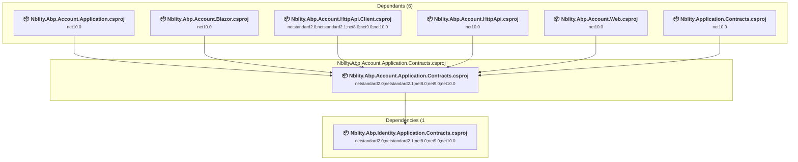

### API Compatibility

| Category | Count | Impact |
| :--- | :---: | :--- |
| 🔴 Binary Incompatible | 0 | High - Require code changes |
| 🟡 Source Incompatible | 0 | Medium - Needs re-compilation and potential conflicting API error fixing |
| 🔵 Behavioral change | 0 | Low - Behavioral changes that may require testing at runtime |
| ✅ Compatible | 254 |  |
| ***Total APIs Analyzed*** | ***254*** |  |

<a id="modulesvoloabpaccountsrcvoloabpaccountapplicationvoloabpaccountapplicationcsproj"></a>
### modules\Nblity.Abp.Account\src\Nblity.Abp.Account.Application\Nblity.Abp.Account.Application.csproj

#### Project Info

- **Current Target Framework:** net10.0✅
- **SDK-style**: True
- **Project Kind:** ClassLibrary
- **Dependencies**: 2
- **Dependants**: 1
- **Number of Files**: 13
- **Lines of Code**: 500
- **Estimated LOC to modify**: 0+ (at least 0.0% of the project)

#### Dependency Graph

Legend:
📦 SDK-style project
⚙️ Classic project

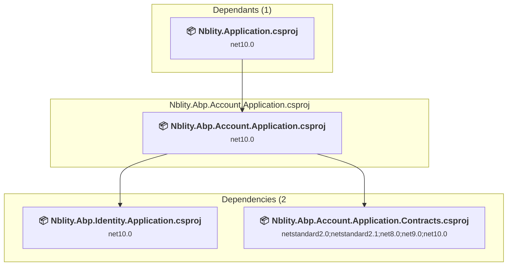

### API Compatibility

| Category | Count | Impact |
| :--- | :---: | :--- |
| 🔴 Binary Incompatible | 0 | High - Require code changes |
| 🟡 Source Incompatible | 0 | Medium - Needs re-compilation and potential conflicting API error fixing |
| 🔵 Behavioral change | 0 | Low - Behavioral changes that may require testing at runtime |
| ✅ Compatible | 0 |  |
| ***Total APIs Analyzed*** | ***0*** |  |

<a id="modulesvoloabpaccountsrcvoloabpaccountblazorvoloabpaccountblazorcsproj"></a>
### modules\Nblity.Abp.Account\src\Nblity.Abp.Account.Blazor\Nblity.Abp.Account.Blazor.csproj

#### Project Info

- **Current Target Framework:** net10.0✅
- **SDK-style**: True
- **Project Kind:** ClassLibrary
- **Dependencies**: 1
- **Dependants**: 0
- **Number of Files**: 8
- **Lines of Code**: 225
- **Estimated LOC to modify**: 0+ (at least 0.0% of the project)

#### Dependency Graph

Legend:
📦 SDK-style project
⚙️ Classic project

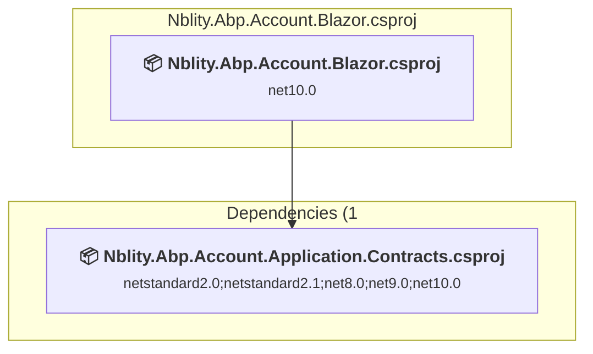

### API Compatibility

| Category | Count | Impact |
| :--- | :---: | :--- |
| 🔴 Binary Incompatible | 0 | High - Require code changes |
| 🟡 Source Incompatible | 0 | Medium - Needs re-compilation and potential conflicting API error fixing |
| 🔵 Behavioral change | 0 | Low - Behavioral changes that may require testing at runtime |
| ✅ Compatible | 0 |  |
| ***Total APIs Analyzed*** | ***0*** |  |

<a id="modulesvoloabpaccountsrcvoloabpaccounthttpapiclientvoloabpaccounthttpapiclientcsproj"></a>
### modules\Nblity.Abp.Account\src\Nblity.Abp.Account.HttpApi.Client\Nblity.Abp.Account.HttpApi.Client.csproj

#### Project Info

- **Current Target Framework:** netstandard2.0;netstandard2.1;net8.0;net9.0;net10.0
- **Proposed Target Framework:** netstandard2.0;netstandard2.1;net8.0;net9.0;net10.0;net10.0
- **SDK-style**: True
- **Project Kind:** ClassLibrary
- **Dependencies**: 1
- **Dependants**: 1
- **Number of Files**: 8
- **Number of Files with Incidents**: 1
- **Lines of Code**: 160
- **Estimated LOC to modify**: 0+ (at least 0.0% of the project)

#### Dependency Graph

Legend:
📦 SDK-style project
⚙️ Classic project

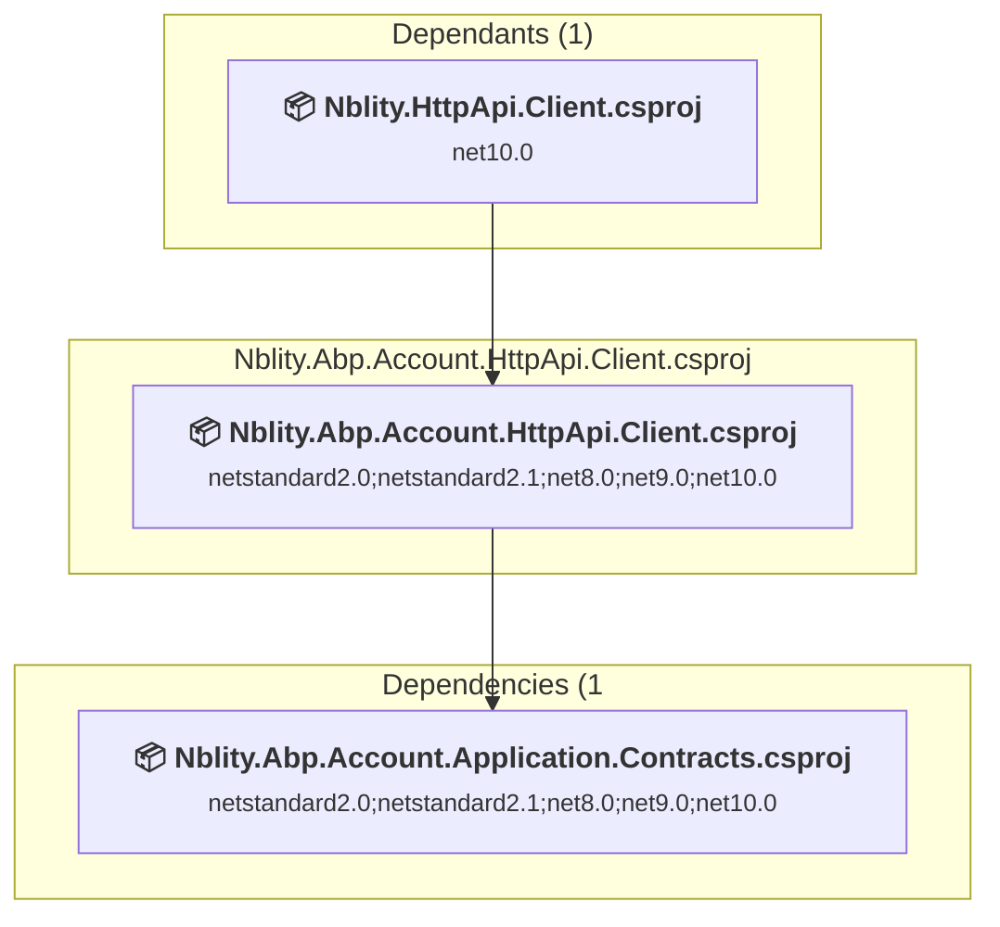

### API Compatibility

| Category | Count | Impact |
| :--- | :---: | :--- |
| 🔴 Binary Incompatible | 0 | High - Require code changes |
| 🟡 Source Incompatible | 0 | Medium - Needs re-compilation and potential conflicting API error fixing |
| 🔵 Behavioral change | 0 | Low - Behavioral changes that may require testing at runtime |
| ✅ Compatible | 81 |  |
| ***Total APIs Analyzed*** | ***81*** |  |

<a id="modulesvoloabpaccountsrcvoloabpaccounthttpapivoloabpaccounthttpapicsproj"></a>
### modules\Nblity.Abp.Account\src\Nblity.Abp.Account.HttpApi\Nblity.Abp.Account.HttpApi.csproj

#### Project Info

- **Current Target Framework:** net10.0✅
- **SDK-style**: True
- **Project Kind:** ClassLibrary
- **Dependencies**: 2
- **Dependants**: 1
- **Number of Files**: 5
- **Lines of Code**: 150
- **Estimated LOC to modify**: 0+ (at least 0.0% of the project)

#### Dependency Graph

Legend:
📦 SDK-style project
⚙️ Classic project

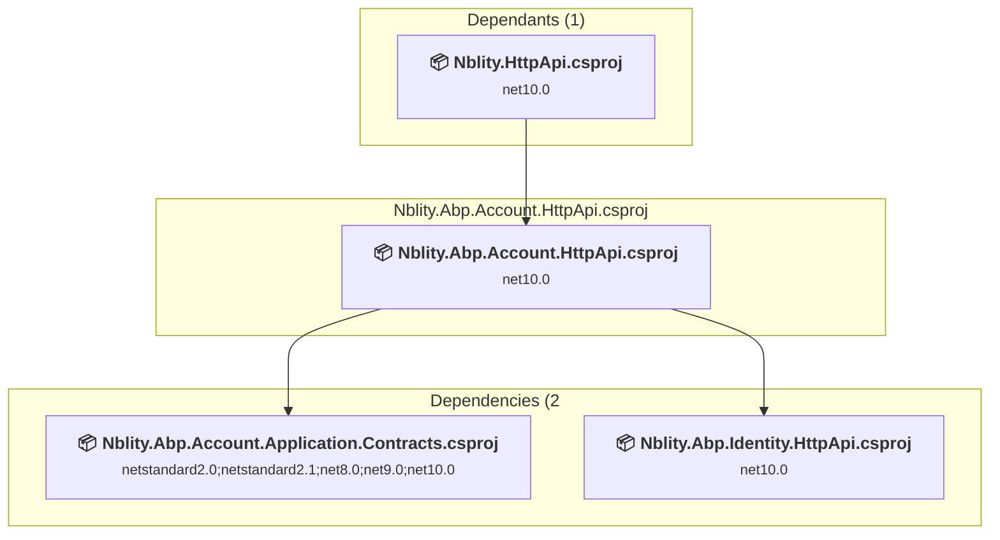

### API Compatibility

| Category | Count | Impact |
| :--- | :---: | :--- |
| 🔴 Binary Incompatible | 0 | High - Require code changes |
| 🟡 Source Incompatible | 0 | Medium - Needs re-compilation and potential conflicting API error fixing |
| 🔵 Behavioral change | 0 | Low - Behavioral changes that may require testing at runtime |
| ✅ Compatible | 0 |  |
| ***Total APIs Analyzed*** | ***0*** |  |

<a id="modulesvoloabpaccountsrcvoloabpaccountinstallervoloabpaccountinstallercsproj"></a>
### modules\Nblity.Abp.Account\src\Nblity.Abp.Account.Installer\Nblity.Abp.Account.Installer.csproj

#### Project Info

- **Current Target Framework:** net10.0✅
- **SDK-style**: True
- **Project Kind:** ClassLibrary
- **Dependencies**: 0
- **Dependants**: 0
- **Number of Files**: 29
- **Lines of Code**: 18
- **Estimated LOC to modify**: 0+ (at least 0.0% of the project)

#### Dependency Graph

Legend:
📦 SDK-style project
⚙️ Classic project

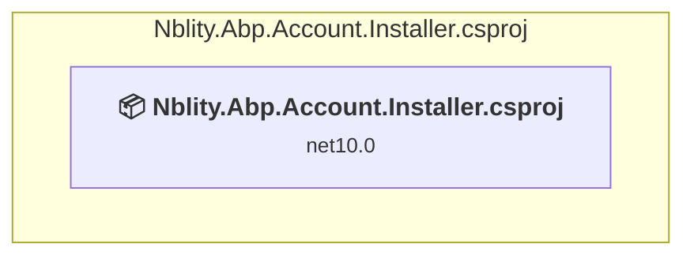

### API Compatibility

| Category | Count | Impact |
| :--- | :---: | :--- |
| 🔴 Binary Incompatible | 0 | High - Require code changes |
| 🟡 Source Incompatible | 0 | Medium - Needs re-compilation and potential conflicting API error fixing |
| 🔵 Behavioral change | 0 | Low - Behavioral changes that may require testing at runtime |
| ✅ Compatible | 0 |  |
| ***Total APIs Analyzed*** | ***0*** |  |

<a id="modulesvoloabpaccountsrcvoloabpaccountwebidentityservervoloabpaccountwebidentityservercsproj"></a>
### modules\Nblity.Abp.Account\src\Nblity.Abp.Account.Web.IdentityServer\Nblity.Abp.Account.Web.IdentityServer.csproj

#### Project Info

- **Current Target Framework:** net10.0✅
- **SDK-style**: True
- **Project Kind:** AspNetCore
- **Dependencies**: 1
- **Dependants**: 0
- **Number of Files**: 8
- **Lines of Code**: 791
- **Estimated LOC to modify**: 0+ (at least 0.0% of the project)

#### Dependency Graph

Legend:
📦 SDK-style project
⚙️ Classic project

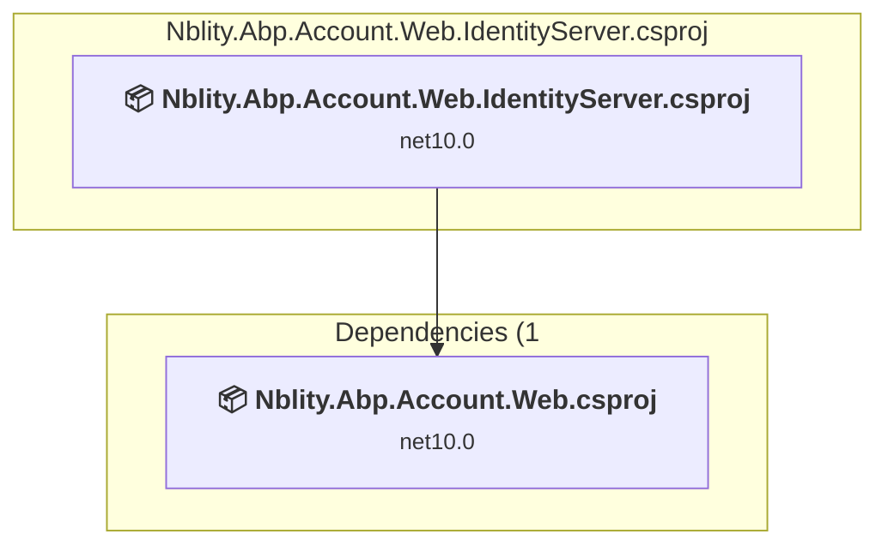

### API Compatibility

| Category | Count | Impact |
| :--- | :---: | :--- |
| 🔴 Binary Incompatible | 0 | High - Require code changes |
| 🟡 Source Incompatible | 0 | Medium - Needs re-compilation and potential conflicting API error fixing |
| 🔵 Behavioral change | 0 | Low - Behavioral changes that may require testing at runtime |
| ✅ Compatible | 0 |  |
| ***Total APIs Analyzed*** | ***0*** |  |

<a id="modulesvoloabpaccountsrcvoloabpaccountwebopeniddictvoloabpaccountwebopeniddictcsproj"></a>
### modules\Nblity.Abp.Account\src\Nblity.Abp.Account.Web.OpenIddict\Nblity.Abp.Account.Web.OpenIddict.csproj

#### Project Info

- **Current Target Framework:** net10.0✅
- **SDK-style**: True
- **Project Kind:** AspNetCore
- **Dependencies**: 1
- **Dependants**: 1
- **Number of Files**: 5
- **Lines of Code**: 153
- **Estimated LOC to modify**: 0+ (at least 0.0% of the project)

#### Dependency Graph

Legend:
📦 SDK-style project
⚙️ Classic project

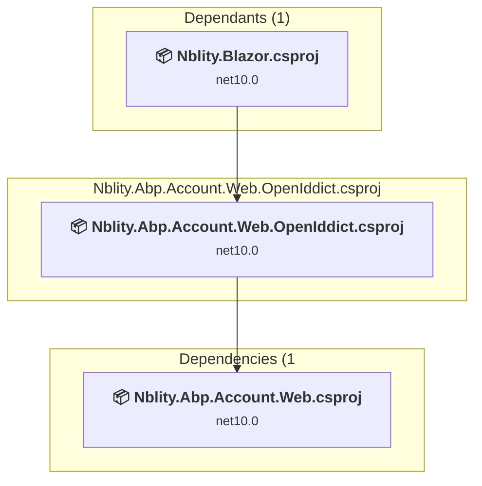

### API Compatibility

| Category | Count | Impact |
| :--- | :---: | :--- |
| 🔴 Binary Incompatible | 0 | High - Require code changes |
| 🟡 Source Incompatible | 0 | Medium - Needs re-compilation and potential conflicting API error fixing |
| 🔵 Behavioral change | 0 | Low - Behavioral changes that may require testing at runtime |
| ✅ Compatible | 0 |  |
| ***Total APIs Analyzed*** | ***0*** |  |

<a id="modulesvoloabpaccountsrcvoloabpaccountwebvoloabpaccountwebcsproj"></a>
### modules\Nblity.Abp.Account\src\Nblity.Abp.Account.Web\Nblity.Abp.Account.Web.csproj

#### Project Info

- **Current Target Framework:** net10.0✅
- **SDK-style**: True
- **Project Kind:** AspNetCore
- **Dependencies**: 2
- **Dependants**: 2
- **Number of Files**: 50
- **Lines of Code**: 2193
- **Estimated LOC to modify**: 0+ (at least 0.0% of the project)

#### Dependency Graph

Legend:
📦 SDK-style project
⚙️ Classic project

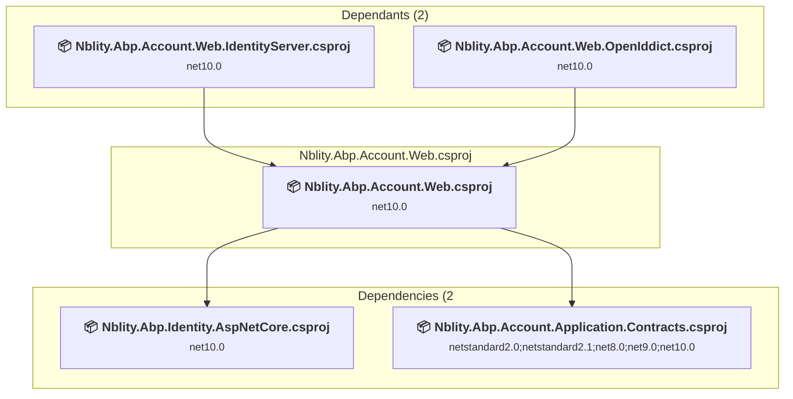

### API Compatibility

| Category | Count | Impact |
| :--- | :---: | :--- |
| 🔴 Binary Incompatible | 0 | High - Require code changes |
| 🟡 Source Incompatible | 0 | Medium - Needs re-compilation and potential conflicting API error fixing |
| 🔵 Behavioral change | 0 | Low - Behavioral changes that may require testing at runtime |
| ✅ Compatible | 0 |  |
| ***Total APIs Analyzed*** | ***0*** |  |

<a id="modulesvoloabpfeaturemanagementsrcvoloabpfeaturemanagementapplicationcontractsvoloabpfeaturemanagementapplicationcontractscsproj"></a>
### modules\Nblity.Abp.FeatureManagement\src\Nblity.Abp.FeatureManagement.Application.Contracts\Nblity.Abp.FeatureManagement.Application.Contracts.csproj

#### Project Info

- **Current Target Framework:** netstandard2.0;netstandard2.1;net8.0;net9.0;net10.0
- **Proposed Target Framework:** netstandard2.0;netstandard2.1;net8.0;net9.0;net10.0;net10.0
- **SDK-style**: True
- **Project Kind:** ClassLibrary
- **Dependencies**: 1
- **Dependants**: 6
- **Number of Files**: 11
- **Number of Files with Incidents**: 1
- **Lines of Code**: 158
- **Estimated LOC to modify**: 0+ (at least 0.0% of the project)

#### Dependency Graph

Legend:
📦 SDK-style project
⚙️ Classic project

```mermaid
flowchart TB
    subgraph upstream["Dependants (6)"]
        P11["<b>📦&nbsp;Nblity.Abp.FeatureManagement.Application.csproj</b><br/><small>net10.0</small>"]
        P14["<b>📦&nbsp;Nblity.Abp.FeatureManagement.Blazor.csproj</b><br/><small>net10.0</small>"]
        P18["<b>📦&nbsp;Nblity.Abp.FeatureManagement.HttpApi.Client.csproj</b><br/><small>netstandard2.0;netstandard2.1;net8.0;net9.0;net10.0</small>"]
        P19["<b>📦&nbsp;Nblity.Abp.FeatureManagement.HttpApi.csproj</b><br/><small>net10.0</small>"]
        P22["<b>📦&nbsp;Nblity.Abp.FeatureManagement.Web.csproj</b><br/><small>net10.0</small>"]
        P83["<b>📦&nbsp;Nblity.Application.Contracts.csproj</b><br/><small>net10.0</small>"]
        click P11 "#modulesvoloabpfeaturemanagementsrcvoloabpfeaturemanagementapplicationvoloabpfeaturemanagementapplicationcsproj"
        click P14 "#modulesvoloabpfeaturemanagementsrcvoloabpfeaturemanagementblazorvoloabpfeaturemanagementblazorcsproj"
        click P18 "#modulesvoloabpfeaturemanagementsrcvoloabpfeaturemanagementhttpapiclientvoloabpfeaturemanagementhttpapiclientcsproj"
        click P19 "#modulesvoloabpfeaturemanagementsrcvoloabpfeaturemanagementhttpapivoloabpfeaturemanagementhttpapicsproj"
        click P22 "#modulesvoloabpfeaturemanagementsrcvoloabpfeaturemanagementwebvoloabpfeaturemanagementwebcsproj"
        click P83 "#srcnblityapplicationcontractsnblityapplicationcontractscsproj"
    end
    subgraph current["Nblity.Abp.FeatureManagement.Application.Contracts.csproj"]
        MAIN["<b>📦&nbsp;Nblity.Abp.FeatureManagement.Application.Contracts.csproj</b><br/><small>netstandard2.0;netstandard2.1;net8.0;net9.0;net10.0</small>"]
        click MAIN "#modulesvoloabpfeaturemanagementsrcvoloabpfeaturemanagementapplicationcontractsvoloabpfeaturemanagementapplicationcontractscsproj"
    end
    subgraph downstream["Dependencies (1"]
        P15["<b>📦&nbsp;Nblity.Abp.FeatureManagement.Domain.Shared.csproj</b><br/><small>netstandard2.0;netstandard2.1;net8.0;net9.0;net10.0</small>"]
        click P15 "#modulesvoloabpfeaturemanagementsrcvoloabpfeaturemanagementdomainsharedvoloabpfeaturemanagementdomainsharedcsproj"
    end
    P11 --> MAIN
    P14 --> MAIN
    P18 --> MAIN
    P19 --> MAIN
    P22 --> MAIN
    P83 --> MAIN
    MAIN --> P15

```

### API Compatibility

| Category | Count | Impact |
| :--- | :---: | :--- |
| 🔴 Binary Incompatible | 0 | High - Require code changes |
| 🟡 Source Incompatible | 0 | Medium - Needs re-compilation and potential conflicting API error fixing |
| 🔵 Behavioral change | 0 | Low - Behavioral changes that may require testing at runtime |
| ✅ Compatible | 124 |  |
| ***Total APIs Analyzed*** | ***124*** |  |

<a id="modulesvoloabpfeaturemanagementsrcvoloabpfeaturemanagementapplicationvoloabpfeaturemanagementapplicationcsproj"></a>
### modules\Nblity.Abp.FeatureManagement\src\Nblity.Abp.FeatureManagement.Application\Nblity.Abp.FeatureManagement.Application.csproj

#### Project Info

- **Current Target Framework:** net10.0✅
- **SDK-style**: True
- **Project Kind:** ClassLibrary
- **Dependencies**: 2
- **Dependants**: 1
- **Number of Files**: 3
- **Lines of Code**: 209
- **Estimated LOC to modify**: 0+ (at least 0.0% of the project)

#### Dependency Graph

Legend:
📦 SDK-style project
⚙️ Classic project

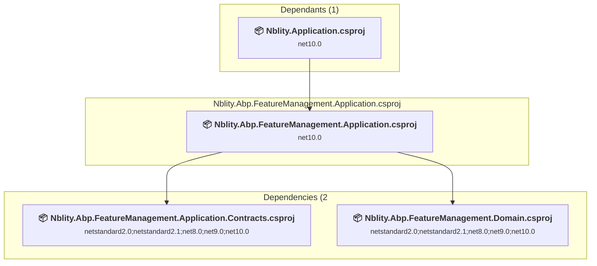

### API Compatibility

| Category | Count | Impact |
| :--- | :---: | :--- |
| 🔴 Binary Incompatible | 0 | High - Require code changes |
| 🟡 Source Incompatible | 0 | Medium - Needs re-compilation and potential conflicting API error fixing |
| 🔵 Behavioral change | 0 | Low - Behavioral changes that may require testing at runtime |
| ✅ Compatible | 0 |  |
| ***Total APIs Analyzed*** | ***0*** |  |

<a id="modulesvoloabpfeaturemanagementsrcvoloabpfeaturemanagementblazorservervoloabpfeaturemanagementblazorservercsproj"></a>
### modules\Nblity.Abp.FeatureManagement\src\Nblity.Abp.FeatureManagement.Blazor.Server\Nblity.Abp.FeatureManagement.Blazor.Server.csproj

#### Project Info

- **Current Target Framework:** net10.0✅
- **SDK-style**: True
- **Project Kind:** ClassLibrary
- **Dependencies**: 1
- **Dependants**: 1
- **Number of Files**: 2
- **Lines of Code**: 13
- **Estimated LOC to modify**: 0+ (at least 0.0% of the project)

#### Dependency Graph

Legend:
📦 SDK-style project
⚙️ Classic project

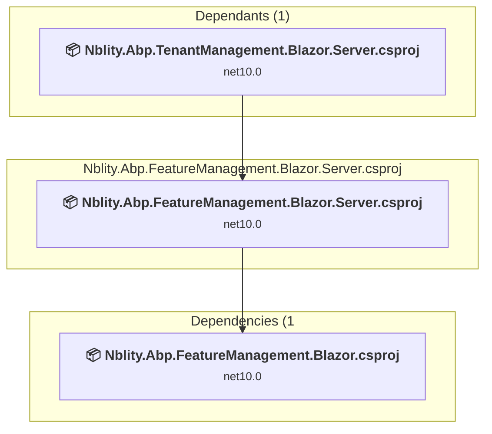

### API Compatibility

| Category | Count | Impact |
| :--- | :---: | :--- |
| 🔴 Binary Incompatible | 0 | High - Require code changes |
| 🟡 Source Incompatible | 0 | Medium - Needs re-compilation and potential conflicting API error fixing |
| 🔵 Behavioral change | 0 | Low - Behavioral changes that may require testing at runtime |
| ✅ Compatible | 0 |  |
| ***Total APIs Analyzed*** | ***0*** |  |

<a id="modulesvoloabpfeaturemanagementsrcvoloabpfeaturemanagementblazorwebassemblyvoloabpfeaturemanagementblazorwebassemblycsproj"></a>
### modules\Nblity.Abp.FeatureManagement\src\Nblity.Abp.FeatureManagement.Blazor.WebAssembly\Nblity.Abp.FeatureManagement.Blazor.WebAssembly.csproj

#### Project Info

- **Current Target Framework:** net10.0✅
- **SDK-style**: True
- **Project Kind:** ClassLibrary
- **Dependencies**: 2
- **Dependants**: 2
- **Number of Files**: 1
- **Lines of Code**: 13
- **Estimated LOC to modify**: 0+ (at least 0.0% of the project)

#### Dependency Graph

Legend:
📦 SDK-style project
⚙️ Classic project

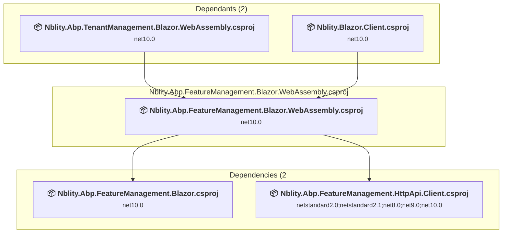

### API Compatibility

| Category | Count | Impact |
| :--- | :---: | :--- |
| 🔴 Binary Incompatible | 0 | High - Require code changes |
| 🟡 Source Incompatible | 0 | Medium - Needs re-compilation and potential conflicting API error fixing |
| 🔵 Behavioral change | 0 | Low - Behavioral changes that may require testing at runtime |
| ✅ Compatible | 0 |  |
| ***Total APIs Analyzed*** | ***0*** |  |

<a id="modulesvoloabpfeaturemanagementsrcvoloabpfeaturemanagementblazorvoloabpfeaturemanagementblazorcsproj"></a>
### modules\Nblity.Abp.FeatureManagement\src\Nblity.Abp.FeatureManagement.Blazor\Nblity.Abp.FeatureManagement.Blazor.csproj

#### Project Info

- **Current Target Framework:** net10.0✅
- **SDK-style**: True
- **Project Kind:** ClassLibrary
- **Dependencies**: 2
- **Dependants**: 3
- **Number of Files**: 10
- **Lines of Code**: 375
- **Estimated LOC to modify**: 0+ (at least 0.0% of the project)

#### Dependency Graph

Legend:
📦 SDK-style project
⚙️ Classic project

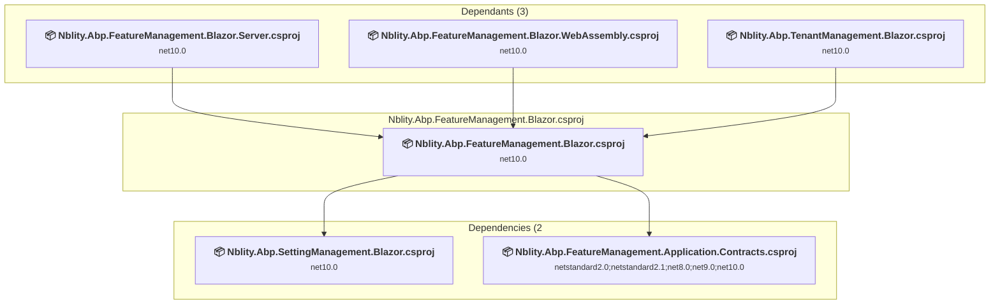

### API Compatibility

| Category | Count | Impact |
| :--- | :---: | :--- |
| 🔴 Binary Incompatible | 0 | High - Require code changes |
| 🟡 Source Incompatible | 0 | Medium - Needs re-compilation and potential conflicting API error fixing |
| 🔵 Behavioral change | 0 | Low - Behavioral changes that may require testing at runtime |
| ✅ Compatible | 0 |  |
| ***Total APIs Analyzed*** | ***0*** |  |

<a id="modulesvoloabpfeaturemanagementsrcvoloabpfeaturemanagementdomainsharedvoloabpfeaturemanagementdomainsharedcsproj"></a>
### modules\Nblity.Abp.FeatureManagement\src\Nblity.Abp.FeatureManagement.Domain.Shared\Nblity.Abp.FeatureManagement.Domain.Shared.csproj

#### Project Info

- **Current Target Framework:** netstandard2.0;netstandard2.1;net8.0;net9.0;net10.0
- **Proposed Target Framework:** netstandard2.0;netstandard2.1;net8.0;net9.0;net10.0;net10.0
- **SDK-style**: True
- **Project Kind:** ClassLibrary
- **Dependencies**: 0
- **Dependants**: 3
- **Number of Files**: 41
- **Number of Files with Incidents**: 4
- **Lines of Code**: 342
- **Estimated LOC to modify**: 6+ (at least 1.8% of the project)

#### Dependency Graph

Legend:
📦 SDK-style project
⚙️ Classic project

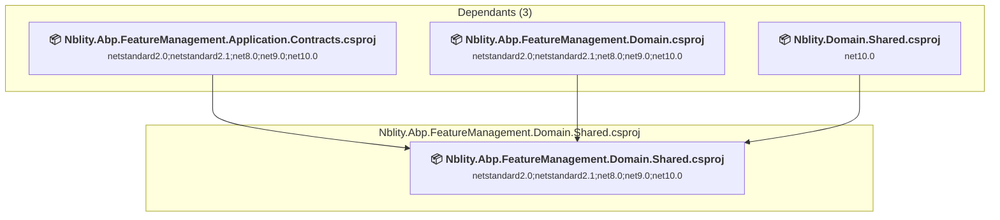

### API Compatibility

| Category | Count | Impact |
| :--- | :---: | :--- |
| 🔴 Binary Incompatible | 0 | High - Require code changes |
| 🟡 Source Incompatible | 0 | Medium - Needs re-compilation and potential conflicting API error fixing |
| 🔵 Behavioral change | 6 | Low - Behavioral changes that may require testing at runtime |
| ✅ Compatible | 415 |  |
| ***Total APIs Analyzed*** | ***421*** |  |

<a id="modulesvoloabpfeaturemanagementsrcvoloabpfeaturemanagementdomainvoloabpfeaturemanagementdomaincsproj"></a>
### modules\Nblity.Abp.FeatureManagement\src\Nblity.Abp.FeatureManagement.Domain\Nblity.Abp.FeatureManagement.Domain.csproj

#### Project Info

- **Current Target Framework:** netstandard2.0;netstandard2.1;net8.0;net9.0;net10.0
- **Proposed Target Framework:** netstandard2.0;netstandard2.1;net8.0;net9.0;net10.0;net10.0
- **SDK-style**: True
- **Project Kind:** ClassLibrary
- **Dependencies**: 1
- **Dependants**: 4
- **Number of Files**: 39
- **Number of Files with Incidents**: 4
- **Lines of Code**: 2387
- **Estimated LOC to modify**: 6+ (at least 0.3% of the project)

#### Dependency Graph

Legend:
📦 SDK-style project
⚙️ Classic project

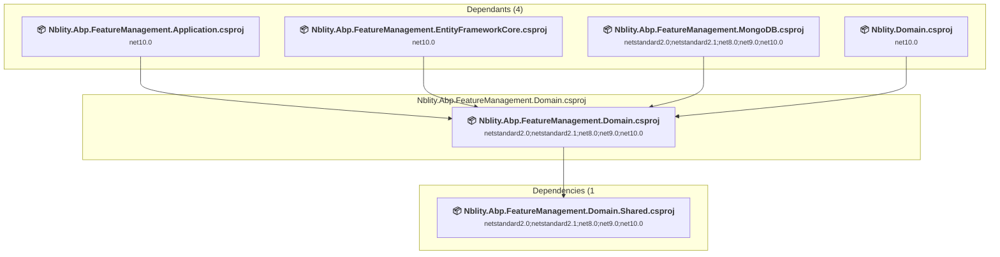

### API Compatibility

| Category | Count | Impact |
| :--- | :---: | :--- |
| 🔴 Binary Incompatible | 0 | High - Require code changes |
| 🟡 Source Incompatible | 6 | Medium - Needs re-compilation and potential conflicting API error fixing |
| 🔵 Behavioral change | 0 | Low - Behavioral changes that may require testing at runtime |
| ✅ Compatible | 2662 |  |
| ***Total APIs Analyzed*** | ***2668*** |  |

<a id="modulesvoloabpfeaturemanagementsrcvoloabpfeaturemanagemententityframeworkcorevoloabpfeaturemanagemententityframeworkcorecsproj"></a>
### modules\Nblity.Abp.FeatureManagement\src\Nblity.Abp.FeatureManagement.EntityFrameworkCore\Nblity.Abp.FeatureManagement.EntityFrameworkCore.csproj

#### Project Info

- **Current Target Framework:** net10.0✅
- **SDK-style**: True
- **Project Kind:** ClassLibrary
- **Dependencies**: 1
- **Dependants**: 1
- **Number of Files**: 7
- **Lines of Code**: 245
- **Estimated LOC to modify**: 0+ (at least 0.0% of the project)

#### Dependency Graph

Legend:
📦 SDK-style project
⚙️ Classic project

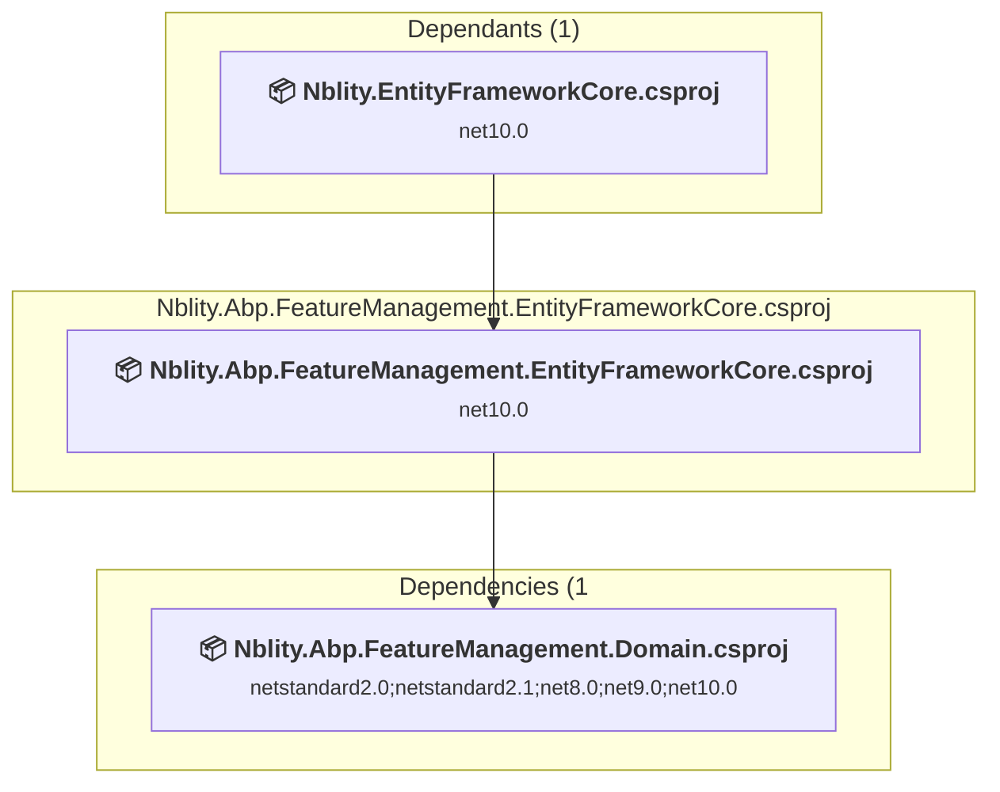

### API Compatibility

| Category | Count | Impact |
| :--- | :---: | :--- |
| 🔴 Binary Incompatible | 0 | High - Require code changes |
| 🟡 Source Incompatible | 0 | Medium - Needs re-compilation and potential conflicting API error fixing |
| 🔵 Behavioral change | 0 | Low - Behavioral changes that may require testing at runtime |
| ✅ Compatible | 0 |  |
| ***Total APIs Analyzed*** | ***0*** |  |

<a id="modulesvoloabpfeaturemanagementsrcvoloabpfeaturemanagementhttpapiclientvoloabpfeaturemanagementhttpapiclientcsproj"></a>
### modules\Nblity.Abp.FeatureManagement\src\Nblity.Abp.FeatureManagement.HttpApi.Client\Nblity.Abp.FeatureManagement.HttpApi.Client.csproj

#### Project Info

- **Current Target Framework:** netstandard2.0;netstandard2.1;net8.0;net9.0;net10.0
- **Proposed Target Framework:** netstandard2.0;netstandard2.1;net8.0;net9.0;net10.0;net10.0
- **SDK-style**: True
- **Project Kind:** ClassLibrary
- **Dependencies**: 1
- **Dependants**: 2
- **Number of Files**: 4
- **Number of Files with Incidents**: 1
- **Lines of Code**: 79
- **Estimated LOC to modify**: 0+ (at least 0.0% of the project)

#### Dependency Graph

Legend:
📦 SDK-style project
⚙️ Classic project

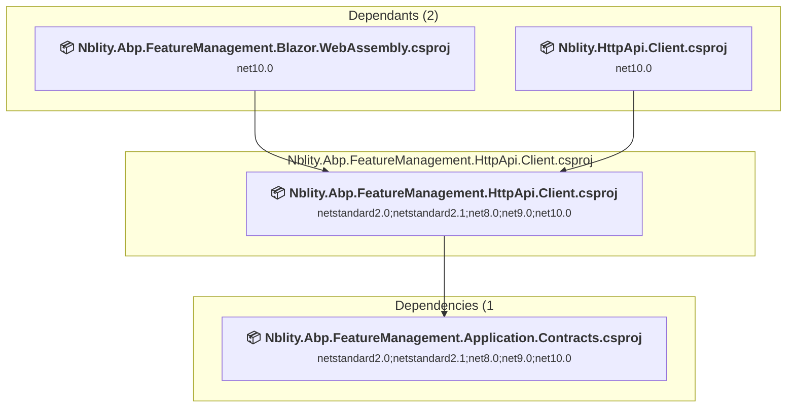

### API Compatibility

| Category | Count | Impact |
| :--- | :---: | :--- |
| 🔴 Binary Incompatible | 0 | High - Require code changes |
| 🟡 Source Incompatible | 0 | Medium - Needs re-compilation and potential conflicting API error fixing |
| 🔵 Behavioral change | 0 | Low - Behavioral changes that may require testing at runtime |
| ✅ Compatible | 60 |  |
| ***Total APIs Analyzed*** | ***60*** |  |

<a id="modulesvoloabpfeaturemanagementsrcvoloabpfeaturemanagementhttpapivoloabpfeaturemanagementhttpapicsproj"></a>
### modules\Nblity.Abp.FeatureManagement\src\Nblity.Abp.FeatureManagement.HttpApi\Nblity.Abp.FeatureManagement.HttpApi.csproj

#### Project Info

- **Current Target Framework:** net10.0✅
- **SDK-style**: True
- **Project Kind:** ClassLibrary
- **Dependencies**: 1
- **Dependants**: 2
- **Number of Files**: 3
- **Lines of Code**: 77
- **Estimated LOC to modify**: 0+ (at least 0.0% of the project)

#### Dependency Graph

Legend:
📦 SDK-style project
⚙️ Classic project

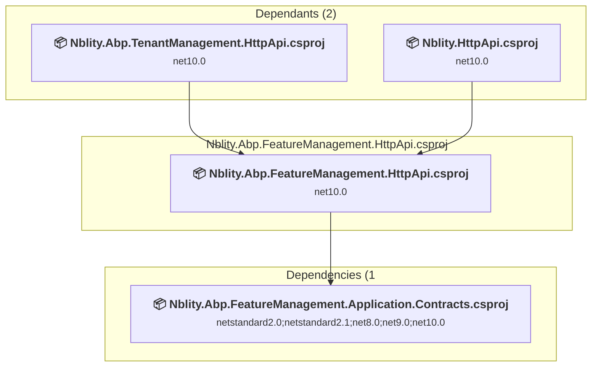

### API Compatibility

| Category | Count | Impact |
| :--- | :---: | :--- |
| 🔴 Binary Incompatible | 0 | High - Require code changes |
| 🟡 Source Incompatible | 0 | Medium - Needs re-compilation and potential conflicting API error fixing |
| 🔵 Behavioral change | 0 | Low - Behavioral changes that may require testing at runtime |
| ✅ Compatible | 0 |  |
| ***Total APIs Analyzed*** | ***0*** |  |

<a id="modulesvoloabpfeaturemanagementsrcvoloabpfeaturemanagementinstallervoloabpfeaturemanagementinstallercsproj"></a>
### modules\Nblity.Abp.FeatureManagement\src\Nblity.Abp.FeatureManagement.Installer\Nblity.Abp.FeatureManagement.Installer.csproj

#### Project Info

- **Current Target Framework:** net10.0✅
- **SDK-style**: True
- **Project Kind:** ClassLibrary
- **Dependencies**: 0
- **Dependants**: 0
- **Number of Files**: 35
- **Lines of Code**: 18
- **Estimated LOC to modify**: 0+ (at least 0.0% of the project)

#### Dependency Graph

Legend:
📦 SDK-style project
⚙️ Classic project

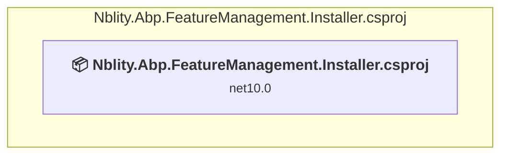

### API Compatibility

| Category | Count | Impact |
| :--- | :---: | :--- |
| 🔴 Binary Incompatible | 0 | High - Require code changes |
| 🟡 Source Incompatible | 0 | Medium - Needs re-compilation and potential conflicting API error fixing |
| 🔵 Behavioral change | 0 | Low - Behavioral changes that may require testing at runtime |
| ✅ Compatible | 0 |  |
| ***Total APIs Analyzed*** | ***0*** |  |

<a id="modulesvoloabpfeaturemanagementsrcvoloabpfeaturemanagementmongodbvoloabpfeaturemanagementmongodbcsproj"></a>
### modules\Nblity.Abp.FeatureManagement\src\Nblity.Abp.FeatureManagement.MongoDB\Nblity.Abp.FeatureManagement.MongoDB.csproj

#### Project Info

- **Current Target Framework:** netstandard2.0;netstandard2.1;net8.0;net9.0;net10.0
- **Proposed Target Framework:** netstandard2.0;netstandard2.1;net8.0;net9.0;net10.0;net10.0
- **SDK-style**: True
- **Project Kind:** ClassLibrary
- **Dependencies**: 1
- **Dependants**: 0
- **Number of Files**: 7
- **Number of Files with Incidents**: 1
- **Lines of Code**: 203
- **Estimated LOC to modify**: 0+ (at least 0.0% of the project)

#### Dependency Graph

Legend:
📦 SDK-style project
⚙️ Classic project

```mermaid
flowchart TB
    subgraph current["Nblity.Abp.FeatureManagement.MongoDB.csproj"]
        MAIN["<b>📦&nbsp;Nblity.Abp.FeatureManagement.MongoDB.csproj</b><br/><small>netstandard2.0;netstandard2.1;net8.0;net9.0;net10.0</small>"]
        click MAIN "#modulesvoloabpfeaturemanagementsrcvoloabpfeaturemanagementmongodbvoloabpfeaturemanagementmongodbcsproj"
    end
    subgraph downstream["Dependencies (1"]
        P16["<b>📦&nbsp;Nblity.Abp.FeatureManagement.Domain.csproj</b><br/><small>netstandard2.0;netstandard2.1;net8.0;net9.0;net10.0</small>"]
        click P16 "#modulesvoloabpfeaturemanagementsrcvoloabpfeaturemanagementdomainvoloabpfeaturemanagementdomaincsproj"
    end
    MAIN --> P16

```

### API Compatibility

| Category | Count | Impact |
| :--- | :---: | :--- |
| 🔴 Binary Incompatible | 0 | High - Require code changes |
| 🟡 Source Incompatible | 0 | Medium - Needs re-compilation and potential conflicting API error fixing |
| 🔵 Behavioral change | 0 | Low - Behavioral changes that may require testing at runtime |
| ✅ Compatible | 181 |  |
| ***Total APIs Analyzed*** | ***181*** |  |

<a id="modulesvoloabpfeaturemanagementsrcvoloabpfeaturemanagementwebvoloabpfeaturemanagementwebcsproj"></a>
### modules\Nblity.Abp.FeatureManagement\src\Nblity.Abp.FeatureManagement.Web\Nblity.Abp.FeatureManagement.Web.csproj

#### Project Info

- **Current Target Framework:** net10.0✅
- **SDK-style**: True
- **Project Kind:** AspNetCore
- **Dependencies**: 2
- **Dependants**: 1
- **Number of Files**: 13
- **Lines of Code**: 388
- **Estimated LOC to modify**: 0+ (at least 0.0% of the project)

#### Dependency Graph

Legend:
📦 SDK-style project
⚙️ Classic project

```mermaid
flowchart TB
    subgraph upstream["Dependants (1)"]
        P82["<b>📦&nbsp;Nblity.Abp.TenantManagement.Web.csproj</b><br/><small>net10.0</small>"]
        click P82 "#modulesvoloabptenantmanagementsrcvoloabptenantmanagementwebvoloabptenantmanagementwebcsproj"
    end
    subgraph current["Nblity.Abp.FeatureManagement.Web.csproj"]
        MAIN["<b>📦&nbsp;Nblity.Abp.FeatureManagement.Web.csproj</b><br/><small>net10.0</small>"]
        click MAIN "#modulesvoloabpfeaturemanagementsrcvoloabpfeaturemanagementwebvoloabpfeaturemanagementwebcsproj"
    end
    subgraph downstream["Dependencies (2"]
        P10["<b>📦&nbsp;Nblity.Abp.FeatureManagement.Application.Contracts.csproj</b><br/><small>netstandard2.0;netstandard2.1;net8.0;net9.0;net10.0</small>"]
        P69["<b>📦&nbsp;Nblity.Abp.SettingManagement.Web.csproj</b><br/><small>net10.0</small>"]
        click P10 "#modulesvoloabpfeaturemanagementsrcvoloabpfeaturemanagementapplicationcontractsvoloabpfeaturemanagementapplicationcontractscsproj"
        click P69 "#modulesvoloabpsettingmanagementsrcvoloabpsettingmanagementwebvoloabpsettingmanagementwebcsproj"
    end
    P82 --> MAIN
    MAIN --> P10
    MAIN --> P69

```

### API Compatibility

| Category | Count | Impact |
| :--- | :---: | :--- |
| 🔴 Binary Incompatible | 0 | High - Require code changes |
| 🟡 Source Incompatible | 0 | Medium - Needs re-compilation and potential conflicting API error fixing |
| 🔵 Behavioral change | 0 | Low - Behavioral changes that may require testing at runtime |
| ✅ Compatible | 0 |  |
| ***Total APIs Analyzed*** | ***0*** |  |

<a id="modulesvoloabpidentitysrcvoloabpidentityapplicationcontractsvoloabpidentityapplicationcontractscsproj"></a>
### modules\Nblity.Abp.Identity\src\Nblity.Abp.Identity.Application.Contracts\Nblity.Abp.Identity.Application.Contracts.csproj

#### Project Info

- **Current Target Framework:** netstandard2.0;netstandard2.1;net8.0;net9.0;net10.0
- **Proposed Target Framework:** netstandard2.0;netstandard2.1;net8.0;net9.0;net10.0;net10.0
- **SDK-style**: True
- **Project Kind:** ClassLibrary
- **Dependencies**: 2
- **Dependants**: 7
- **Number of Files**: 24
- **Number of Files with Incidents**: 1
- **Lines of Code**: 455
- **Estimated LOC to modify**: 0+ (at least 0.0% of the project)

#### Dependency Graph

Legend:
📦 SDK-style project
⚙️ Classic project

```mermaid
flowchart TB
    subgraph upstream["Dependants (7)"]
        P1["<b>📦&nbsp;Nblity.Abp.Account.Application.Contracts.csproj</b><br/><small>netstandard2.0;netstandard2.1;net8.0;net9.0;net10.0</small>"]
        P24["<b>📦&nbsp;Nblity.Abp.Identity.Application.csproj</b><br/><small>net10.0</small>"]
        P28["<b>📦&nbsp;Nblity.Abp.Identity.Blazor.csproj</b><br/><small>net10.0</small>"]
        P32["<b>📦&nbsp;Nblity.Abp.Identity.HttpApi.Client.csproj</b><br/><small>netstandard2.0;netstandard2.1;net8.0;net9.0;net10.0</small>"]
        P33["<b>📦&nbsp;Nblity.Abp.Identity.HttpApi.csproj</b><br/><small>net10.0</small>"]
        P36["<b>📦&nbsp;Nblity.Abp.Identity.Web.csproj</b><br/><small>net10.0</small>"]
        P83["<b>📦&nbsp;Nblity.Application.Contracts.csproj</b><br/><small>net10.0</small>"]
        click P1 "#modulesvoloabpaccountsrcvoloabpaccountapplicationcontractsvoloabpaccountapplicationcontractscsproj"
        click P24 "#modulesvoloabpidentitysrcvoloabpidentityapplicationvoloabpidentityapplicationcsproj"
        click P28 "#modulesvoloabpidentitysrcvoloabpidentityblazorvoloabpidentityblazorcsproj"
        click P32 "#modulesvoloabpidentitysrcvoloabpidentityhttpapiclientvoloabpidentityhttpapiclientcsproj"
        click P33 "#modulesvoloabpidentitysrcvoloabpidentityhttpapivoloabpidentityhttpapicsproj"
        click P36 "#modulesvoloabpidentitysrcvoloabpidentitywebvoloabpidentitywebcsproj"
        click P83 "#srcnblityapplicationcontractsnblityapplicationcontractscsproj"
    end
    subgraph current["Nblity.Abp.Identity.Application.Contracts.csproj"]
        MAIN["<b>📦&nbsp;Nblity.Abp.Identity.Application.Contracts.csproj</b><br/><small>netstandard2.0;netstandard2.1;net8.0;net9.0;net10.0</small>"]
        click MAIN "#modulesvoloabpidentitysrcvoloabpidentityapplicationcontractsvoloabpidentityapplicationcontractscsproj"
    end
    subgraph downstream["Dependencies (2"]
        P29["<b>📦&nbsp;Nblity.Abp.Identity.Domain.Shared.csproj</b><br/><small>netstandard2.0;netstandard2.1;net8.0;net9.0;net10.0</small>"]
        P44["<b>📦&nbsp;Nblity.Abp.PermissionManagement.Application.Contracts.csproj</b><br/><small>netstandard2.0;netstandard2.1;net8.0;net9.0;net10.0</small>"]
        click P29 "#modulesvoloabpidentitysrcvoloabpidentitydomainsharedvoloabpidentitydomainsharedcsproj"
        click P44 "#modulesvoloabppermissionmanagementsrcvoloabppermissionmanagementapplicationcontractsvoloabppermissionmanagementapplicationcontractscsproj"
    end
    P1 --> MAIN
    P24 --> MAIN
    P28 --> MAIN
    P32 --> MAIN
    P33 --> MAIN
    P36 --> MAIN
    P83 --> MAIN
    MAIN --> P29
    MAIN --> P44

```

### API Compatibility

| Category | Count | Impact |
| :--- | :---: | :--- |
| 🔴 Binary Incompatible | 0 | High - Require code changes |
| 🟡 Source Incompatible | 0 | Medium - Needs re-compilation and potential conflicting API error fixing |
| 🔵 Behavioral change | 0 | Low - Behavioral changes that may require testing at runtime |
| ✅ Compatible | 358 |  |
| ***Total APIs Analyzed*** | ***358*** |  |

<a id="modulesvoloabpidentitysrcvoloabpidentityapplicationvoloabpidentityapplicationcsproj"></a>
### modules\Nblity.Abp.Identity\src\Nblity.Abp.Identity.Application\Nblity.Abp.Identity.Application.csproj

#### Project Info

- **Current Target Framework:** net10.0✅
- **SDK-style**: True
- **Project Kind:** ClassLibrary
- **Dependencies**: 3
- **Dependants**: 2
- **Number of Files**: 8
- **Lines of Code**: 536
- **Estimated LOC to modify**: 0+ (at least 0.0% of the project)

#### Dependency Graph

Legend:
📦 SDK-style project
⚙️ Classic project

```mermaid
flowchart TB
    subgraph upstream["Dependants (2)"]
        P2["<b>📦&nbsp;Nblity.Abp.Account.Application.csproj</b><br/><small>net10.0</small>"]
        P84["<b>📦&nbsp;Nblity.Application.csproj</b><br/><small>net10.0</small>"]
        click P2 "#modulesvoloabpaccountsrcvoloabpaccountapplicationvoloabpaccountapplicationcsproj"
        click P84 "#srcnblityapplicationnblityapplicationcsproj"
    end
    subgraph current["Nblity.Abp.Identity.Application.csproj"]
        MAIN["<b>📦&nbsp;Nblity.Abp.Identity.Application.csproj</b><br/><small>net10.0</small>"]
        click MAIN "#modulesvoloabpidentitysrcvoloabpidentityapplicationvoloabpidentityapplicationcsproj"
    end
    subgraph downstream["Dependencies (3"]
        P23["<b>📦&nbsp;Nblity.Abp.Identity.Application.Contracts.csproj</b><br/><small>netstandard2.0;netstandard2.1;net8.0;net9.0;net10.0</small>"]
        P30["<b>📦&nbsp;Nblity.Abp.Identity.Domain.csproj</b><br/><small>net10.0</small>"]
        P45["<b>📦&nbsp;Nblity.Abp.PermissionManagement.Application.csproj</b><br/><small>net10.0</small>"]
        click P23 "#modulesvoloabpidentitysrcvoloabpidentityapplicationcontractsvoloabpidentityapplicationcontractscsproj"
        click P30 "#modulesvoloabpidentitysrcvoloabpidentitydomainvoloabpidentitydomaincsproj"
        click P45 "#modulesvoloabppermissionmanagementsrcvoloabppermissionmanagementapplicationvoloabppermissionmanagementapplicationcsproj"
    end
    P2 --> MAIN
    P84 --> MAIN
    MAIN --> P23
    MAIN --> P30
    MAIN --> P45

```

### API Compatibility

| Category | Count | Impact |
| :--- | :---: | :--- |
| 🔴 Binary Incompatible | 0 | High - Require code changes |
| 🟡 Source Incompatible | 0 | Medium - Needs re-compilation and potential conflicting API error fixing |
| 🔵 Behavioral change | 0 | Low - Behavioral changes that may require testing at runtime |
| ✅ Compatible | 0 |  |
| ***Total APIs Analyzed*** | ***0*** |  |

<a id="modulesvoloabpidentitysrcvoloabpidentityaspnetcorevoloabpidentityaspnetcorecsproj"></a>
### modules\Nblity.Abp.Identity\src\Nblity.Abp.Identity.AspNetCore\Nblity.Abp.Identity.AspNetCore.csproj

#### Project Info

- **Current Target Framework:** net10.0✅
- **SDK-style**: True
- **Project Kind:** AspNetCore
- **Dependencies**: 1
- **Dependants**: 1
- **Number of Files**: 11
- **Lines of Code**: 413
- **Estimated LOC to modify**: 0+ (at least 0.0% of the project)

#### Dependency Graph

Legend:
📦 SDK-style project
⚙️ Classic project

```mermaid
flowchart TB
    subgraph upstream["Dependants (1)"]
        P9["<b>📦&nbsp;Nblity.Abp.Account.Web.csproj</b><br/><small>net10.0</small>"]
        click P9 "#modulesvoloabpaccountsrcvoloabpaccountwebvoloabpaccountwebcsproj"
    end
    subgraph current["Nblity.Abp.Identity.AspNetCore.csproj"]
        MAIN["<b>📦&nbsp;Nblity.Abp.Identity.AspNetCore.csproj</b><br/><small>net10.0</small>"]
        click MAIN "#modulesvoloabpidentitysrcvoloabpidentityaspnetcorevoloabpidentityaspnetcorecsproj"
    end
    subgraph downstream["Dependencies (1"]
        P30["<b>📦&nbsp;Nblity.Abp.Identity.Domain.csproj</b><br/><small>net10.0</small>"]
        click P30 "#modulesvoloabpidentitysrcvoloabpidentitydomainvoloabpidentitydomaincsproj"
    end
    P9 --> MAIN
    MAIN --> P30

```

### API Compatibility

| Category | Count | Impact |
| :--- | :---: | :--- |
| 🔴 Binary Incompatible | 0 | High - Require code changes |
| 🟡 Source Incompatible | 0 | Medium - Needs re-compilation and potential conflicting API error fixing |
| 🔵 Behavioral change | 0 | Low - Behavioral changes that may require testing at runtime |
| ✅ Compatible | 0 |  |
| ***Total APIs Analyzed*** | ***0*** |  |

<a id="modulesvoloabpidentitysrcvoloabpidentityblazorservervoloabpidentityblazorservercsproj"></a>
### modules\Nblity.Abp.Identity\src\Nblity.Abp.Identity.Blazor.Server\Nblity.Abp.Identity.Blazor.Server.csproj

#### Project Info

- **Current Target Framework:** net10.0✅
- **SDK-style**: True
- **Project Kind:** ClassLibrary
- **Dependencies**: 2
- **Dependants**: 1
- **Number of Files**: 2
- **Lines of Code**: 15
- **Estimated LOC to modify**: 0+ (at least 0.0% of the project)

#### Dependency Graph

Legend:
📦 SDK-style project
⚙️ Classic project

```mermaid
flowchart TB
    subgraph upstream["Dependants (1)"]
        P86["<b>📦&nbsp;Nblity.Blazor.csproj</b><br/><small>net10.0</small>"]
        click P86 "#srcnblityblazornblityblazorcsproj"
    end
    subgraph current["Nblity.Abp.Identity.Blazor.Server.csproj"]
        MAIN["<b>📦&nbsp;Nblity.Abp.Identity.Blazor.Server.csproj</b><br/><small>net10.0</small>"]
        click MAIN "#modulesvoloabpidentitysrcvoloabpidentityblazorservervoloabpidentityblazorservercsproj"
    end
    subgraph downstream["Dependencies (2"]
        P28["<b>📦&nbsp;Nblity.Abp.Identity.Blazor.csproj</b><br/><small>net10.0</small>"]
        P46["<b>📦&nbsp;Nblity.Abp.PermissionManagement.Blazor.Server.csproj</b><br/><small>net10.0</small>"]
        click P28 "#modulesvoloabpidentitysrcvoloabpidentityblazorvoloabpidentityblazorcsproj"
        click P46 "#modulesvoloabppermissionmanagementsrcvoloabppermissionmanagementblazorservervoloabppermissionmanagementblazorservercsproj"
    end
    P86 --> MAIN
    MAIN --> P28
    MAIN --> P46

```

### API Compatibility

| Category | Count | Impact |
| :--- | :---: | :--- |
| 🔴 Binary Incompatible | 0 | High - Require code changes |
| 🟡 Source Incompatible | 0 | Medium - Needs re-compilation and potential conflicting API error fixing |
| 🔵 Behavioral change | 0 | Low - Behavioral changes that may require testing at runtime |
| ✅ Compatible | 0 |  |
| ***Total APIs Analyzed*** | ***0*** |  |

<a id="modulesvoloabpidentitysrcvoloabpidentityblazorwebassemblyvoloabpidentityblazorwebassemblycsproj"></a>
### modules\Nblity.Abp.Identity\src\Nblity.Abp.Identity.Blazor.WebAssembly\Nblity.Abp.Identity.Blazor.WebAssembly.csproj

#### Project Info

- **Current Target Framework:** net10.0✅
- **SDK-style**: True
- **Project Kind:** ClassLibrary
- **Dependencies**: 3
- **Dependants**: 1
- **Number of Files**: 2
- **Lines of Code**: 16
- **Estimated LOC to modify**: 0+ (at least 0.0% of the project)

#### Dependency Graph

Legend:
📦 SDK-style project
⚙️ Classic project

```mermaid
flowchart TB
    subgraph upstream["Dependants (1)"]
        P85["<b>📦&nbsp;Nblity.Blazor.Client.csproj</b><br/><small>net10.0</small>"]
        click P85 "#srcnblityblazorclientnblityblazorclientcsproj"
    end
    subgraph current["Nblity.Abp.Identity.Blazor.WebAssembly.csproj"]
        MAIN["<b>📦&nbsp;Nblity.Abp.Identity.Blazor.WebAssembly.csproj</b><br/><small>net10.0</small>"]
        click MAIN "#modulesvoloabpidentitysrcvoloabpidentityblazorwebassemblyvoloabpidentityblazorwebassemblycsproj"
    end
    subgraph downstream["Dependencies (3"]
        P47["<b>📦&nbsp;Nblity.Abp.PermissionManagement.Blazor.WebAssembly.csproj</b><br/><small>net10.0</small>"]
        P28["<b>📦&nbsp;Nblity.Abp.Identity.Blazor.csproj</b><br/><small>net10.0</small>"]
        P32["<b>📦&nbsp;Nblity.Abp.Identity.HttpApi.Client.csproj</b><br/><small>netstandard2.0;netstandard2.1;net8.0;net9.0;net10.0</small>"]
        click P47 "#modulesvoloabppermissionmanagementsrcvoloabppermissionmanagementblazorwebassemblyvoloabppermissionmanagementblazorwebassemblycsproj"
        click P28 "#modulesvoloabpidentitysrcvoloabpidentityblazorvoloabpidentityblazorcsproj"
        click P32 "#modulesvoloabpidentitysrcvoloabpidentityhttpapiclientvoloabpidentityhttpapiclientcsproj"
    end
    P85 --> MAIN
    MAIN --> P47
    MAIN --> P28
    MAIN --> P32

```

### API Compatibility

| Category | Count | Impact |
| :--- | :---: | :--- |
| 🔴 Binary Incompatible | 0 | High - Require code changes |
| 🟡 Source Incompatible | 0 | Medium - Needs re-compilation and potential conflicting API error fixing |
| 🔵 Behavioral change | 0 | Low - Behavioral changes that may require testing at runtime |
| ✅ Compatible | 0 |  |
| ***Total APIs Analyzed*** | ***0*** |  |

<a id="modulesvoloabpidentitysrcvoloabpidentityblazorvoloabpidentityblazorcsproj"></a>
### modules\Nblity.Abp.Identity\src\Nblity.Abp.Identity.Blazor\Nblity.Abp.Identity.Blazor.csproj

#### Project Info

- **Current Target Framework:** net10.0✅
- **SDK-style**: True
- **Project Kind:** ClassLibrary
- **Dependencies**: 2
- **Dependants**: 2
- **Number of Files**: 12
- **Lines of Code**: 549
- **Estimated LOC to modify**: 0+ (at least 0.0% of the project)

#### Dependency Graph

Legend:
📦 SDK-style project
⚙️ Classic project

```mermaid
flowchart TB
    subgraph upstream["Dependants (2)"]
        P26["<b>📦&nbsp;Nblity.Abp.Identity.Blazor.Server.csproj</b><br/><small>net10.0</small>"]
        P27["<b>📦&nbsp;Nblity.Abp.Identity.Blazor.WebAssembly.csproj</b><br/><small>net10.0</small>"]
        click P26 "#modulesvoloabpidentitysrcvoloabpidentityblazorservervoloabpidentityblazorservercsproj"
        click P27 "#modulesvoloabpidentitysrcvoloabpidentityblazorwebassemblyvoloabpidentityblazorwebassemblycsproj"
    end
    subgraph current["Nblity.Abp.Identity.Blazor.csproj"]
        MAIN["<b>📦&nbsp;Nblity.Abp.Identity.Blazor.csproj</b><br/><small>net10.0</small>"]
        click MAIN "#modulesvoloabpidentitysrcvoloabpidentityblazorvoloabpidentityblazorcsproj"
    end
    subgraph downstream["Dependencies (2"]
        P48["<b>📦&nbsp;Nblity.Abp.PermissionManagement.Blazor.csproj</b><br/><small>net10.0</small>"]
        P23["<b>📦&nbsp;Nblity.Abp.Identity.Application.Contracts.csproj</b><br/><small>netstandard2.0;netstandard2.1;net8.0;net9.0;net10.0</small>"]
        click P48 "#modulesvoloabppermissionmanagementsrcvoloabppermissionmanagementblazorvoloabppermissionmanagementblazorcsproj"
        click P23 "#modulesvoloabpidentitysrcvoloabpidentityapplicationcontractsvoloabpidentityapplicationcontractscsproj"
    end
    P26 --> MAIN
    P27 --> MAIN
    MAIN --> P48
    MAIN --> P23

```

### API Compatibility

| Category | Count | Impact |
| :--- | :---: | :--- |
| 🔴 Binary Incompatible | 0 | High - Require code changes |
| 🟡 Source Incompatible | 0 | Medium - Needs re-compilation and potential conflicting API error fixing |
| 🔵 Behavioral change | 0 | Low - Behavioral changes that may require testing at runtime |
| ✅ Compatible | 0 |  |
| ***Total APIs Analyzed*** | ***0*** |  |

<a id="modulesvoloabpidentitysrcvoloabpidentitydomainsharedvoloabpidentitydomainsharedcsproj"></a>
### modules\Nblity.Abp.Identity\src\Nblity.Abp.Identity.Domain.Shared\Nblity.Abp.Identity.Domain.Shared.csproj

#### Project Info

- **Current Target Framework:** netstandard2.0;netstandard2.1;net8.0;net9.0;net10.0
- **Proposed Target Framework:** netstandard2.0;netstandard2.1;net8.0;net9.0;net10.0;net10.0
- **SDK-style**: True
- **Project Kind:** ClassLibrary
- **Dependencies**: 0
- **Dependants**: 4
- **Number of Files**: 60
- **Number of Files with Incidents**: 1
- **Lines of Code**: 690
- **Estimated LOC to modify**: 0+ (at least 0.0% of the project)

#### Dependency Graph

Legend:
📦 SDK-style project
⚙️ Classic project

```mermaid
flowchart TB
    subgraph upstream["Dependants (4)"]
        P23["<b>📦&nbsp;Nblity.Abp.Identity.Application.Contracts.csproj</b><br/><small>netstandard2.0;netstandard2.1;net8.0;net9.0;net10.0</small>"]
        P30["<b>📦&nbsp;Nblity.Abp.Identity.Domain.csproj</b><br/><small>net10.0</small>"]
        P37["<b>📦&nbsp;Nblity.Abp.PermissionManagement.Domain.Identity.csproj</b><br/><small>netstandard2.0;netstandard2.1;net8.0;net9.0;net10.0</small>"]
        P88["<b>📦&nbsp;Nblity.Domain.Shared.csproj</b><br/><small>net10.0</small>"]
        click P23 "#modulesvoloabpidentitysrcvoloabpidentityapplicationcontractsvoloabpidentityapplicationcontractscsproj"
        click P30 "#modulesvoloabpidentitysrcvoloabpidentitydomainvoloabpidentitydomaincsproj"
        click P37 "#modulesvoloabpidentitysrcvoloabppermissionmanagementdomainidentityvoloabppermissionmanagementdomainidentitycsproj"
        click P88 "#srcnblitydomainsharednblitydomainsharedcsproj"
    end
    subgraph current["Nblity.Abp.Identity.Domain.Shared.csproj"]
        MAIN["<b>📦&nbsp;Nblity.Abp.Identity.Domain.Shared.csproj</b><br/><small>netstandard2.0;netstandard2.1;net8.0;net9.0;net10.0</small>"]
        click MAIN "#modulesvoloabpidentitysrcvoloabpidentitydomainsharedvoloabpidentitydomainsharedcsproj"
    end
    P23 --> MAIN
    P30 --> MAIN
    P37 --> MAIN
    P88 --> MAIN

```

### API Compatibility

| Category | Count | Impact |
| :--- | :---: | :--- |
| 🔴 Binary Incompatible | 0 | High - Require code changes |
| 🟡 Source Incompatible | 0 | Medium - Needs re-compilation and potential conflicting API error fixing |
| 🔵 Behavioral change | 0 | Low - Behavioral changes that may require testing at runtime |
| ✅ Compatible | 514 |  |
| ***Total APIs Analyzed*** | ***514*** |  |

<a id="modulesvoloabpidentitysrcvoloabpidentitydomainvoloabpidentitydomaincsproj"></a>
### modules\Nblity.Abp.Identity\src\Nblity.Abp.Identity.Domain\Nblity.Abp.Identity.Domain.csproj

#### Project Info

- **Current Target Framework:** net10.0✅
- **SDK-style**: True
- **Project Kind:** ClassLibrary
- **Dependencies**: 1
- **Dependants**: 5
- **Number of Files**: 73
- **Lines of Code**: 6957
- **Estimated LOC to modify**: 0+ (at least 0.0% of the project)

#### Dependency Graph

Legend:
📦 SDK-style project
⚙️ Classic project

```mermaid
flowchart TB
    subgraph upstream["Dependants (5)"]
        P24["<b>📦&nbsp;Nblity.Abp.Identity.Application.csproj</b><br/><small>net10.0</small>"]
        P25["<b>📦&nbsp;Nblity.Abp.Identity.AspNetCore.csproj</b><br/><small>net10.0</small>"]
        P31["<b>📦&nbsp;Nblity.Abp.Identity.EntityFrameworkCore.csproj</b><br/><small>net10.0</small>"]
        P35["<b>📦&nbsp;Nblity.Abp.Identity.MongoDB.csproj</b><br/><small>net10.0</small>"]
        P89["<b>📦&nbsp;Nblity.Domain.csproj</b><br/><small>net10.0</small>"]
        click P24 "#modulesvoloabpidentitysrcvoloabpidentityapplicationvoloabpidentityapplicationcsproj"
        click P25 "#modulesvoloabpidentitysrcvoloabpidentityaspnetcorevoloabpidentityaspnetcorecsproj"
        click P31 "#modulesvoloabpidentitysrcvoloabpidentityentityframeworkcorevoloabpidentityentityframeworkcorecsproj"
        click P35 "#modulesvoloabpidentitysrcvoloabpidentitymongodbvoloabpidentitymongodbcsproj"
        click P89 "#srcnblitydomainnblitydomaincsproj"
    end
    subgraph current["Nblity.Abp.Identity.Domain.csproj"]
        MAIN["<b>📦&nbsp;Nblity.Abp.Identity.Domain.csproj</b><br/><small>net10.0</small>"]
        click MAIN "#modulesvoloabpidentitysrcvoloabpidentitydomainvoloabpidentitydomaincsproj"
    end
    subgraph downstream["Dependencies (1"]
        P29["<b>📦&nbsp;Nblity.Abp.Identity.Domain.Shared.csproj</b><br/><small>netstandard2.0;netstandard2.1;net8.0;net9.0;net10.0</small>"]
        click P29 "#modulesvoloabpidentitysrcvoloabpidentitydomainsharedvoloabpidentitydomainsharedcsproj"
    end
    P24 --> MAIN
    P25 --> MAIN
    P31 --> MAIN
    P35 --> MAIN
    P89 --> MAIN
    MAIN --> P29

```

### API Compatibility

| Category | Count | Impact |
| :--- | :---: | :--- |
| 🔴 Binary Incompatible | 0 | High - Require code changes |
| 🟡 Source Incompatible | 0 | Medium - Needs re-compilation and potential conflicting API error fixing |
| 🔵 Behavioral change | 0 | Low - Behavioral changes that may require testing at runtime |
| ✅ Compatible | 0 |  |
| ***Total APIs Analyzed*** | ***0*** |  |

<a id="modulesvoloabpidentitysrcvoloabpidentityentityframeworkcorevoloabpidentityentityframeworkcorecsproj"></a>
### modules\Nblity.Abp.Identity\src\Nblity.Abp.Identity.EntityFrameworkCore\Nblity.Abp.Identity.EntityFrameworkCore.csproj

#### Project Info

- **Current Target Framework:** net10.0✅
- **SDK-style**: True
- **Project Kind:** ClassLibrary
- **Dependencies**: 1
- **Dependants**: 1
- **Number of Files**: 14
- **Lines of Code**: 1940
- **Estimated LOC to modify**: 0+ (at least 0.0% of the project)

#### Dependency Graph

Legend:
📦 SDK-style project
⚙️ Classic project

```mermaid
flowchart TB
    subgraph upstream["Dependants (1)"]
        P90["<b>📦&nbsp;Nblity.EntityFrameworkCore.csproj</b><br/><small>net10.0</small>"]
        click P90 "#srcnblityentityframeworkcorenblityentityframeworkcorecsproj"
    end
    subgraph current["Nblity.Abp.Identity.EntityFrameworkCore.csproj"]
        MAIN["<b>📦&nbsp;Nblity.Abp.Identity.EntityFrameworkCore.csproj</b><br/><small>net10.0</small>"]
        click MAIN "#modulesvoloabpidentitysrcvoloabpidentityentityframeworkcorevoloabpidentityentityframeworkcorecsproj"
    end
    subgraph downstream["Dependencies (1"]
        P30["<b>📦&nbsp;Nblity.Abp.Identity.Domain.csproj</b><br/><small>net10.0</small>"]
        click P30 "#modulesvoloabpidentitysrcvoloabpidentitydomainvoloabpidentitydomaincsproj"
    end
    P90 --> MAIN
    MAIN --> P30

```

### API Compatibility

| Category | Count | Impact |
| :--- | :---: | :--- |
| 🔴 Binary Incompatible | 0 | High - Require code changes |
| 🟡 Source Incompatible | 0 | Medium - Needs re-compilation and potential conflicting API error fixing |
| 🔵 Behavioral change | 0 | Low - Behavioral changes that may require testing at runtime |
| ✅ Compatible | 0 |  |
| ***Total APIs Analyzed*** | ***0*** |  |

<a id="modulesvoloabpidentitysrcvoloabpidentityhttpapiclientvoloabpidentityhttpapiclientcsproj"></a>
### modules\Nblity.Abp.Identity\src\Nblity.Abp.Identity.HttpApi.Client\Nblity.Abp.Identity.HttpApi.Client.csproj

#### Project Info

- **Current Target Framework:** netstandard2.0;netstandard2.1;net8.0;net9.0;net10.0
- **Proposed Target Framework:** netstandard2.0;netstandard2.1;net8.0;net9.0;net10.0;net10.0
- **SDK-style**: True
- **Project Kind:** ClassLibrary
- **Dependencies**: 1
- **Dependants**: 2
- **Number of Files**: 14
- **Number of Files with Incidents**: 1
- **Lines of Code**: 549
- **Estimated LOC to modify**: 0+ (at least 0.0% of the project)

#### Dependency Graph

Legend:
📦 SDK-style project
⚙️ Classic project

```mermaid
flowchart TB
    subgraph upstream["Dependants (2)"]
        P27["<b>📦&nbsp;Nblity.Abp.Identity.Blazor.WebAssembly.csproj</b><br/><small>net10.0</small>"]
        P91["<b>📦&nbsp;Nblity.HttpApi.Client.csproj</b><br/><small>net10.0</small>"]
        click P27 "#modulesvoloabpidentitysrcvoloabpidentityblazorwebassemblyvoloabpidentityblazorwebassemblycsproj"
        click P91 "#srcnblityhttpapiclientnblityhttpapiclientcsproj"
    end
    subgraph current["Nblity.Abp.Identity.HttpApi.Client.csproj"]
        MAIN["<b>📦&nbsp;Nblity.Abp.Identity.HttpApi.Client.csproj</b><br/><small>netstandard2.0;netstandard2.1;net8.0;net9.0;net10.0</small>"]
        click MAIN "#modulesvoloabpidentitysrcvoloabpidentityhttpapiclientvoloabpidentityhttpapiclientcsproj"
    end
    subgraph downstream["Dependencies (1"]
        P23["<b>📦&nbsp;Nblity.Abp.Identity.Application.Contracts.csproj</b><br/><small>netstandard2.0;netstandard2.1;net8.0;net9.0;net10.0</small>"]
        click P23 "#modulesvoloabpidentitysrcvoloabpidentityapplicationcontractsvoloabpidentityapplicationcontractscsproj"
    end
    P27 --> MAIN
    P91 --> MAIN
    MAIN --> P23

```

### API Compatibility

| Category | Count | Impact |
| :--- | :---: | :--- |
| 🔴 Binary Incompatible | 0 | High - Require code changes |
| 🟡 Source Incompatible | 0 | Medium - Needs re-compilation and potential conflicting API error fixing |
| 🔵 Behavioral change | 0 | Low - Behavioral changes that may require testing at runtime |
| ✅ Compatible | 429 |  |
| ***Total APIs Analyzed*** | ***429*** |  |

<a id="modulesvoloabpidentitysrcvoloabpidentityhttpapivoloabpidentityhttpapicsproj"></a>
### modules\Nblity.Abp.Identity\src\Nblity.Abp.Identity.HttpApi\Nblity.Abp.Identity.HttpApi.csproj

#### Project Info

- **Current Target Framework:** net10.0✅
- **SDK-style**: True
- **Project Kind:** AspNetCore
- **Dependencies**: 1
- **Dependants**: 2
- **Number of Files**: 8
- **Lines of Code**: 339
- **Estimated LOC to modify**: 0+ (at least 0.0% of the project)

#### Dependency Graph

Legend:
📦 SDK-style project
⚙️ Classic project

```mermaid
flowchart TB
    subgraph upstream["Dependants (2)"]
        P5["<b>📦&nbsp;Nblity.Abp.Account.HttpApi.csproj</b><br/><small>net10.0</small>"]
        P92["<b>📦&nbsp;Nblity.HttpApi.csproj</b><br/><small>net10.0</small>"]
        click P5 "#modulesvoloabpaccountsrcvoloabpaccounthttpapivoloabpaccounthttpapicsproj"
        click P92 "#srcnblityhttpapinblityhttpapicsproj"
    end
    subgraph current["Nblity.Abp.Identity.HttpApi.csproj"]
        MAIN["<b>📦&nbsp;Nblity.Abp.Identity.HttpApi.csproj</b><br/><small>net10.0</small>"]
        click MAIN "#modulesvoloabpidentitysrcvoloabpidentityhttpapivoloabpidentityhttpapicsproj"
    end
    subgraph downstream["Dependencies (1"]
        P23["<b>📦&nbsp;Nblity.Abp.Identity.Application.Contracts.csproj</b><br/><small>netstandard2.0;netstandard2.1;net8.0;net9.0;net10.0</small>"]
        click P23 "#modulesvoloabpidentitysrcvoloabpidentityapplicationcontractsvoloabpidentityapplicationcontractscsproj"
    end
    P5 --> MAIN
    P92 --> MAIN
    MAIN --> P23

```

### API Compatibility

| Category | Count | Impact |
| :--- | :---: | :--- |
| 🔴 Binary Incompatible | 0 | High - Require code changes |
| 🟡 Source Incompatible | 0 | Medium - Needs re-compilation and potential conflicting API error fixing |
| 🔵 Behavioral change | 0 | Low - Behavioral changes that may require testing at runtime |
| ✅ Compatible | 0 |  |
| ***Total APIs Analyzed*** | ***0*** |  |

<a id="modulesvoloabpidentitysrcvoloabpidentityinstallervoloabpidentityinstallercsproj"></a>
### modules\Nblity.Abp.Identity\src\Nblity.Abp.Identity.Installer\Nblity.Abp.Identity.Installer.csproj

#### Project Info

- **Current Target Framework:** net10.0✅
- **SDK-style**: True
- **Project Kind:** ClassLibrary
- **Dependencies**: 0
- **Dependants**: 0
- **Number of Files**: 44
- **Lines of Code**: 19
- **Estimated LOC to modify**: 0+ (at least 0.0% of the project)

#### Dependency Graph

Legend:
📦 SDK-style project
⚙️ Classic project

```mermaid
flowchart TB
    subgraph current["Nblity.Abp.Identity.Installer.csproj"]
        MAIN["<b>📦&nbsp;Nblity.Abp.Identity.Installer.csproj</b><br/><small>net10.0</small>"]
        click MAIN "#modulesvoloabpidentitysrcvoloabpidentityinstallervoloabpidentityinstallercsproj"
    end

```

### API Compatibility

| Category | Count | Impact |
| :--- | :---: | :--- |
| 🔴 Binary Incompatible | 0 | High - Require code changes |
| 🟡 Source Incompatible | 0 | Medium - Needs re-compilation and potential conflicting API error fixing |
| 🔵 Behavioral change | 0 | Low - Behavioral changes that may require testing at runtime |
| ✅ Compatible | 0 |  |
| ***Total APIs Analyzed*** | ***0*** |  |

<a id="modulesvoloabpidentitysrcvoloabpidentitymongodbvoloabpidentitymongodbcsproj"></a>
### modules\Nblity.Abp.Identity\src\Nblity.Abp.Identity.MongoDB\Nblity.Abp.Identity.MongoDB.csproj

#### Project Info

- **Current Target Framework:** net10.0✅
- **SDK-style**: True
- **Project Kind:** ClassLibrary
- **Dependencies**: 1
- **Dependants**: 0
- **Number of Files**: 12
- **Lines of Code**: 1514
- **Estimated LOC to modify**: 0+ (at least 0.0% of the project)

#### Dependency Graph

Legend:
📦 SDK-style project
⚙️ Classic project

```mermaid
flowchart TB
    subgraph current["Nblity.Abp.Identity.MongoDB.csproj"]
        MAIN["<b>📦&nbsp;Nblity.Abp.Identity.MongoDB.csproj</b><br/><small>net10.0</small>"]
        click MAIN "#modulesvoloabpidentitysrcvoloabpidentitymongodbvoloabpidentitymongodbcsproj"
    end
    subgraph downstream["Dependencies (1"]
        P30["<b>📦&nbsp;Nblity.Abp.Identity.Domain.csproj</b><br/><small>net10.0</small>"]
        click P30 "#modulesvoloabpidentitysrcvoloabpidentitydomainvoloabpidentitydomaincsproj"
    end
    MAIN --> P30

```

### API Compatibility

| Category | Count | Impact |
| :--- | :---: | :--- |
| 🔴 Binary Incompatible | 0 | High - Require code changes |
| 🟡 Source Incompatible | 0 | Medium - Needs re-compilation and potential conflicting API error fixing |
| 🔵 Behavioral change | 0 | Low - Behavioral changes that may require testing at runtime |
| ✅ Compatible | 0 |  |
| ***Total APIs Analyzed*** | ***0*** |  |

<a id="modulesvoloabpidentitysrcvoloabpidentitywebvoloabpidentitywebcsproj"></a>
### modules\Nblity.Abp.Identity\src\Nblity.Abp.Identity.Web\Nblity.Abp.Identity.Web.csproj

#### Project Info

- **Current Target Framework:** net10.0✅
- **SDK-style**: True
- **Project Kind:** AspNetCore
- **Dependencies**: 2
- **Dependants**: 0
- **Number of Files**: 24
- **Lines of Code**: 1111
- **Estimated LOC to modify**: 0+ (at least 0.0% of the project)

#### Dependency Graph

Legend:
📦 SDK-style project
⚙️ Classic project

```mermaid
flowchart TB
    subgraph current["Nblity.Abp.Identity.Web.csproj"]
        MAIN["<b>📦&nbsp;Nblity.Abp.Identity.Web.csproj</b><br/><small>net10.0</small>"]
        click MAIN "#modulesvoloabpidentitysrcvoloabpidentitywebvoloabpidentitywebcsproj"
    end
    subgraph downstream["Dependencies (2"]
        P56["<b>📦&nbsp;Nblity.Abp.PermissionManagement.Web.csproj</b><br/><small>net10.0</small>"]
        P23["<b>📦&nbsp;Nblity.Abp.Identity.Application.Contracts.csproj</b><br/><small>netstandard2.0;netstandard2.1;net8.0;net9.0;net10.0</small>"]
        click P56 "#modulesvoloabppermissionmanagementsrcvoloabppermissionmanagementwebvoloabppermissionmanagementwebcsproj"
        click P23 "#modulesvoloabpidentitysrcvoloabpidentityapplicationcontractsvoloabpidentityapplicationcontractscsproj"
    end
    MAIN --> P56
    MAIN --> P23

```

### API Compatibility

| Category | Count | Impact |
| :--- | :---: | :--- |
| 🔴 Binary Incompatible | 0 | High - Require code changes |
| 🟡 Source Incompatible | 0 | Medium - Needs re-compilation and potential conflicting API error fixing |
| 🔵 Behavioral change | 0 | Low - Behavioral changes that may require testing at runtime |
| ✅ Compatible | 0 |  |
| ***Total APIs Analyzed*** | ***0*** |  |

<a id="modulesvoloabpidentitysrcvoloabppermissionmanagementdomainidentityvoloabppermissionmanagementdomainidentitycsproj"></a>
### modules\Nblity.Abp.Identity\src\Nblity.Abp.PermissionManagement.Domain.Identity\Nblity.Abp.PermissionManagement.Domain.Identity.csproj

#### Project Info

- **Current Target Framework:** netstandard2.0;netstandard2.1;net8.0;net9.0;net10.0
- **Proposed Target Framework:** netstandard2.0;netstandard2.1;net8.0;net9.0;net10.0;net10.0
- **SDK-style**: True
- **Project Kind:** ClassLibrary
- **Dependencies**: 2
- **Dependants**: 1
- **Number of Files**: 14
- **Number of Files with Incidents**: 1
- **Lines of Code**: 539
- **Estimated LOC to modify**: 0+ (at least 0.0% of the project)

#### Dependency Graph

Legend:
📦 SDK-style project
⚙️ Classic project

```mermaid
flowchart TB
    subgraph upstream["Dependants (1)"]
        P89["<b>📦&nbsp;Nblity.Domain.csproj</b><br/><small>net10.0</small>"]
        click P89 "#srcnblitydomainnblitydomaincsproj"
    end
    subgraph current["Nblity.Abp.PermissionManagement.Domain.Identity.csproj"]
        MAIN["<b>📦&nbsp;Nblity.Abp.PermissionManagement.Domain.Identity.csproj</b><br/><small>netstandard2.0;netstandard2.1;net8.0;net9.0;net10.0</small>"]
        click MAIN "#modulesvoloabpidentitysrcvoloabppermissionmanagementdomainidentityvoloabppermissionmanagementdomainidentitycsproj"
    end
    subgraph downstream["Dependencies (2"]
        P29["<b>📦&nbsp;Nblity.Abp.Identity.Domain.Shared.csproj</b><br/><small>netstandard2.0;netstandard2.1;net8.0;net9.0;net10.0</small>"]
        P50["<b>📦&nbsp;Nblity.Abp.PermissionManagement.Domain.csproj</b><br/><small>netstandard2.0;netstandard2.1;net8.0;net9.0;net10.0</small>"]
        click P29 "#modulesvoloabpidentitysrcvoloabpidentitydomainsharedvoloabpidentitydomainsharedcsproj"
        click P50 "#modulesvoloabppermissionmanagementsrcvoloabppermissionmanagementdomainvoloabppermissionmanagementdomaincsproj"
    end
    P89 --> MAIN
    MAIN --> P29
    MAIN --> P50

```

### API Compatibility

| Category | Count | Impact |
| :--- | :---: | :--- |
| 🔴 Binary Incompatible | 0 | High - Require code changes |
| 🟡 Source Incompatible | 0 | Medium - Needs re-compilation and potential conflicting API error fixing |
| 🔵 Behavioral change | 0 | Low - Behavioral changes that may require testing at runtime |
| ✅ Compatible | 546 |  |
| ***Total APIs Analyzed*** | ***546*** |  |

<a id="modulesvoloabpleptonxlitethemesrcvoloabpaspnetcorecomponentsserverleptonxlitethemevoloabpaspnetcorecomponentsserverleptonxlitethemecsproj"></a>
### modules\Nblity.Abp.MudblazorTheme\src\Nblity.Abp.AspNetCore.Components.Server.MudblazorTheme\Nblity.Abp.AspNetCore.Components.Server.MudblazorTheme.csproj

#### Project Info

- **Current Target Framework:** net10.0✅
- **SDK-style**: True
- **Project Kind:** ClassLibrary
- **Dependencies**: 1
- **Dependants**: 1
- **Number of Files**: 11
- **Lines of Code**: 381
- **Estimated LOC to modify**: 0+ (at least 0.0% of the project)

#### Dependency Graph

Legend:
📦 SDK-style project
⚙️ Classic project

```mermaid
flowchart TB
    subgraph upstream["Dependants (1)"]
        P86["<b>📦&nbsp;Nblity.Blazor.csproj</b><br/><small>net10.0</small>"]
        click P86 "#srcnblityblazornblityblazorcsproj"
    end
    subgraph current["Nblity.Abp.AspNetCore.Components.Server.MudblazorTheme.csproj"]
        MAIN["<b>📦&nbsp;Nblity.Abp.AspNetCore.Components.Server.MudblazorTheme.csproj</b><br/><small>net10.0</small>"]
        click MAIN "#modulesvoloabpleptonxlitethemesrcvoloabpaspnetcorecomponentsserverleptonxlitethemevoloabpaspnetcorecomponentsserverleptonxlitethemecsproj"
    end
    subgraph downstream["Dependencies (1"]
        P39["<b>📦&nbsp;Nblity.Abp.AspNetCore.Components.Web.MudblazorTheme.csproj</b><br/><small>net10.0</small>"]
        click P39 "#modulesvoloabpleptonxlitethemesrcvoloabpaspnetcorecomponentswebleptonxlitethemevoloabpaspnetcorecomponentswebleptonxlitethemecsproj"
    end
    P86 --> MAIN
    MAIN --> P39

```

### API Compatibility

| Category | Count | Impact |
| :--- | :---: | :--- |
| 🔴 Binary Incompatible | 0 | High - Require code changes |
| 🟡 Source Incompatible | 0 | Medium - Needs re-compilation and potential conflicting API error fixing |
| 🔵 Behavioral change | 0 | Low - Behavioral changes that may require testing at runtime |
| ✅ Compatible | 0 |  |
| ***Total APIs Analyzed*** | ***0*** |  |

<a id="modulesvoloabpleptonxlitethemesrcvoloabpaspnetcorecomponentswebleptonxlitethemevoloabpaspnetcorecomponentswebleptonxlitethemecsproj"></a>
### modules\Nblity.Abp.MudblazorTheme\src\Nblity.Abp.AspNetCore.Components.Web.MudblazorTheme\Nblity.Abp.AspNetCore.Components.Web.MudblazorTheme.csproj

#### Project Info

- **Current Target Framework:** net10.0✅
- **SDK-style**: True
- **Project Kind:** ClassLibrary
- **Dependencies**: 0
- **Dependants**: 2
- **Number of Files**: 1741
- **Lines of Code**: 643
- **Estimated LOC to modify**: 0+ (at least 0.0% of the project)

#### Dependency Graph

Legend:
📦 SDK-style project
⚙️ Classic project

```mermaid
flowchart TB
    subgraph upstream["Dependants (2)"]
        P38["<b>📦&nbsp;Nblity.Abp.AspNetCore.Components.Server.MudblazorTheme.csproj</b><br/><small>net10.0</small>"]
        P41["<b>📦&nbsp;Nblity.Abp.AspNetCore.Components.WebAssembly.MudblazorTheme.csproj</b><br/><small>net10.0</small>"]
        click P38 "#modulesvoloabpleptonxlitethemesrcvoloabpaspnetcorecomponentsserverleptonxlitethemevoloabpaspnetcorecomponentsserverleptonxlitethemecsproj"
        click P41 "#modulesvoloabpleptonxlitethemesrcvoloabpaspnetcorecomponentswebassemblyleptonxlitethemevoloabpaspnetcorecomponentswebassemblyleptonxlitethemecsproj"
    end
    subgraph current["Nblity.Abp.AspNetCore.Components.Web.MudblazorTheme.csproj"]
        MAIN["<b>📦&nbsp;Nblity.Abp.AspNetCore.Components.Web.MudblazorTheme.csproj</b><br/><small>net10.0</small>"]
        click MAIN "#modulesvoloabpleptonxlitethemesrcvoloabpaspnetcorecomponentswebleptonxlitethemevoloabpaspnetcorecomponentswebleptonxlitethemecsproj"
    end
    P38 --> MAIN
    P41 --> MAIN

```

### API Compatibility

| Category | Count | Impact |
| :--- | :---: | :--- |
| 🔴 Binary Incompatible | 0 | High - Require code changes |
| 🟡 Source Incompatible | 0 | Medium - Needs re-compilation and potential conflicting API error fixing |
| 🔵 Behavioral change | 0 | Low - Behavioral changes that may require testing at runtime |
| ✅ Compatible | 0 |  |
| ***Total APIs Analyzed*** | ***0*** |  |

<a id="modulesvoloabpleptonxlitethemesrcvoloabpaspnetcorecomponentswebassemblyleptonxlitethemebundlingvoloabpaspnetcorecomponentswebassemblyleptonxlitethemebundlingcsproj"></a>
### modules\Nblity.Abp.MudblazorTheme\src\Nblity.Abp.AspNetCore.Components.WebAssembly.MudblazorTheme.Bundling\Nblity.Abp.AspNetCore.Components.WebAssembly.MudblazorTheme.Bundling.csproj

#### Project Info

- **Current Target Framework:** net10.0✅
- **SDK-style**: True
- **Project Kind:** ClassLibrary
- **Dependencies**: 0
- **Dependants**: 2
- **Number of Files**: 3
- **Lines of Code**: 58
- **Estimated LOC to modify**: 0+ (at least 0.0% of the project)

#### Dependency Graph

Legend:
📦 SDK-style project
⚙️ Classic project

```mermaid
flowchart TB
    subgraph upstream["Dependants (2)"]
        P41["<b>📦&nbsp;Nblity.Abp.AspNetCore.Components.WebAssembly.MudblazorTheme.csproj</b><br/><small>net10.0</small>"]
        P86["<b>📦&nbsp;Nblity.Blazor.csproj</b><br/><small>net10.0</small>"]
        click P41 "#modulesvoloabpleptonxlitethemesrcvoloabpaspnetcorecomponentswebassemblyleptonxlitethemevoloabpaspnetcorecomponentswebassemblyleptonxlitethemecsproj"
        click P86 "#srcnblityblazornblityblazorcsproj"
    end
    subgraph current["Nblity.Abp.AspNetCore.Components.WebAssembly.MudblazorTheme.Bundling.csproj"]
        MAIN["<b>📦&nbsp;Nblity.Abp.AspNetCore.Components.WebAssembly.MudblazorTheme.Bundling.csproj</b><br/><small>net10.0</small>"]
        click MAIN "#modulesvoloabpleptonxlitethemesrcvoloabpaspnetcorecomponentswebassemblyleptonxlitethemebundlingvoloabpaspnetcorecomponentswebassemblyleptonxlitethemebundlingcsproj"
    end
    P41 --> MAIN
    P86 --> MAIN

```

### API Compatibility

| Category | Count | Impact |
| :--- | :---: | :--- |
| 🔴 Binary Incompatible | 0 | High - Require code changes |
| 🟡 Source Incompatible | 0 | Medium - Needs re-compilation and potential conflicting API error fixing |
| 🔵 Behavioral change | 0 | Low - Behavioral changes that may require testing at runtime |
| ✅ Compatible | 0 |  |
| ***Total APIs Analyzed*** | ***0*** |  |

<a id="modulesvoloabpleptonxlitethemesrcvoloabpaspnetcorecomponentswebassemblyleptonxlitethemevoloabpaspnetcorecomponentswebassemblyleptonxlitethemecsproj"></a>
### modules\Nblity.Abp.MudblazorTheme\src\Nblity.Abp.AspNetCore.Components.WebAssembly.MudblazorTheme\Nblity.Abp.AspNetCore.Components.WebAssembly.MudblazorTheme.csproj

#### Project Info

- **Current Target Framework:** net10.0✅
- **SDK-style**: True
- **Project Kind:** ClassLibrary
- **Dependencies**: 2
- **Dependants**: 1
- **Number of Files**: 13
- **Lines of Code**: 468
- **Estimated LOC to modify**: 0+ (at least 0.0% of the project)

#### Dependency Graph

Legend:
📦 SDK-style project
⚙️ Classic project

```mermaid
flowchart TB
    subgraph upstream["Dependants (1)"]
        P85["<b>📦&nbsp;Nblity.Blazor.Client.csproj</b><br/><small>net10.0</small>"]
        click P85 "#srcnblityblazorclientnblityblazorclientcsproj"
    end
    subgraph current["Nblity.Abp.AspNetCore.Components.WebAssembly.MudblazorTheme.csproj"]
        MAIN["<b>📦&nbsp;Nblity.Abp.AspNetCore.Components.WebAssembly.MudblazorTheme.csproj</b><br/><small>net10.0</small>"]
        click MAIN "#modulesvoloabpleptonxlitethemesrcvoloabpaspnetcorecomponentswebassemblyleptonxlitethemevoloabpaspnetcorecomponentswebassemblyleptonxlitethemecsproj"
    end
    subgraph downstream["Dependencies (2"]
        P39["<b>📦&nbsp;Nblity.Abp.AspNetCore.Components.Web.MudblazorTheme.csproj</b><br/><small>net10.0</small>"]
        P40["<b>📦&nbsp;Nblity.Abp.AspNetCore.Components.WebAssembly.MudblazorTheme.Bundling.csproj</b><br/><small>net10.0</small>"]
        click P39 "#modulesvoloabpleptonxlitethemesrcvoloabpaspnetcorecomponentswebleptonxlitethemevoloabpaspnetcorecomponentswebleptonxlitethemecsproj"
        click P40 "#modulesvoloabpleptonxlitethemesrcvoloabpaspnetcorecomponentswebassemblyleptonxlitethemebundlingvoloabpaspnetcorecomponentswebassemblyleptonxlitethemebundlingcsproj"
    end
    P85 --> MAIN
    MAIN --> P39
    MAIN --> P40

```

### API Compatibility

| Category | Count | Impact |
| :--- | :---: | :--- |
| 🔴 Binary Incompatible | 0 | High - Require code changes |
| 🟡 Source Incompatible | 0 | Medium - Needs re-compilation and potential conflicting API error fixing |
| 🔵 Behavioral change | 0 | Low - Behavioral changes that may require testing at runtime |
| ✅ Compatible | 0 |  |
| ***Total APIs Analyzed*** | ***0*** |  |

<a id="modulesvoloabpleptonxlitethemesrcvoloabpaspnetcoremvcuithemeleptonxlitevoloabpaspnetcoremvcuithemeleptonxlitecsproj"></a>
### modules\Nblity.Abp.MudblazorTheme\src\Nblity.Abp.AspNetCore.Mvc.UI.Theme.Mudblazor\Nblity.Abp.AspNetCore.Mvc.UI.Theme.Mudblazor.csproj

#### Project Info

- **Current Target Framework:** net10.0✅
- **SDK-style**: True
- **Project Kind:** AspNetCore
- **Dependencies**: 0
- **Dependants**: 1
- **Number of Files**: 1760
- **Lines of Code**: 1450
- **Estimated LOC to modify**: 0+ (at least 0.0% of the project)

#### Dependency Graph

Legend:
📦 SDK-style project
⚙️ Classic project

```mermaid
flowchart TB
    subgraph upstream["Dependants (1)"]
        P86["<b>📦&nbsp;Nblity.Blazor.csproj</b><br/><small>net10.0</small>"]
        click P86 "#srcnblityblazornblityblazorcsproj"
    end
    subgraph current["Nblity.Abp.AspNetCore.Mvc.UI.Theme.Mudblazor.csproj"]
        MAIN["<b>📦&nbsp;Nblity.Abp.AspNetCore.Mvc.UI.Theme.Mudblazor.csproj</b><br/><small>net10.0</small>"]
        click MAIN "#modulesvoloabpleptonxlitethemesrcvoloabpaspnetcoremvcuithemeleptonxlitevoloabpaspnetcoremvcuithemeleptonxlitecsproj"
    end
    P86 --> MAIN

```

### API Compatibility

| Category | Count | Impact |
| :--- | :---: | :--- |
| 🔴 Binary Incompatible | 0 | High - Require code changes |
| 🟡 Source Incompatible | 0 | Medium - Needs re-compilation and potential conflicting API error fixing |
| 🔵 Behavioral change | 0 | Low - Behavioral changes that may require testing at runtime |
| ✅ Compatible | 0 |  |
| ***Total APIs Analyzed*** | ***0*** |  |

<a id="modulesvoloabpleptonxlitethemesrcvoloabpleptonxlitethemeinstallervoloabpleptonxlitethemeinstallercsproj"></a>
### modules\Nblity.Abp.MudblazorTheme\src\Nblity.Abp.MudblazorTheme.Installer\Nblity.Abp.MudblazorTheme.Installer.csproj

#### Project Info

- **Current Target Framework:** net10.0✅
- **SDK-style**: True
- **Project Kind:** ClassLibrary
- **Dependencies**: 0
- **Dependants**: 0
- **Number of Files**: 6
- **Lines of Code**: 18
- **Estimated LOC to modify**: 0+ (at least 0.0% of the project)

#### Dependency Graph

Legend:
📦 SDK-style project
⚙️ Classic project

```mermaid
flowchart TB
    subgraph current["Nblity.Abp.MudblazorTheme.Installer.csproj"]
        MAIN["<b>📦&nbsp;Nblity.Abp.MudblazorTheme.Installer.csproj</b><br/><small>net10.0</small>"]
        click MAIN "#modulesvoloabpleptonxlitethemesrcvoloabpleptonxlitethemeinstallervoloabpleptonxlitethemeinstallercsproj"
    end

```

### API Compatibility

| Category | Count | Impact |
| :--- | :---: | :--- |
| 🔴 Binary Incompatible | 0 | High - Require code changes |
| 🟡 Source Incompatible | 0 | Medium - Needs re-compilation and potential conflicting API error fixing |
| 🔵 Behavioral change | 0 | Low - Behavioral changes that may require testing at runtime |
| ✅ Compatible | 0 |  |
| ***Total APIs Analyzed*** | ***0*** |  |

<a id="modulesvoloabppermissionmanagementsrcvoloabppermissionmanagementapplicationcontractsvoloabppermissionmanagementapplicationcontractscsproj"></a>
### modules\Nblity.Abp.PermissionManagement\src\Nblity.Abp.PermissionManagement.Application.Contracts\Nblity.Abp.PermissionManagement.Application.Contracts.csproj

#### Project Info

- **Current Target Framework:** netstandard2.0;netstandard2.1;net8.0;net9.0;net10.0
- **Proposed Target Framework:** netstandard2.0;netstandard2.1;net8.0;net9.0;net10.0;net10.0
- **SDK-style**: True
- **Project Kind:** ClassLibrary
- **Dependencies**: 1
- **Dependants**: 7
- **Number of Files**: 22
- **Number of Files with Incidents**: 1
- **Lines of Code**: 241
- **Estimated LOC to modify**: 0+ (at least 0.0% of the project)

#### Dependency Graph

Legend:
📦 SDK-style project
⚙️ Classic project

```mermaid
flowchart TB
    subgraph upstream["Dependants (7)"]
        P23["<b>📦&nbsp;Nblity.Abp.Identity.Application.Contracts.csproj</b><br/><small>netstandard2.0;netstandard2.1;net8.0;net9.0;net10.0</small>"]
        P45["<b>📦&nbsp;Nblity.Abp.PermissionManagement.Application.csproj</b><br/><small>net10.0</small>"]
        P48["<b>📦&nbsp;Nblity.Abp.PermissionManagement.Blazor.csproj</b><br/><small>net10.0</small>"]
        P52["<b>📦&nbsp;Nblity.Abp.PermissionManagement.HttpApi.Client.csproj</b><br/><small>netstandard2.0;netstandard2.1;net8.0;net9.0;net10.0</small>"]
        P53["<b>📦&nbsp;Nblity.Abp.PermissionManagement.HttpApi.csproj</b><br/><small>net10.0</small>"]
        P56["<b>📦&nbsp;Nblity.Abp.PermissionManagement.Web.csproj</b><br/><small>net10.0</small>"]
        P83["<b>📦&nbsp;Nblity.Application.Contracts.csproj</b><br/><small>net10.0</small>"]
        click P23 "#modulesvoloabpidentitysrcvoloabpidentityapplicationcontractsvoloabpidentityapplicationcontractscsproj"
        click P45 "#modulesvoloabppermissionmanagementsrcvoloabppermissionmanagementapplicationvoloabppermissionmanagementapplicationcsproj"
        click P48 "#modulesvoloabppermissionmanagementsrcvoloabppermissionmanagementblazorvoloabppermissionmanagementblazorcsproj"
        click P52 "#modulesvoloabppermissionmanagementsrcvoloabppermissionmanagementhttpapiclientvoloabppermissionmanagementhttpapiclientcsproj"
        click P53 "#modulesvoloabppermissionmanagementsrcvoloabppermissionmanagementhttpapivoloabppermissionmanagementhttpapicsproj"
        click P56 "#modulesvoloabppermissionmanagementsrcvoloabppermissionmanagementwebvoloabppermissionmanagementwebcsproj"
        click P83 "#srcnblityapplicationcontractsnblityapplicationcontractscsproj"
    end
    subgraph current["Nblity.Abp.PermissionManagement.Application.Contracts.csproj"]
        MAIN["<b>📦&nbsp;Nblity.Abp.PermissionManagement.Application.Contracts.csproj</b><br/><small>netstandard2.0;netstandard2.1;net8.0;net9.0;net10.0</small>"]
        click MAIN "#modulesvoloabppermissionmanagementsrcvoloabppermissionmanagementapplicationcontractsvoloabppermissionmanagementapplicationcontractscsproj"
    end
    subgraph downstream["Dependencies (1"]
        P49["<b>📦&nbsp;Nblity.Abp.PermissionManagement.Domain.Shared.csproj</b><br/><small>netstandard2.0;netstandard2.1;net8.0;net9.0;net10.0</small>"]
        click P49 "#modulesvoloabppermissionmanagementsrcvoloabppermissionmanagementdomainsharedvoloabppermissionmanagementdomainsharedcsproj"
    end
    P23 --> MAIN
    P45 --> MAIN
    P48 --> MAIN
    P52 --> MAIN
    P53 --> MAIN
    P56 --> MAIN
    P83 --> MAIN
    MAIN --> P49

```

### API Compatibility

| Category | Count | Impact |
| :--- | :---: | :--- |
| 🔴 Binary Incompatible | 0 | High - Require code changes |
| 🟡 Source Incompatible | 0 | Medium - Needs re-compilation and potential conflicting API error fixing |
| 🔵 Behavioral change | 0 | Low - Behavioral changes that may require testing at runtime |
| ✅ Compatible | 260 |  |
| ***Total APIs Analyzed*** | ***260*** |  |

<a id="modulesvoloabppermissionmanagementsrcvoloabppermissionmanagementapplicationvoloabppermissionmanagementapplicationcsproj"></a>
### modules\Nblity.Abp.PermissionManagement\src\Nblity.Abp.PermissionManagement.Application\Nblity.Abp.PermissionManagement.Application.csproj

#### Project Info

- **Current Target Framework:** net10.0✅
- **SDK-style**: True
- **Project Kind:** ClassLibrary
- **Dependencies**: 2
- **Dependants**: 2
- **Number of Files**: 3
- **Lines of Code**: 418
- **Estimated LOC to modify**: 0+ (at least 0.0% of the project)

#### Dependency Graph

Legend:
📦 SDK-style project
⚙️ Classic project

```mermaid
flowchart TB
    subgraph upstream["Dependants (2)"]
        P24["<b>📦&nbsp;Nblity.Abp.Identity.Application.csproj</b><br/><small>net10.0</small>"]
        P84["<b>📦&nbsp;Nblity.Application.csproj</b><br/><small>net10.0</small>"]
        click P24 "#modulesvoloabpidentitysrcvoloabpidentityapplicationvoloabpidentityapplicationcsproj"
        click P84 "#srcnblityapplicationnblityapplicationcsproj"
    end
    subgraph current["Nblity.Abp.PermissionManagement.Application.csproj"]
        MAIN["<b>📦&nbsp;Nblity.Abp.PermissionManagement.Application.csproj</b><br/><small>net10.0</small>"]
        click MAIN "#modulesvoloabppermissionmanagementsrcvoloabppermissionmanagementapplicationvoloabppermissionmanagementapplicationcsproj"
    end
    subgraph downstream["Dependencies (2"]
        P50["<b>📦&nbsp;Nblity.Abp.PermissionManagement.Domain.csproj</b><br/><small>netstandard2.0;netstandard2.1;net8.0;net9.0;net10.0</small>"]
        P44["<b>📦&nbsp;Nblity.Abp.PermissionManagement.Application.Contracts.csproj</b><br/><small>netstandard2.0;netstandard2.1;net8.0;net9.0;net10.0</small>"]
        click P50 "#modulesvoloabppermissionmanagementsrcvoloabppermissionmanagementdomainvoloabppermissionmanagementdomaincsproj"
        click P44 "#modulesvoloabppermissionmanagementsrcvoloabppermissionmanagementapplicationcontractsvoloabppermissionmanagementapplicationcontractscsproj"
    end
    P24 --> MAIN
    P84 --> MAIN
    MAIN --> P50
    MAIN --> P44

```

### API Compatibility

| Category | Count | Impact |
| :--- | :---: | :--- |
| 🔴 Binary Incompatible | 0 | High - Require code changes |
| 🟡 Source Incompatible | 0 | Medium - Needs re-compilation and potential conflicting API error fixing |
| 🔵 Behavioral change | 0 | Low - Behavioral changes that may require testing at runtime |
| ✅ Compatible | 0 |  |
| ***Total APIs Analyzed*** | ***0*** |  |

<a id="modulesvoloabppermissionmanagementsrcvoloabppermissionmanagementblazorservervoloabppermissionmanagementblazorservercsproj"></a>
### modules\Nblity.Abp.PermissionManagement\src\Nblity.Abp.PermissionManagement.Blazor.Server\Nblity.Abp.PermissionManagement.Blazor.Server.csproj

#### Project Info

- **Current Target Framework:** net10.0✅
- **SDK-style**: True
- **Project Kind:** ClassLibrary
- **Dependencies**: 1
- **Dependants**: 1
- **Number of Files**: 2
- **Lines of Code**: 12
- **Estimated LOC to modify**: 0+ (at least 0.0% of the project)

#### Dependency Graph

Legend:
📦 SDK-style project
⚙️ Classic project

```mermaid
flowchart TB
    subgraph upstream["Dependants (1)"]
        P26["<b>📦&nbsp;Nblity.Abp.Identity.Blazor.Server.csproj</b><br/><small>net10.0</small>"]
        click P26 "#modulesvoloabpidentitysrcvoloabpidentityblazorservervoloabpidentityblazorservercsproj"
    end
    subgraph current["Nblity.Abp.PermissionManagement.Blazor.Server.csproj"]
        MAIN["<b>📦&nbsp;Nblity.Abp.PermissionManagement.Blazor.Server.csproj</b><br/><small>net10.0</small>"]
        click MAIN "#modulesvoloabppermissionmanagementsrcvoloabppermissionmanagementblazorservervoloabppermissionmanagementblazorservercsproj"
    end
    subgraph downstream["Dependencies (1"]
        P48["<b>📦&nbsp;Nblity.Abp.PermissionManagement.Blazor.csproj</b><br/><small>net10.0</small>"]
        click P48 "#modulesvoloabppermissionmanagementsrcvoloabppermissionmanagementblazorvoloabppermissionmanagementblazorcsproj"
    end
    P26 --> MAIN
    MAIN --> P48

```

### API Compatibility

| Category | Count | Impact |
| :--- | :---: | :--- |
| 🔴 Binary Incompatible | 0 | High - Require code changes |
| 🟡 Source Incompatible | 0 | Medium - Needs re-compilation and potential conflicting API error fixing |
| 🔵 Behavioral change | 0 | Low - Behavioral changes that may require testing at runtime |
| ✅ Compatible | 0 |  |
| ***Total APIs Analyzed*** | ***0*** |  |

<a id="modulesvoloabppermissionmanagementsrcvoloabppermissionmanagementblazorwebassemblyvoloabppermissionmanagementblazorwebassemblycsproj"></a>
### modules\Nblity.Abp.PermissionManagement\src\Nblity.Abp.PermissionManagement.Blazor.WebAssembly\Nblity.Abp.PermissionManagement.Blazor.WebAssembly.csproj

#### Project Info

- **Current Target Framework:** net10.0✅
- **SDK-style**: True
- **Project Kind:** ClassLibrary
- **Dependencies**: 2
- **Dependants**: 1
- **Number of Files**: 1
- **Lines of Code**: 13
- **Estimated LOC to modify**: 0+ (at least 0.0% of the project)

#### Dependency Graph

Legend:
📦 SDK-style project
⚙️ Classic project

```mermaid
flowchart TB
    subgraph upstream["Dependants (1)"]
        P27["<b>📦&nbsp;Nblity.Abp.Identity.Blazor.WebAssembly.csproj</b><br/><small>net10.0</small>"]
        click P27 "#modulesvoloabpidentitysrcvoloabpidentityblazorwebassemblyvoloabpidentityblazorwebassemblycsproj"
    end
    subgraph current["Nblity.Abp.PermissionManagement.Blazor.WebAssembly.csproj"]
        MAIN["<b>📦&nbsp;Nblity.Abp.PermissionManagement.Blazor.WebAssembly.csproj</b><br/><small>net10.0</small>"]
        click MAIN "#modulesvoloabppermissionmanagementsrcvoloabppermissionmanagementblazorwebassemblyvoloabppermissionmanagementblazorwebassemblycsproj"
    end
    subgraph downstream["Dependencies (2"]
        P48["<b>📦&nbsp;Nblity.Abp.PermissionManagement.Blazor.csproj</b><br/><small>net10.0</small>"]
        P52["<b>📦&nbsp;Nblity.Abp.PermissionManagement.HttpApi.Client.csproj</b><br/><small>netstandard2.0;netstandard2.1;net8.0;net9.0;net10.0</small>"]
        click P48 "#modulesvoloabppermissionmanagementsrcvoloabppermissionmanagementblazorvoloabppermissionmanagementblazorcsproj"
        click P52 "#modulesvoloabppermissionmanagementsrcvoloabppermissionmanagementhttpapiclientvoloabppermissionmanagementhttpapiclientcsproj"
    end
    P27 --> MAIN
    MAIN --> P48
    MAIN --> P52

```

### API Compatibility

| Category | Count | Impact |
| :--- | :---: | :--- |
| 🔴 Binary Incompatible | 0 | High - Require code changes |
| 🟡 Source Incompatible | 0 | Medium - Needs re-compilation and potential conflicting API error fixing |
| 🔵 Behavioral change | 0 | Low - Behavioral changes that may require testing at runtime |
| ✅ Compatible | 0 |  |
| ***Total APIs Analyzed*** | ***0*** |  |

<a id="modulesvoloabppermissionmanagementsrcvoloabppermissionmanagementblazorvoloabppermissionmanagementblazorcsproj"></a>
### modules\Nblity.Abp.PermissionManagement\src\Nblity.Abp.PermissionManagement.Blazor\Nblity.Abp.PermissionManagement.Blazor.csproj

#### Project Info

- **Current Target Framework:** net10.0✅
- **SDK-style**: True
- **Project Kind:** ClassLibrary
- **Dependencies**: 1
- **Dependants**: 3
- **Number of Files**: 7
- **Lines of Code**: 699
- **Estimated LOC to modify**: 0+ (at least 0.0% of the project)

#### Dependency Graph

Legend:
📦 SDK-style project
⚙️ Classic project

```mermaid
flowchart TB
    subgraph upstream["Dependants (3)"]
        P28["<b>📦&nbsp;Nblity.Abp.Identity.Blazor.csproj</b><br/><small>net10.0</small>"]
        P46["<b>📦&nbsp;Nblity.Abp.PermissionManagement.Blazor.Server.csproj</b><br/><small>net10.0</small>"]
        P47["<b>📦&nbsp;Nblity.Abp.PermissionManagement.Blazor.WebAssembly.csproj</b><br/><small>net10.0</small>"]
        click P28 "#modulesvoloabpidentitysrcvoloabpidentityblazorvoloabpidentityblazorcsproj"
        click P46 "#modulesvoloabppermissionmanagementsrcvoloabppermissionmanagementblazorservervoloabppermissionmanagementblazorservercsproj"
        click P47 "#modulesvoloabppermissionmanagementsrcvoloabppermissionmanagementblazorwebassemblyvoloabppermissionmanagementblazorwebassemblycsproj"
    end
    subgraph current["Nblity.Abp.PermissionManagement.Blazor.csproj"]
        MAIN["<b>📦&nbsp;Nblity.Abp.PermissionManagement.Blazor.csproj</b><br/><small>net10.0</small>"]
        click MAIN "#modulesvoloabppermissionmanagementsrcvoloabppermissionmanagementblazorvoloabppermissionmanagementblazorcsproj"
    end
    subgraph downstream["Dependencies (1"]
        P44["<b>📦&nbsp;Nblity.Abp.PermissionManagement.Application.Contracts.csproj</b><br/><small>netstandard2.0;netstandard2.1;net8.0;net9.0;net10.0</small>"]
        click P44 "#modulesvoloabppermissionmanagementsrcvoloabppermissionmanagementapplicationcontractsvoloabppermissionmanagementapplicationcontractscsproj"
    end
    P28 --> MAIN
    P46 --> MAIN
    P47 --> MAIN
    MAIN --> P44

```

### API Compatibility

| Category | Count | Impact |
| :--- | :---: | :--- |
| 🔴 Binary Incompatible | 0 | High - Require code changes |
| 🟡 Source Incompatible | 0 | Medium - Needs re-compilation and potential conflicting API error fixing |
| 🔵 Behavioral change | 0 | Low - Behavioral changes that may require testing at runtime |
| ✅ Compatible | 0 |  |
| ***Total APIs Analyzed*** | ***0*** |  |

<a id="modulesvoloabppermissionmanagementsrcvoloabppermissionmanagementdomainsharedvoloabppermissionmanagementdomainsharedcsproj"></a>
### modules\Nblity.Abp.PermissionManagement\src\Nblity.Abp.PermissionManagement.Domain.Shared\Nblity.Abp.PermissionManagement.Domain.Shared.csproj

#### Project Info

- **Current Target Framework:** netstandard2.0;netstandard2.1;net8.0;net9.0;net10.0
- **Proposed Target Framework:** netstandard2.0;netstandard2.1;net8.0;net9.0;net10.0;net10.0
- **SDK-style**: True
- **Project Kind:** ClassLibrary
- **Dependencies**: 0
- **Dependants**: 3
- **Number of Files**: 37
- **Number of Files with Incidents**: 1
- **Lines of Code**: 162
- **Estimated LOC to modify**: 0+ (at least 0.0% of the project)

#### Dependency Graph

Legend:
📦 SDK-style project
⚙️ Classic project

```mermaid
flowchart TB
    subgraph upstream["Dependants (3)"]
        P44["<b>📦&nbsp;Nblity.Abp.PermissionManagement.Application.Contracts.csproj</b><br/><small>netstandard2.0;netstandard2.1;net8.0;net9.0;net10.0</small>"]
        P50["<b>📦&nbsp;Nblity.Abp.PermissionManagement.Domain.csproj</b><br/><small>netstandard2.0;netstandard2.1;net8.0;net9.0;net10.0</small>"]
        P88["<b>📦&nbsp;Nblity.Domain.Shared.csproj</b><br/><small>net10.0</small>"]
        click P44 "#modulesvoloabppermissionmanagementsrcvoloabppermissionmanagementapplicationcontractsvoloabppermissionmanagementapplicationcontractscsproj"
        click P50 "#modulesvoloabppermissionmanagementsrcvoloabppermissionmanagementdomainvoloabppermissionmanagementdomaincsproj"
        click P88 "#srcnblitydomainsharednblitydomainsharedcsproj"
    end
    subgraph current["Nblity.Abp.PermissionManagement.Domain.Shared.csproj"]
        MAIN["<b>📦&nbsp;Nblity.Abp.PermissionManagement.Domain.Shared.csproj</b><br/><small>netstandard2.0;netstandard2.1;net8.0;net9.0;net10.0</small>"]
        click MAIN "#modulesvoloabppermissionmanagementsrcvoloabppermissionmanagementdomainsharedvoloabppermissionmanagementdomainsharedcsproj"
    end
    P44 --> MAIN
    P50 --> MAIN
    P88 --> MAIN

```

### API Compatibility

| Category | Count | Impact |
| :--- | :---: | :--- |
| 🔴 Binary Incompatible | 0 | High - Require code changes |
| 🟡 Source Incompatible | 0 | Medium - Needs re-compilation and potential conflicting API error fixing |
| 🔵 Behavioral change | 0 | Low - Behavioral changes that may require testing at runtime |
| ✅ Compatible | 125 |  |
| ***Total APIs Analyzed*** | ***125*** |  |

<a id="modulesvoloabppermissionmanagementsrcvoloabppermissionmanagementdomainvoloabppermissionmanagementdomaincsproj"></a>
### modules\Nblity.Abp.PermissionManagement\src\Nblity.Abp.PermissionManagement.Domain\Nblity.Abp.PermissionManagement.Domain.csproj

#### Project Info

- **Current Target Framework:** netstandard2.0;netstandard2.1;net8.0;net9.0;net10.0
- **Proposed Target Framework:** netstandard2.0;netstandard2.1;net8.0;net9.0;net10.0;net10.0
- **SDK-style**: True
- **Project Kind:** ClassLibrary
- **Dependencies**: 1
- **Dependants**: 4
- **Number of Files**: 48
- **Number of Files with Incidents**: 4
- **Lines of Code**: 3646
- **Estimated LOC to modify**: 6+ (at least 0.2% of the project)

#### Dependency Graph

Legend:
📦 SDK-style project
⚙️ Classic project

```mermaid
flowchart TB
    subgraph upstream["Dependants (4)"]
        P37["<b>📦&nbsp;Nblity.Abp.PermissionManagement.Domain.Identity.csproj</b><br/><small>netstandard2.0;netstandard2.1;net8.0;net9.0;net10.0</small>"]
        P45["<b>📦&nbsp;Nblity.Abp.PermissionManagement.Application.csproj</b><br/><small>net10.0</small>"]
        P51["<b>📦&nbsp;Nblity.Abp.PermissionManagement.EntityFrameworkCore.csproj</b><br/><small>net10.0</small>"]
        P55["<b>📦&nbsp;Nblity.Abp.PermissionManagement.MongoDB.csproj</b><br/><small>netstandard2.0;netstandard2.1;net8.0;net9.0;net10.0</small>"]
        click P37 "#modulesvoloabpidentitysrcvoloabppermissionmanagementdomainidentityvoloabppermissionmanagementdomainidentitycsproj"
        click P45 "#modulesvoloabppermissionmanagementsrcvoloabppermissionmanagementapplicationvoloabppermissionmanagementapplicationcsproj"
        click P51 "#modulesvoloabppermissionmanagementsrcvoloabppermissionmanagemententityframeworkcorevoloabppermissionmanagemententityframeworkcorecsproj"
        click P55 "#modulesvoloabppermissionmanagementsrcvoloabppermissionmanagementmongodbvoloabppermissionmanagementmongodbcsproj"
    end
    subgraph current["Nblity.Abp.PermissionManagement.Domain.csproj"]
        MAIN["<b>📦&nbsp;Nblity.Abp.PermissionManagement.Domain.csproj</b><br/><small>netstandard2.0;netstandard2.1;net8.0;net9.0;net10.0</small>"]
        click MAIN "#modulesvoloabppermissionmanagementsrcvoloabppermissionmanagementdomainvoloabppermissionmanagementdomaincsproj"
    end
    subgraph downstream["Dependencies (1"]
        P49["<b>📦&nbsp;Nblity.Abp.PermissionManagement.Domain.Shared.csproj</b><br/><small>netstandard2.0;netstandard2.1;net8.0;net9.0;net10.0</small>"]
        click P49 "#modulesvoloabppermissionmanagementsrcvoloabppermissionmanagementdomainsharedvoloabppermissionmanagementdomainsharedcsproj"
    end
    P37 --> MAIN
    P45 --> MAIN
    P51 --> MAIN
    P55 --> MAIN
    MAIN --> P49

```

### API Compatibility

| Category | Count | Impact |
| :--- | :---: | :--- |
| 🔴 Binary Incompatible | 0 | High - Require code changes |
| 🟡 Source Incompatible | 6 | Medium - Needs re-compilation and potential conflicting API error fixing |
| 🔵 Behavioral change | 0 | Low - Behavioral changes that may require testing at runtime |
| ✅ Compatible | 4248 |  |
| ***Total APIs Analyzed*** | ***4254*** |  |

<a id="modulesvoloabppermissionmanagementsrcvoloabppermissionmanagemententityframeworkcorevoloabppermissionmanagemententityframeworkcorecsproj"></a>
### modules\Nblity.Abp.PermissionManagement\src\Nblity.Abp.PermissionManagement.EntityFrameworkCore\Nblity.Abp.PermissionManagement.EntityFrameworkCore.csproj

#### Project Info

- **Current Target Framework:** net10.0✅
- **SDK-style**: True
- **Project Kind:** ClassLibrary
- **Dependencies**: 1
- **Dependants**: 1
- **Number of Files**: 8
- **Lines of Code**: 345
- **Estimated LOC to modify**: 0+ (at least 0.0% of the project)

#### Dependency Graph

Legend:
📦 SDK-style project
⚙️ Classic project

```mermaid
flowchart TB
    subgraph upstream["Dependants (1)"]
        P90["<b>📦&nbsp;Nblity.EntityFrameworkCore.csproj</b><br/><small>net10.0</small>"]
        click P90 "#srcnblityentityframeworkcorenblityentityframeworkcorecsproj"
    end
    subgraph current["Nblity.Abp.PermissionManagement.EntityFrameworkCore.csproj"]
        MAIN["<b>📦&nbsp;Nblity.Abp.PermissionManagement.EntityFrameworkCore.csproj</b><br/><small>net10.0</small>"]
        click MAIN "#modulesvoloabppermissionmanagementsrcvoloabppermissionmanagemententityframeworkcorevoloabppermissionmanagemententityframeworkcorecsproj"
    end
    subgraph downstream["Dependencies (1"]
        P50["<b>📦&nbsp;Nblity.Abp.PermissionManagement.Domain.csproj</b><br/><small>netstandard2.0;netstandard2.1;net8.0;net9.0;net10.0</small>"]
        click P50 "#modulesvoloabppermissionmanagementsrcvoloabppermissionmanagementdomainvoloabppermissionmanagementdomaincsproj"
    end
    P90 --> MAIN
    MAIN --> P50

```

### API Compatibility

| Category | Count | Impact |
| :--- | :---: | :--- |
| 🔴 Binary Incompatible | 0 | High - Require code changes |
| 🟡 Source Incompatible | 0 | Medium - Needs re-compilation and potential conflicting API error fixing |
| 🔵 Behavioral change | 0 | Low - Behavioral changes that may require testing at runtime |
| ✅ Compatible | 0 |  |
| ***Total APIs Analyzed*** | ***0*** |  |

<a id="modulesvoloabppermissionmanagementsrcvoloabppermissionmanagementhttpapiclientvoloabppermissionmanagementhttpapiclientcsproj"></a>
### modules\Nblity.Abp.PermissionManagement\src\Nblity.Abp.PermissionManagement.HttpApi.Client\Nblity.Abp.PermissionManagement.HttpApi.Client.csproj

#### Project Info

- **Current Target Framework:** netstandard2.0;netstandard2.1;net8.0;net9.0;net10.0
- **Proposed Target Framework:** netstandard2.0;netstandard2.1;net8.0;net9.0;net10.0;net10.0
- **SDK-style**: True
- **Project Kind:** ClassLibrary
- **Dependencies**: 1
- **Dependants**: 2
- **Number of Files**: 7
- **Number of Files with Incidents**: 1
- **Lines of Code**: 208
- **Estimated LOC to modify**: 0+ (at least 0.0% of the project)

#### Dependency Graph

Legend:
📦 SDK-style project
⚙️ Classic project

```mermaid
flowchart TB
    subgraph upstream["Dependants (2)"]
        P47["<b>📦&nbsp;Nblity.Abp.PermissionManagement.Blazor.WebAssembly.csproj</b><br/><small>net10.0</small>"]
        P91["<b>📦&nbsp;Nblity.HttpApi.Client.csproj</b><br/><small>net10.0</small>"]
        click P47 "#modulesvoloabppermissionmanagementsrcvoloabppermissionmanagementblazorwebassemblyvoloabppermissionmanagementblazorwebassemblycsproj"
        click P91 "#srcnblityhttpapiclientnblityhttpapiclientcsproj"
    end
    subgraph current["Nblity.Abp.PermissionManagement.HttpApi.Client.csproj"]
        MAIN["<b>📦&nbsp;Nblity.Abp.PermissionManagement.HttpApi.Client.csproj</b><br/><small>netstandard2.0;netstandard2.1;net8.0;net9.0;net10.0</small>"]
        click MAIN "#modulesvoloabppermissionmanagementsrcvoloabppermissionmanagementhttpapiclientvoloabppermissionmanagementhttpapiclientcsproj"
    end
    subgraph downstream["Dependencies (1"]
        P44["<b>📦&nbsp;Nblity.Abp.PermissionManagement.Application.Contracts.csproj</b><br/><small>netstandard2.0;netstandard2.1;net8.0;net9.0;net10.0</small>"]
        click P44 "#modulesvoloabppermissionmanagementsrcvoloabppermissionmanagementapplicationcontractsvoloabppermissionmanagementapplicationcontractscsproj"
    end
    P47 --> MAIN
    P91 --> MAIN
    MAIN --> P44

```

### API Compatibility

| Category | Count | Impact |
| :--- | :---: | :--- |
| 🔴 Binary Incompatible | 0 | High - Require code changes |
| 🟡 Source Incompatible | 0 | Medium - Needs re-compilation and potential conflicting API error fixing |
| 🔵 Behavioral change | 0 | Low - Behavioral changes that may require testing at runtime |
| ✅ Compatible | 186 |  |
| ***Total APIs Analyzed*** | ***186*** |  |

<a id="modulesvoloabppermissionmanagementsrcvoloabppermissionmanagementhttpapivoloabppermissionmanagementhttpapicsproj"></a>
### modules\Nblity.Abp.PermissionManagement\src\Nblity.Abp.PermissionManagement.HttpApi\Nblity.Abp.PermissionManagement.HttpApi.csproj

#### Project Info

- **Current Target Framework:** net10.0✅
- **SDK-style**: True
- **Project Kind:** ClassLibrary
- **Dependencies**: 1
- **Dependants**: 1
- **Number of Files**: 4
- **Lines of Code**: 147
- **Estimated LOC to modify**: 0+ (at least 0.0% of the project)

#### Dependency Graph

Legend:
📦 SDK-style project
⚙️ Classic project

```mermaid
flowchart TB
    subgraph upstream["Dependants (1)"]
        P92["<b>📦&nbsp;Nblity.HttpApi.csproj</b><br/><small>net10.0</small>"]
        click P92 "#srcnblityhttpapinblityhttpapicsproj"
    end
    subgraph current["Nblity.Abp.PermissionManagement.HttpApi.csproj"]
        MAIN["<b>📦&nbsp;Nblity.Abp.PermissionManagement.HttpApi.csproj</b><br/><small>net10.0</small>"]
        click MAIN "#modulesvoloabppermissionmanagementsrcvoloabppermissionmanagementhttpapivoloabppermissionmanagementhttpapicsproj"
    end
    subgraph downstream["Dependencies (1"]
        P44["<b>📦&nbsp;Nblity.Abp.PermissionManagement.Application.Contracts.csproj</b><br/><small>netstandard2.0;netstandard2.1;net8.0;net9.0;net10.0</small>"]
        click P44 "#modulesvoloabppermissionmanagementsrcvoloabppermissionmanagementapplicationcontractsvoloabppermissionmanagementapplicationcontractscsproj"
    end
    P92 --> MAIN
    MAIN --> P44

```

### API Compatibility

| Category | Count | Impact |
| :--- | :---: | :--- |
| 🔴 Binary Incompatible | 0 | High - Require code changes |
| 🟡 Source Incompatible | 0 | Medium - Needs re-compilation and potential conflicting API error fixing |
| 🔵 Behavioral change | 0 | Low - Behavioral changes that may require testing at runtime |
| ✅ Compatible | 0 |  |
| ***Total APIs Analyzed*** | ***0*** |  |

<a id="modulesvoloabppermissionmanagementsrcvoloabppermissionmanagementinstallervoloabppermissionmanagementinstallercsproj"></a>
### modules\Nblity.Abp.PermissionManagement\src\Nblity.Abp.PermissionManagement.Installer\Nblity.Abp.PermissionManagement.Installer.csproj

#### Project Info

- **Current Target Framework:** net10.0✅
- **SDK-style**: True
- **Project Kind:** ClassLibrary
- **Dependencies**: 0
- **Dependants**: 0
- **Number of Files**: 31
- **Lines of Code**: 18
- **Estimated LOC to modify**: 0+ (at least 0.0% of the project)

#### Dependency Graph

Legend:
📦 SDK-style project
⚙️ Classic project

```mermaid
flowchart TB
    subgraph current["Nblity.Abp.PermissionManagement.Installer.csproj"]
        MAIN["<b>📦&nbsp;Nblity.Abp.PermissionManagement.Installer.csproj</b><br/><small>net10.0</small>"]
        click MAIN "#modulesvoloabppermissionmanagementsrcvoloabppermissionmanagementinstallervoloabppermissionmanagementinstallercsproj"
    end

```

### API Compatibility

| Category | Count | Impact |
| :--- | :---: | :--- |
| 🔴 Binary Incompatible | 0 | High - Require code changes |
| 🟡 Source Incompatible | 0 | Medium - Needs re-compilation and potential conflicting API error fixing |
| 🔵 Behavioral change | 0 | Low - Behavioral changes that may require testing at runtime |
| ✅ Compatible | 0 |  |
| ***Total APIs Analyzed*** | ***0*** |  |

<a id="modulesvoloabppermissionmanagementsrcvoloabppermissionmanagementmongodbvoloabppermissionmanagementmongodbcsproj"></a>
### modules\Nblity.Abp.PermissionManagement\src\Nblity.Abp.PermissionManagement.MongoDB\Nblity.Abp.PermissionManagement.MongoDB.csproj

#### Project Info

- **Current Target Framework:** netstandard2.0;netstandard2.1;net8.0;net9.0;net10.0
- **Proposed Target Framework:** netstandard2.0;netstandard2.1;net8.0;net9.0;net10.0;net10.0
- **SDK-style**: True
- **Project Kind:** ClassLibrary
- **Dependencies**: 1
- **Dependants**: 0
- **Number of Files**: 8
- **Number of Files with Incidents**: 1
- **Lines of Code**: 296
- **Estimated LOC to modify**: 0+ (at least 0.0% of the project)

#### Dependency Graph

Legend:
📦 SDK-style project
⚙️ Classic project

```mermaid
flowchart TB
    subgraph current["Nblity.Abp.PermissionManagement.MongoDB.csproj"]
        MAIN["<b>📦&nbsp;Nblity.Abp.PermissionManagement.MongoDB.csproj</b><br/><small>netstandard2.0;netstandard2.1;net8.0;net9.0;net10.0</small>"]
        click MAIN "#modulesvoloabppermissionmanagementsrcvoloabppermissionmanagementmongodbvoloabppermissionmanagementmongodbcsproj"
    end
    subgraph downstream["Dependencies (1"]
        P50["<b>📦&nbsp;Nblity.Abp.PermissionManagement.Domain.csproj</b><br/><small>netstandard2.0;netstandard2.1;net8.0;net9.0;net10.0</small>"]
        click P50 "#modulesvoloabppermissionmanagementsrcvoloabppermissionmanagementdomainvoloabppermissionmanagementdomaincsproj"
    end
    MAIN --> P50

```

### API Compatibility

| Category | Count | Impact |
| :--- | :---: | :--- |
| 🔴 Binary Incompatible | 0 | High - Require code changes |
| 🟡 Source Incompatible | 0 | Medium - Needs re-compilation and potential conflicting API error fixing |
| 🔵 Behavioral change | 0 | Low - Behavioral changes that may require testing at runtime |
| ✅ Compatible | 308 |  |
| ***Total APIs Analyzed*** | ***308*** |  |

<a id="modulesvoloabppermissionmanagementsrcvoloabppermissionmanagementwebvoloabppermissionmanagementwebcsproj"></a>
### modules\Nblity.Abp.PermissionManagement\src\Nblity.Abp.PermissionManagement.Web\Nblity.Abp.PermissionManagement.Web.csproj

#### Project Info

- **Current Target Framework:** net10.0✅
- **SDK-style**: True
- **Project Kind:** AspNetCore
- **Dependencies**: 1
- **Dependants**: 1
- **Number of Files**: 20
- **Lines of Code**: 747
- **Estimated LOC to modify**: 0+ (at least 0.0% of the project)

#### Dependency Graph

Legend:
📦 SDK-style project
⚙️ Classic project

```mermaid
flowchart TB
    subgraph upstream["Dependants (1)"]
        P36["<b>📦&nbsp;Nblity.Abp.Identity.Web.csproj</b><br/><small>net10.0</small>"]
        click P36 "#modulesvoloabpidentitysrcvoloabpidentitywebvoloabpidentitywebcsproj"
    end
    subgraph current["Nblity.Abp.PermissionManagement.Web.csproj"]
        MAIN["<b>📦&nbsp;Nblity.Abp.PermissionManagement.Web.csproj</b><br/><small>net10.0</small>"]
        click MAIN "#modulesvoloabppermissionmanagementsrcvoloabppermissionmanagementwebvoloabppermissionmanagementwebcsproj"
    end
    subgraph downstream["Dependencies (1"]
        P44["<b>📦&nbsp;Nblity.Abp.PermissionManagement.Application.Contracts.csproj</b><br/><small>netstandard2.0;netstandard2.1;net8.0;net9.0;net10.0</small>"]
        click P44 "#modulesvoloabppermissionmanagementsrcvoloabppermissionmanagementapplicationcontractsvoloabppermissionmanagementapplicationcontractscsproj"
    end
    P36 --> MAIN
    MAIN --> P44

```

### API Compatibility

| Category | Count | Impact |
| :--- | :---: | :--- |
| 🔴 Binary Incompatible | 0 | High - Require code changes |
| 🟡 Source Incompatible | 0 | Medium - Needs re-compilation and potential conflicting API error fixing |
| 🔵 Behavioral change | 0 | Low - Behavioral changes that may require testing at runtime |
| ✅ Compatible | 0 |  |
| ***Total APIs Analyzed*** | ***0*** |  |

<a id="modulesvoloabpsettingmanagementsrcvoloabpsettingmanagementapplicationcontractsvoloabpsettingmanagementapplicationcontractscsproj"></a>
### modules\Nblity.Abp.SettingManagement\src\Nblity.Abp.SettingManagement.Application.Contracts\Nblity.Abp.SettingManagement.Application.Contracts.csproj

#### Project Info

- **Current Target Framework:** netstandard2.0;netstandard2.1;net8.0;net9.0;net10.0
- **Proposed Target Framework:** netstandard2.0;netstandard2.1;net8.0;net9.0;net10.0;net10.0
- **SDK-style**: True
- **Project Kind:** ClassLibrary
- **Dependencies**: 1
- **Dependants**: 6
- **Number of Files**: 10
- **Number of Files with Incidents**: 1
- **Lines of Code**: 196
- **Estimated LOC to modify**: 0+ (at least 0.0% of the project)

#### Dependency Graph

Legend:
📦 SDK-style project
⚙️ Classic project

```mermaid
flowchart TB
    subgraph upstream["Dependants (6)"]
        P58["<b>📦&nbsp;Nblity.Abp.SettingManagement.Application.csproj</b><br/><small>net10.0</small>"]
        P61["<b>📦&nbsp;Nblity.Abp.SettingManagement.Blazor.csproj</b><br/><small>net10.0</small>"]
        P65["<b>📦&nbsp;Nblity.Abp.SettingManagement.HttpApi.Client.csproj</b><br/><small>netstandard2.0;netstandard2.1;net8.0;net9.0;net10.0</small>"]
        P66["<b>📦&nbsp;Nblity.Abp.SettingManagement.HttpApi.csproj</b><br/><small>net10.0</small>"]
        P69["<b>📦&nbsp;Nblity.Abp.SettingManagement.Web.csproj</b><br/><small>net10.0</small>"]
        P83["<b>📦&nbsp;Nblity.Application.Contracts.csproj</b><br/><small>net10.0</small>"]
        click P58 "#modulesvoloabpsettingmanagementsrcvoloabpsettingmanagementapplicationvoloabpsettingmanagementapplicationcsproj"
        click P61 "#modulesvoloabpsettingmanagementsrcvoloabpsettingmanagementblazorvoloabpsettingmanagementblazorcsproj"
        click P65 "#modulesvoloabpsettingmanagementsrcvoloabpsettingmanagementhttpapiclientvoloabpsettingmanagementhttpapiclientcsproj"
        click P66 "#modulesvoloabpsettingmanagementsrcvoloabpsettingmanagementhttpapivoloabpsettingmanagementhttpapicsproj"
        click P69 "#modulesvoloabpsettingmanagementsrcvoloabpsettingmanagementwebvoloabpsettingmanagementwebcsproj"
        click P83 "#srcnblityapplicationcontractsnblityapplicationcontractscsproj"
    end
    subgraph current["Nblity.Abp.SettingManagement.Application.Contracts.csproj"]
        MAIN["<b>📦&nbsp;Nblity.Abp.SettingManagement.Application.Contracts.csproj</b><br/><small>netstandard2.0;netstandard2.1;net8.0;net9.0;net10.0</small>"]
        click MAIN "#modulesvoloabpsettingmanagementsrcvoloabpsettingmanagementapplicationcontractsvoloabpsettingmanagementapplicationcontractscsproj"
    end
    subgraph downstream["Dependencies (1"]
        P62["<b>📦&nbsp;Nblity.Abp.SettingManagement.Domain.Shared.csproj</b><br/><small>netstandard2.0;netstandard2.1;net8.0;net9.0;net10.0</small>"]
        click P62 "#modulesvoloabpsettingmanagementsrcvoloabpsettingmanagementdomainsharedvoloabpsettingmanagementdomainsharedcsproj"
    end
    P58 --> MAIN
    P61 --> MAIN
    P65 --> MAIN
    P66 --> MAIN
    P69 --> MAIN
    P83 --> MAIN
    MAIN --> P62

```

### API Compatibility

| Category | Count | Impact |
| :--- | :---: | :--- |
| 🔴 Binary Incompatible | 0 | High - Require code changes |
| 🟡 Source Incompatible | 0 | Medium - Needs re-compilation and potential conflicting API error fixing |
| 🔵 Behavioral change | 0 | Low - Behavioral changes that may require testing at runtime |
| ✅ Compatible | 183 |  |
| ***Total APIs Analyzed*** | ***183*** |  |

<a id="modulesvoloabpsettingmanagementsrcvoloabpsettingmanagementapplicationvoloabpsettingmanagementapplicationcsproj"></a>
### modules\Nblity.Abp.SettingManagement\src\Nblity.Abp.SettingManagement.Application\Nblity.Abp.SettingManagement.Application.csproj

#### Project Info

- **Current Target Framework:** net10.0✅
- **SDK-style**: True
- **Project Kind:** ClassLibrary
- **Dependencies**: 2
- **Dependants**: 1
- **Number of Files**: 5
- **Lines of Code**: 216
- **Estimated LOC to modify**: 0+ (at least 0.0% of the project)

#### Dependency Graph

Legend:
📦 SDK-style project
⚙️ Classic project

```mermaid
flowchart TB
    subgraph upstream["Dependants (1)"]
        P84["<b>📦&nbsp;Nblity.Application.csproj</b><br/><small>net10.0</small>"]
        click P84 "#srcnblityapplicationnblityapplicationcsproj"
    end
    subgraph current["Nblity.Abp.SettingManagement.Application.csproj"]
        MAIN["<b>📦&nbsp;Nblity.Abp.SettingManagement.Application.csproj</b><br/><small>net10.0</small>"]
        click MAIN "#modulesvoloabpsettingmanagementsrcvoloabpsettingmanagementapplicationvoloabpsettingmanagementapplicationcsproj"
    end
    subgraph downstream["Dependencies (2"]
        P63["<b>📦&nbsp;Nblity.Abp.SettingManagement.Domain.csproj</b><br/><small>netstandard2.0;netstandard2.1;net8.0;net9.0;net10.0</small>"]
        P57["<b>📦&nbsp;Nblity.Abp.SettingManagement.Application.Contracts.csproj</b><br/><small>netstandard2.0;netstandard2.1;net8.0;net9.0;net10.0</small>"]
        click P63 "#modulesvoloabpsettingmanagementsrcvoloabpsettingmanagementdomainvoloabpsettingmanagementdomaincsproj"
        click P57 "#modulesvoloabpsettingmanagementsrcvoloabpsettingmanagementapplicationcontractsvoloabpsettingmanagementapplicationcontractscsproj"
    end
    P84 --> MAIN
    MAIN --> P63
    MAIN --> P57

```

### API Compatibility

| Category | Count | Impact |
| :--- | :---: | :--- |
| 🔴 Binary Incompatible | 0 | High - Require code changes |
| 🟡 Source Incompatible | 0 | Medium - Needs re-compilation and potential conflicting API error fixing |
| 🔵 Behavioral change | 0 | Low - Behavioral changes that may require testing at runtime |
| ✅ Compatible | 0 |  |
| ***Total APIs Analyzed*** | ***0*** |  |

<a id="modulesvoloabpsettingmanagementsrcvoloabpsettingmanagementblazorservervoloabpsettingmanagementblazorservercsproj"></a>
### modules\Nblity.Abp.SettingManagement\src\Nblity.Abp.SettingManagement.Blazor.Server\Nblity.Abp.SettingManagement.Blazor.Server.csproj

#### Project Info

- **Current Target Framework:** net10.0✅
- **SDK-style**: True
- **Project Kind:** ClassLibrary
- **Dependencies**: 1
- **Dependants**: 0
- **Number of Files**: 2
- **Lines of Code**: 12
- **Estimated LOC to modify**: 0+ (at least 0.0% of the project)

#### Dependency Graph

Legend:
📦 SDK-style project
⚙️ Classic project

```mermaid
flowchart TB
    subgraph current["Nblity.Abp.SettingManagement.Blazor.Server.csproj"]
        MAIN["<b>📦&nbsp;Nblity.Abp.SettingManagement.Blazor.Server.csproj</b><br/><small>net10.0</small>"]
        click MAIN "#modulesvoloabpsettingmanagementsrcvoloabpsettingmanagementblazorservervoloabpsettingmanagementblazorservercsproj"
    end
    subgraph downstream["Dependencies (1"]
        P61["<b>📦&nbsp;Nblity.Abp.SettingManagement.Blazor.csproj</b><br/><small>net10.0</small>"]
        click P61 "#modulesvoloabpsettingmanagementsrcvoloabpsettingmanagementblazorvoloabpsettingmanagementblazorcsproj"
    end
    MAIN --> P61

```

### API Compatibility

| Category | Count | Impact |
| :--- | :---: | :--- |
| 🔴 Binary Incompatible | 0 | High - Require code changes |
| 🟡 Source Incompatible | 0 | Medium - Needs re-compilation and potential conflicting API error fixing |
| 🔵 Behavioral change | 0 | Low - Behavioral changes that may require testing at runtime |
| ✅ Compatible | 0 |  |
| ***Total APIs Analyzed*** | ***0*** |  |

<a id="modulesvoloabpsettingmanagementsrcvoloabpsettingmanagementblazorwebassemblyvoloabpsettingmanagementblazorwebassemblycsproj"></a>
### modules\Nblity.Abp.SettingManagement\src\Nblity.Abp.SettingManagement.Blazor.WebAssembly\Nblity.Abp.SettingManagement.Blazor.WebAssembly.csproj

#### Project Info

- **Current Target Framework:** net10.0✅
- **SDK-style**: True
- **Project Kind:** ClassLibrary
- **Dependencies**: 2
- **Dependants**: 1
- **Number of Files**: 1
- **Lines of Code**: 13
- **Estimated LOC to modify**: 0+ (at least 0.0% of the project)

#### Dependency Graph

Legend:
📦 SDK-style project
⚙️ Classic project

```mermaid
flowchart TB
    subgraph upstream["Dependants (1)"]
        P85["<b>📦&nbsp;Nblity.Blazor.Client.csproj</b><br/><small>net10.0</small>"]
        click P85 "#srcnblityblazorclientnblityblazorclientcsproj"
    end
    subgraph current["Nblity.Abp.SettingManagement.Blazor.WebAssembly.csproj"]
        MAIN["<b>📦&nbsp;Nblity.Abp.SettingManagement.Blazor.WebAssembly.csproj</b><br/><small>net10.0</small>"]
        click MAIN "#modulesvoloabpsettingmanagementsrcvoloabpsettingmanagementblazorwebassemblyvoloabpsettingmanagementblazorwebassemblycsproj"
    end
    subgraph downstream["Dependencies (2"]
        P61["<b>📦&nbsp;Nblity.Abp.SettingManagement.Blazor.csproj</b><br/><small>net10.0</small>"]
        P65["<b>📦&nbsp;Nblity.Abp.SettingManagement.HttpApi.Client.csproj</b><br/><small>netstandard2.0;netstandard2.1;net8.0;net9.0;net10.0</small>"]
        click P61 "#modulesvoloabpsettingmanagementsrcvoloabpsettingmanagementblazorvoloabpsettingmanagementblazorcsproj"
        click P65 "#modulesvoloabpsettingmanagementsrcvoloabpsettingmanagementhttpapiclientvoloabpsettingmanagementhttpapiclientcsproj"
    end
    P85 --> MAIN
    MAIN --> P61
    MAIN --> P65

```

### API Compatibility

| Category | Count | Impact |
| :--- | :---: | :--- |
| 🔴 Binary Incompatible | 0 | High - Require code changes |
| 🟡 Source Incompatible | 0 | Medium - Needs re-compilation and potential conflicting API error fixing |
| 🔵 Behavioral change | 0 | Low - Behavioral changes that may require testing at runtime |
| ✅ Compatible | 0 |  |
| ***Total APIs Analyzed*** | ***0*** |  |

<a id="modulesvoloabpsettingmanagementsrcvoloabpsettingmanagementblazorvoloabpsettingmanagementblazorcsproj"></a>
### modules\Nblity.Abp.SettingManagement\src\Nblity.Abp.SettingManagement.Blazor\Nblity.Abp.SettingManagement.Blazor.csproj

#### Project Info

- **Current Target Framework:** net10.0✅
- **SDK-style**: True
- **Project Kind:** ClassLibrary
- **Dependencies**: 1
- **Dependants**: 3
- **Number of Files**: 18
- **Lines of Code**: 648
- **Estimated LOC to modify**: 0+ (at least 0.0% of the project)

#### Dependency Graph

Legend:
📦 SDK-style project
⚙️ Classic project

```mermaid
flowchart TB
    subgraph upstream["Dependants (3)"]
        P14["<b>📦&nbsp;Nblity.Abp.FeatureManagement.Blazor.csproj</b><br/><small>net10.0</small>"]
        P59["<b>📦&nbsp;Nblity.Abp.SettingManagement.Blazor.Server.csproj</b><br/><small>net10.0</small>"]
        P60["<b>📦&nbsp;Nblity.Abp.SettingManagement.Blazor.WebAssembly.csproj</b><br/><small>net10.0</small>"]
        click P14 "#modulesvoloabpfeaturemanagementsrcvoloabpfeaturemanagementblazorvoloabpfeaturemanagementblazorcsproj"
        click P59 "#modulesvoloabpsettingmanagementsrcvoloabpsettingmanagementblazorservervoloabpsettingmanagementblazorservercsproj"
        click P60 "#modulesvoloabpsettingmanagementsrcvoloabpsettingmanagementblazorwebassemblyvoloabpsettingmanagementblazorwebassemblycsproj"
    end
    subgraph current["Nblity.Abp.SettingManagement.Blazor.csproj"]
        MAIN["<b>📦&nbsp;Nblity.Abp.SettingManagement.Blazor.csproj</b><br/><small>net10.0</small>"]
        click MAIN "#modulesvoloabpsettingmanagementsrcvoloabpsettingmanagementblazorvoloabpsettingmanagementblazorcsproj"
    end
    subgraph downstream["Dependencies (1"]
        P57["<b>📦&nbsp;Nblity.Abp.SettingManagement.Application.Contracts.csproj</b><br/><small>netstandard2.0;netstandard2.1;net8.0;net9.0;net10.0</small>"]
        click P57 "#modulesvoloabpsettingmanagementsrcvoloabpsettingmanagementapplicationcontractsvoloabpsettingmanagementapplicationcontractscsproj"
    end
    P14 --> MAIN
    P59 --> MAIN
    P60 --> MAIN
    MAIN --> P57

```

### API Compatibility

| Category | Count | Impact |
| :--- | :---: | :--- |
| 🔴 Binary Incompatible | 0 | High - Require code changes |
| 🟡 Source Incompatible | 0 | Medium - Needs re-compilation and potential conflicting API error fixing |
| 🔵 Behavioral change | 0 | Low - Behavioral changes that may require testing at runtime |
| ✅ Compatible | 0 |  |
| ***Total APIs Analyzed*** | ***0*** |  |

<a id="modulesvoloabpsettingmanagementsrcvoloabpsettingmanagementdomainsharedvoloabpsettingmanagementdomainsharedcsproj"></a>
### modules\Nblity.Abp.SettingManagement\src\Nblity.Abp.SettingManagement.Domain.Shared\Nblity.Abp.SettingManagement.Domain.Shared.csproj

#### Project Info

- **Current Target Framework:** netstandard2.0;netstandard2.1;net8.0;net9.0;net10.0
- **Proposed Target Framework:** netstandard2.0;netstandard2.1;net8.0;net9.0;net10.0;net10.0
- **SDK-style**: True
- **Project Kind:** ClassLibrary
- **Dependencies**: 0
- **Dependants**: 4
- **Number of Files**: 34
- **Number of Files with Incidents**: 1
- **Lines of Code**: 127
- **Estimated LOC to modify**: 0+ (at least 0.0% of the project)

#### Dependency Graph

Legend:
📦 SDK-style project
⚙️ Classic project

```mermaid
flowchart TB
    subgraph upstream["Dependants (4)"]
        P57["<b>📦&nbsp;Nblity.Abp.SettingManagement.Application.Contracts.csproj</b><br/><small>netstandard2.0;netstandard2.1;net8.0;net9.0;net10.0</small>"]
        P63["<b>📦&nbsp;Nblity.Abp.SettingManagement.Domain.csproj</b><br/><small>netstandard2.0;netstandard2.1;net8.0;net9.0;net10.0</small>"]
        P69["<b>📦&nbsp;Nblity.Abp.SettingManagement.Web.csproj</b><br/><small>net10.0</small>"]
        P88["<b>📦&nbsp;Nblity.Domain.Shared.csproj</b><br/><small>net10.0</small>"]
        click P57 "#modulesvoloabpsettingmanagementsrcvoloabpsettingmanagementapplicationcontractsvoloabpsettingmanagementapplicationcontractscsproj"
        click P63 "#modulesvoloabpsettingmanagementsrcvoloabpsettingmanagementdomainvoloabpsettingmanagementdomaincsproj"
        click P69 "#modulesvoloabpsettingmanagementsrcvoloabpsettingmanagementwebvoloabpsettingmanagementwebcsproj"
        click P88 "#srcnblitydomainsharednblitydomainsharedcsproj"
    end
    subgraph current["Nblity.Abp.SettingManagement.Domain.Shared.csproj"]
        MAIN["<b>📦&nbsp;Nblity.Abp.SettingManagement.Domain.Shared.csproj</b><br/><small>netstandard2.0;netstandard2.1;net8.0;net9.0;net10.0</small>"]
        click MAIN "#modulesvoloabpsettingmanagementsrcvoloabpsettingmanagementdomainsharedvoloabpsettingmanagementdomainsharedcsproj"
    end
    P57 --> MAIN
    P63 --> MAIN
    P69 --> MAIN
    P88 --> MAIN

```

### API Compatibility

| Category | Count | Impact |
| :--- | :---: | :--- |
| 🔴 Binary Incompatible | 0 | High - Require code changes |
| 🟡 Source Incompatible | 0 | Medium - Needs re-compilation and potential conflicting API error fixing |
| 🔵 Behavioral change | 0 | Low - Behavioral changes that may require testing at runtime |
| ✅ Compatible | 96 |  |
| ***Total APIs Analyzed*** | ***96*** |  |

<a id="modulesvoloabpsettingmanagementsrcvoloabpsettingmanagementdomainvoloabpsettingmanagementdomaincsproj"></a>
### modules\Nblity.Abp.SettingManagement\src\Nblity.Abp.SettingManagement.Domain\Nblity.Abp.SettingManagement.Domain.csproj

#### Project Info

- **Current Target Framework:** netstandard2.0;netstandard2.1;net8.0;net9.0;net10.0
- **Proposed Target Framework:** netstandard2.0;netstandard2.1;net8.0;net9.0;net10.0;net10.0
- **SDK-style**: True
- **Project Kind:** ClassLibrary
- **Dependencies**: 1
- **Dependants**: 4
- **Number of Files**: 35
- **Number of Files with Incidents**: 4
- **Lines of Code**: 2031
- **Estimated LOC to modify**: 6+ (at least 0.3% of the project)

#### Dependency Graph

Legend:
📦 SDK-style project
⚙️ Classic project

```mermaid
flowchart TB
    subgraph upstream["Dependants (4)"]
        P58["<b>📦&nbsp;Nblity.Abp.SettingManagement.Application.csproj</b><br/><small>net10.0</small>"]
        P64["<b>📦&nbsp;Nblity.Abp.SettingManagement.EntityFrameworkCore.csproj</b><br/><small>net10.0</small>"]
        P68["<b>📦&nbsp;Nblity.Abp.SettingManagement.MongoDB.csproj</b><br/><small>netstandard2.0;netstandard2.1;net8.0;net9.0;net10.0</small>"]
        P89["<b>📦&nbsp;Nblity.Domain.csproj</b><br/><small>net10.0</small>"]
        click P58 "#modulesvoloabpsettingmanagementsrcvoloabpsettingmanagementapplicationvoloabpsettingmanagementapplicationcsproj"
        click P64 "#modulesvoloabpsettingmanagementsrcvoloabpsettingmanagemententityframeworkcorevoloabpsettingmanagemententityframeworkcorecsproj"
        click P68 "#modulesvoloabpsettingmanagementsrcvoloabpsettingmanagementmongodbvoloabpsettingmanagementmongodbcsproj"
        click P89 "#srcnblitydomainnblitydomaincsproj"
    end
    subgraph current["Nblity.Abp.SettingManagement.Domain.csproj"]
        MAIN["<b>📦&nbsp;Nblity.Abp.SettingManagement.Domain.csproj</b><br/><small>netstandard2.0;netstandard2.1;net8.0;net9.0;net10.0</small>"]
        click MAIN "#modulesvoloabpsettingmanagementsrcvoloabpsettingmanagementdomainvoloabpsettingmanagementdomaincsproj"
    end
    subgraph downstream["Dependencies (1"]
        P62["<b>📦&nbsp;Nblity.Abp.SettingManagement.Domain.Shared.csproj</b><br/><small>netstandard2.0;netstandard2.1;net8.0;net9.0;net10.0</small>"]
        click P62 "#modulesvoloabpsettingmanagementsrcvoloabpsettingmanagementdomainsharedvoloabpsettingmanagementdomainsharedcsproj"
    end
    P58 --> MAIN
    P64 --> MAIN
    P68 --> MAIN
    P89 --> MAIN
    MAIN --> P62

```

### API Compatibility

| Category | Count | Impact |
| :--- | :---: | :--- |
| 🔴 Binary Incompatible | 0 | High - Require code changes |
| 🟡 Source Incompatible | 6 | Medium - Needs re-compilation and potential conflicting API error fixing |
| 🔵 Behavioral change | 0 | Low - Behavioral changes that may require testing at runtime |
| ✅ Compatible | 2164 |  |
| ***Total APIs Analyzed*** | ***2170*** |  |

<a id="modulesvoloabpsettingmanagementsrcvoloabpsettingmanagemententityframeworkcorevoloabpsettingmanagemententityframeworkcorecsproj"></a>
### modules\Nblity.Abp.SettingManagement\src\Nblity.Abp.SettingManagement.EntityFrameworkCore\Nblity.Abp.SettingManagement.EntityFrameworkCore.csproj

#### Project Info

- **Current Target Framework:** net10.0✅
- **SDK-style**: True
- **Project Kind:** ClassLibrary
- **Dependencies**: 1
- **Dependants**: 1
- **Number of Files**: 6
- **Lines of Code**: 202
- **Estimated LOC to modify**: 0+ (at least 0.0% of the project)

#### Dependency Graph

Legend:
📦 SDK-style project
⚙️ Classic project

```mermaid
flowchart TB
    subgraph upstream["Dependants (1)"]
        P90["<b>📦&nbsp;Nblity.EntityFrameworkCore.csproj</b><br/><small>net10.0</small>"]
        click P90 "#srcnblityentityframeworkcorenblityentityframeworkcorecsproj"
    end
    subgraph current["Nblity.Abp.SettingManagement.EntityFrameworkCore.csproj"]
        MAIN["<b>📦&nbsp;Nblity.Abp.SettingManagement.EntityFrameworkCore.csproj</b><br/><small>net10.0</small>"]
        click MAIN "#modulesvoloabpsettingmanagementsrcvoloabpsettingmanagemententityframeworkcorevoloabpsettingmanagemententityframeworkcorecsproj"
    end
    subgraph downstream["Dependencies (1"]
        P63["<b>📦&nbsp;Nblity.Abp.SettingManagement.Domain.csproj</b><br/><small>netstandard2.0;netstandard2.1;net8.0;net9.0;net10.0</small>"]
        click P63 "#modulesvoloabpsettingmanagementsrcvoloabpsettingmanagementdomainvoloabpsettingmanagementdomaincsproj"
    end
    P90 --> MAIN
    MAIN --> P63

```

### API Compatibility

| Category | Count | Impact |
| :--- | :---: | :--- |
| 🔴 Binary Incompatible | 0 | High - Require code changes |
| 🟡 Source Incompatible | 0 | Medium - Needs re-compilation and potential conflicting API error fixing |
| 🔵 Behavioral change | 0 | Low - Behavioral changes that may require testing at runtime |
| ✅ Compatible | 0 |  |
| ***Total APIs Analyzed*** | ***0*** |  |

<a id="modulesvoloabpsettingmanagementsrcvoloabpsettingmanagementhttpapiclientvoloabpsettingmanagementhttpapiclientcsproj"></a>
### modules\Nblity.Abp.SettingManagement\src\Nblity.Abp.SettingManagement.HttpApi.Client\Nblity.Abp.SettingManagement.HttpApi.Client.csproj

#### Project Info

- **Current Target Framework:** netstandard2.0;netstandard2.1;net8.0;net9.0;net10.0
- **Proposed Target Framework:** netstandard2.0;netstandard2.1;net8.0;net9.0;net10.0;net10.0
- **SDK-style**: True
- **Project Kind:** ClassLibrary
- **Dependencies**: 1
- **Dependants**: 2
- **Number of Files**: 6
- **Number of Files with Incidents**: 1
- **Lines of Code**: 116
- **Estimated LOC to modify**: 0+ (at least 0.0% of the project)

#### Dependency Graph

Legend:
📦 SDK-style project
⚙️ Classic project

```mermaid
flowchart TB
    subgraph upstream["Dependants (2)"]
        P60["<b>📦&nbsp;Nblity.Abp.SettingManagement.Blazor.WebAssembly.csproj</b><br/><small>net10.0</small>"]
        P91["<b>📦&nbsp;Nblity.HttpApi.Client.csproj</b><br/><small>net10.0</small>"]
        click P60 "#modulesvoloabpsettingmanagementsrcvoloabpsettingmanagementblazorwebassemblyvoloabpsettingmanagementblazorwebassemblycsproj"
        click P91 "#srcnblityhttpapiclientnblityhttpapiclientcsproj"
    end
    subgraph current["Nblity.Abp.SettingManagement.HttpApi.Client.csproj"]
        MAIN["<b>📦&nbsp;Nblity.Abp.SettingManagement.HttpApi.Client.csproj</b><br/><small>netstandard2.0;netstandard2.1;net8.0;net9.0;net10.0</small>"]
        click MAIN "#modulesvoloabpsettingmanagementsrcvoloabpsettingmanagementhttpapiclientvoloabpsettingmanagementhttpapiclientcsproj"
    end
    subgraph downstream["Dependencies (1"]
        P57["<b>📦&nbsp;Nblity.Abp.SettingManagement.Application.Contracts.csproj</b><br/><small>netstandard2.0;netstandard2.1;net8.0;net9.0;net10.0</small>"]
        click P57 "#modulesvoloabpsettingmanagementsrcvoloabpsettingmanagementapplicationcontractsvoloabpsettingmanagementapplicationcontractscsproj"
    end
    P60 --> MAIN
    P91 --> MAIN
    MAIN --> P57

```

### API Compatibility

| Category | Count | Impact |
| :--- | :---: | :--- |
| 🔴 Binary Incompatible | 0 | High - Require code changes |
| 🟡 Source Incompatible | 0 | Medium - Needs re-compilation and potential conflicting API error fixing |
| 🔵 Behavioral change | 0 | Low - Behavioral changes that may require testing at runtime |
| ✅ Compatible | 60 |  |
| ***Total APIs Analyzed*** | ***60*** |  |

<a id="modulesvoloabpsettingmanagementsrcvoloabpsettingmanagementhttpapivoloabpsettingmanagementhttpapicsproj"></a>
### modules\Nblity.Abp.SettingManagement\src\Nblity.Abp.SettingManagement.HttpApi\Nblity.Abp.SettingManagement.HttpApi.csproj

#### Project Info

- **Current Target Framework:** net10.0✅
- **SDK-style**: True
- **Project Kind:** ClassLibrary
- **Dependencies**: 1
- **Dependants**: 1
- **Number of Files**: 4
- **Lines of Code**: 108
- **Estimated LOC to modify**: 0+ (at least 0.0% of the project)

#### Dependency Graph

Legend:
📦 SDK-style project
⚙️ Classic project

```mermaid
flowchart TB
    subgraph upstream["Dependants (1)"]
        P92["<b>📦&nbsp;Nblity.HttpApi.csproj</b><br/><small>net10.0</small>"]
        click P92 "#srcnblityhttpapinblityhttpapicsproj"
    end
    subgraph current["Nblity.Abp.SettingManagement.HttpApi.csproj"]
        MAIN["<b>📦&nbsp;Nblity.Abp.SettingManagement.HttpApi.csproj</b><br/><small>net10.0</small>"]
        click MAIN "#modulesvoloabpsettingmanagementsrcvoloabpsettingmanagementhttpapivoloabpsettingmanagementhttpapicsproj"
    end
    subgraph downstream["Dependencies (1"]
        P57["<b>📦&nbsp;Nblity.Abp.SettingManagement.Application.Contracts.csproj</b><br/><small>netstandard2.0;netstandard2.1;net8.0;net9.0;net10.0</small>"]
        click P57 "#modulesvoloabpsettingmanagementsrcvoloabpsettingmanagementapplicationcontractsvoloabpsettingmanagementapplicationcontractscsproj"
    end
    P92 --> MAIN
    MAIN --> P57

```

### API Compatibility

| Category | Count | Impact |
| :--- | :---: | :--- |
| 🔴 Binary Incompatible | 0 | High - Require code changes |
| 🟡 Source Incompatible | 0 | Medium - Needs re-compilation and potential conflicting API error fixing |
| 🔵 Behavioral change | 0 | Low - Behavioral changes that may require testing at runtime |
| ✅ Compatible | 0 |  |
| ***Total APIs Analyzed*** | ***0*** |  |

<a id="modulesvoloabpsettingmanagementsrcvoloabpsettingmanagementinstallervoloabpsettingmanagementinstallercsproj"></a>
### modules\Nblity.Abp.SettingManagement\src\Nblity.Abp.SettingManagement.Installer\Nblity.Abp.SettingManagement.Installer.csproj

#### Project Info

- **Current Target Framework:** net10.0✅
- **SDK-style**: True
- **Project Kind:** ClassLibrary
- **Dependencies**: 0
- **Dependants**: 0
- **Number of Files**: 33
- **Lines of Code**: 18
- **Estimated LOC to modify**: 0+ (at least 0.0% of the project)

#### Dependency Graph

Legend:
📦 SDK-style project
⚙️ Classic project

```mermaid
flowchart TB
    subgraph current["Nblity.Abp.SettingManagement.Installer.csproj"]
        MAIN["<b>📦&nbsp;Nblity.Abp.SettingManagement.Installer.csproj</b><br/><small>net10.0</small>"]
        click MAIN "#modulesvoloabpsettingmanagementsrcvoloabpsettingmanagementinstallervoloabpsettingmanagementinstallercsproj"
    end

```

### API Compatibility

| Category | Count | Impact |
| :--- | :---: | :--- |
| 🔴 Binary Incompatible | 0 | High - Require code changes |
| 🟡 Source Incompatible | 0 | Medium - Needs re-compilation and potential conflicting API error fixing |
| 🔵 Behavioral change | 0 | Low - Behavioral changes that may require testing at runtime |
| ✅ Compatible | 0 |  |
| ***Total APIs Analyzed*** | ***0*** |  |

<a id="modulesvoloabpsettingmanagementsrcvoloabpsettingmanagementmongodbvoloabpsettingmanagementmongodbcsproj"></a>
### modules\Nblity.Abp.SettingManagement\src\Nblity.Abp.SettingManagement.MongoDB\Nblity.Abp.SettingManagement.MongoDB.csproj

#### Project Info

- **Current Target Framework:** netstandard2.0;netstandard2.1;net8.0;net9.0;net10.0
- **Proposed Target Framework:** netstandard2.0;netstandard2.1;net8.0;net9.0;net10.0;net10.0
- **SDK-style**: True
- **Project Kind:** ClassLibrary
- **Dependencies**: 1
- **Dependants**: 0
- **Number of Files**: 6
- **Number of Files with Incidents**: 1
- **Lines of Code**: 158
- **Estimated LOC to modify**: 0+ (at least 0.0% of the project)

#### Dependency Graph

Legend:
📦 SDK-style project
⚙️ Classic project

```mermaid
flowchart TB
    subgraph current["Nblity.Abp.SettingManagement.MongoDB.csproj"]
        MAIN["<b>📦&nbsp;Nblity.Abp.SettingManagement.MongoDB.csproj</b><br/><small>netstandard2.0;netstandard2.1;net8.0;net9.0;net10.0</small>"]
        click MAIN "#modulesvoloabpsettingmanagementsrcvoloabpsettingmanagementmongodbvoloabpsettingmanagementmongodbcsproj"
    end
    subgraph downstream["Dependencies (1"]
        P63["<b>📦&nbsp;Nblity.Abp.SettingManagement.Domain.csproj</b><br/><small>netstandard2.0;netstandard2.1;net8.0;net9.0;net10.0</small>"]
        click P63 "#modulesvoloabpsettingmanagementsrcvoloabpsettingmanagementdomainvoloabpsettingmanagementdomaincsproj"
    end
    MAIN --> P63

```

### API Compatibility

| Category | Count | Impact |
| :--- | :---: | :--- |
| 🔴 Binary Incompatible | 0 | High - Require code changes |
| 🟡 Source Incompatible | 0 | Medium - Needs re-compilation and potential conflicting API error fixing |
| 🔵 Behavioral change | 0 | Low - Behavioral changes that may require testing at runtime |
| ✅ Compatible | 151 |  |
| ***Total APIs Analyzed*** | ***151*** |  |

<a id="modulesvoloabpsettingmanagementsrcvoloabpsettingmanagementwebvoloabpsettingmanagementwebcsproj"></a>
### modules\Nblity.Abp.SettingManagement\src\Nblity.Abp.SettingManagement.Web\Nblity.Abp.SettingManagement.Web.csproj

#### Project Info

- **Current Target Framework:** net10.0✅
- **SDK-style**: True
- **Project Kind:** AspNetCore
- **Dependencies**: 2
- **Dependants**: 1
- **Number of Files**: 27
- **Lines of Code**: 814
- **Estimated LOC to modify**: 0+ (at least 0.0% of the project)

#### Dependency Graph

Legend:
📦 SDK-style project
⚙️ Classic project

```mermaid
flowchart TB
    subgraph upstream["Dependants (1)"]
        P22["<b>📦&nbsp;Nblity.Abp.FeatureManagement.Web.csproj</b><br/><small>net10.0</small>"]
        click P22 "#modulesvoloabpfeaturemanagementsrcvoloabpfeaturemanagementwebvoloabpfeaturemanagementwebcsproj"
    end
    subgraph current["Nblity.Abp.SettingManagement.Web.csproj"]
        MAIN["<b>📦&nbsp;Nblity.Abp.SettingManagement.Web.csproj</b><br/><small>net10.0</small>"]
        click MAIN "#modulesvoloabpsettingmanagementsrcvoloabpsettingmanagementwebvoloabpsettingmanagementwebcsproj"
    end
    subgraph downstream["Dependencies (2"]
        P57["<b>📦&nbsp;Nblity.Abp.SettingManagement.Application.Contracts.csproj</b><br/><small>netstandard2.0;netstandard2.1;net8.0;net9.0;net10.0</small>"]
        P62["<b>📦&nbsp;Nblity.Abp.SettingManagement.Domain.Shared.csproj</b><br/><small>netstandard2.0;netstandard2.1;net8.0;net9.0;net10.0</small>"]
        click P57 "#modulesvoloabpsettingmanagementsrcvoloabpsettingmanagementapplicationcontractsvoloabpsettingmanagementapplicationcontractscsproj"
        click P62 "#modulesvoloabpsettingmanagementsrcvoloabpsettingmanagementdomainsharedvoloabpsettingmanagementdomainsharedcsproj"
    end
    P22 --> MAIN
    MAIN --> P57
    MAIN --> P62

```

### API Compatibility

| Category | Count | Impact |
| :--- | :---: | :--- |
| 🔴 Binary Incompatible | 0 | High - Require code changes |
| 🟡 Source Incompatible | 0 | Medium - Needs re-compilation and potential conflicting API error fixing |
| 🔵 Behavioral change | 0 | Low - Behavioral changes that may require testing at runtime |
| ✅ Compatible | 0 |  |
| ***Total APIs Analyzed*** | ***0*** |  |

<a id="modulesvoloabptenantmanagementsrcvoloabptenantmanagementapplicationcontractsvoloabptenantmanagementapplicationcontractscsproj"></a>
### modules\Nblity.Abp.TenantManagement\src\Nblity.Abp.TenantManagement.Application.Contracts\Nblity.Abp.TenantManagement.Application.Contracts.csproj

#### Project Info

- **Current Target Framework:** netstandard2.0;netstandard2.1;net8.0;net9.0;net10.0
- **Proposed Target Framework:** netstandard2.0;netstandard2.1;net8.0;net9.0;net10.0;net10.0
- **SDK-style**: True
- **Project Kind:** ClassLibrary
- **Dependencies**: 1
- **Dependants**: 6
- **Number of Files**: 10
- **Number of Files with Incidents**: 1
- **Lines of Code**: 167
- **Estimated LOC to modify**: 0+ (at least 0.0% of the project)

#### Dependency Graph

Legend:
📦 SDK-style project
⚙️ Classic project

```mermaid
flowchart TB
    subgraph upstream["Dependants (6)"]
        P71["<b>📦&nbsp;Nblity.Abp.TenantManagement.Application.csproj</b><br/><small>net10.0</small>"]
        P74["<b>📦&nbsp;Nblity.Abp.TenantManagement.Blazor.csproj</b><br/><small>net10.0</small>"]
        P78["<b>📦&nbsp;Nblity.Abp.TenantManagement.HttpApi.Client.csproj</b><br/><small>netstandard2.0;netstandard2.1;net8.0;net9.0;net10.0</small>"]
        P79["<b>📦&nbsp;Nblity.Abp.TenantManagement.HttpApi.csproj</b><br/><small>net10.0</small>"]
        P82["<b>📦&nbsp;Nblity.Abp.TenantManagement.Web.csproj</b><br/><small>net10.0</small>"]
        P83["<b>📦&nbsp;Nblity.Application.Contracts.csproj</b><br/><small>net10.0</small>"]
        click P71 "#modulesvoloabptenantmanagementsrcvoloabptenantmanagementapplicationvoloabptenantmanagementapplicationcsproj"
        click P74 "#modulesvoloabptenantmanagementsrcvoloabptenantmanagementblazorvoloabptenantmanagementblazorcsproj"
        click P78 "#modulesvoloabptenantmanagementsrcvoloabptenantmanagementhttpapiclientvoloabptenantmanagementhttpapiclientcsproj"
        click P79 "#modulesvoloabptenantmanagementsrcvoloabptenantmanagementhttpapivoloabptenantmanagementhttpapicsproj"
        click P82 "#modulesvoloabptenantmanagementsrcvoloabptenantmanagementwebvoloabptenantmanagementwebcsproj"
        click P83 "#srcnblityapplicationcontractsnblityapplicationcontractscsproj"
    end
    subgraph current["Nblity.Abp.TenantManagement.Application.Contracts.csproj"]
        MAIN["<b>📦&nbsp;Nblity.Abp.TenantManagement.Application.Contracts.csproj</b><br/><small>netstandard2.0;netstandard2.1;net8.0;net9.0;net10.0</small>"]
        click MAIN "#modulesvoloabptenantmanagementsrcvoloabptenantmanagementapplicationcontractsvoloabptenantmanagementapplicationcontractscsproj"
    end
    subgraph downstream["Dependencies (1"]
        P75["<b>📦&nbsp;Nblity.Abp.TenantManagement.Domain.Shared.csproj</b><br/><small>netstandard2.0;netstandard2.1;net8.0;net9.0;net10.0</small>"]
        click P75 "#modulesvoloabptenantmanagementsrcvoloabptenantmanagementdomainsharedvoloabptenantmanagementdomainsharedcsproj"
    end
    P71 --> MAIN
    P74 --> MAIN
    P78 --> MAIN
    P79 --> MAIN
    P82 --> MAIN
    P83 --> MAIN
    MAIN --> P75

```

### API Compatibility

| Category | Count | Impact |
| :--- | :---: | :--- |
| 🔴 Binary Incompatible | 0 | High - Require code changes |
| 🟡 Source Incompatible | 0 | Medium - Needs re-compilation and potential conflicting API error fixing |
| 🔵 Behavioral change | 0 | Low - Behavioral changes that may require testing at runtime |
| ✅ Compatible | 139 |  |
| ***Total APIs Analyzed*** | ***139*** |  |

<a id="modulesvoloabptenantmanagementsrcvoloabptenantmanagementapplicationvoloabptenantmanagementapplicationcsproj"></a>
### modules\Nblity.Abp.TenantManagement\src\Nblity.Abp.TenantManagement.Application\Nblity.Abp.TenantManagement.Application.csproj

#### Project Info

- **Current Target Framework:** net10.0✅
- **SDK-style**: True
- **Project Kind:** ClassLibrary
- **Dependencies**: 2
- **Dependants**: 1
- **Number of Files**: 4
- **Lines of Code**: 197
- **Estimated LOC to modify**: 0+ (at least 0.0% of the project)

#### Dependency Graph

Legend:
📦 SDK-style project
⚙️ Classic project

```mermaid
flowchart TB
    subgraph upstream["Dependants (1)"]
        P84["<b>📦&nbsp;Nblity.Application.csproj</b><br/><small>net10.0</small>"]
        click P84 "#srcnblityapplicationnblityapplicationcsproj"
    end
    subgraph current["Nblity.Abp.TenantManagement.Application.csproj"]
        MAIN["<b>📦&nbsp;Nblity.Abp.TenantManagement.Application.csproj</b><br/><small>net10.0</small>"]
        click MAIN "#modulesvoloabptenantmanagementsrcvoloabptenantmanagementapplicationvoloabptenantmanagementapplicationcsproj"
    end
    subgraph downstream["Dependencies (2"]
        P76["<b>📦&nbsp;Nblity.Abp.TenantManagement.Domain.csproj</b><br/><small>net10.0</small>"]
        P70["<b>📦&nbsp;Nblity.Abp.TenantManagement.Application.Contracts.csproj</b><br/><small>netstandard2.0;netstandard2.1;net8.0;net9.0;net10.0</small>"]
        click P76 "#modulesvoloabptenantmanagementsrcvoloabptenantmanagementdomainvoloabptenantmanagementdomaincsproj"
        click P70 "#modulesvoloabptenantmanagementsrcvoloabptenantmanagementapplicationcontractsvoloabptenantmanagementapplicationcontractscsproj"
    end
    P84 --> MAIN
    MAIN --> P76
    MAIN --> P70

```

### API Compatibility

| Category | Count | Impact |
| :--- | :---: | :--- |
| 🔴 Binary Incompatible | 0 | High - Require code changes |
| 🟡 Source Incompatible | 0 | Medium - Needs re-compilation and potential conflicting API error fixing |
| 🔵 Behavioral change | 0 | Low - Behavioral changes that may require testing at runtime |
| ✅ Compatible | 0 |  |
| ***Total APIs Analyzed*** | ***0*** |  |

<a id="modulesvoloabptenantmanagementsrcvoloabptenantmanagementblazorservervoloabptenantmanagementblazorservercsproj"></a>
### modules\Nblity.Abp.TenantManagement\src\Nblity.Abp.TenantManagement.Blazor.Server\Nblity.Abp.TenantManagement.Blazor.Server.csproj

#### Project Info

- **Current Target Framework:** net10.0✅
- **SDK-style**: True
- **Project Kind:** ClassLibrary
- **Dependencies**: 2
- **Dependants**: 1
- **Number of Files**: 2
- **Lines of Code**: 16
- **Estimated LOC to modify**: 0+ (at least 0.0% of the project)

#### Dependency Graph

Legend:
📦 SDK-style project
⚙️ Classic project

```mermaid
flowchart TB
    subgraph upstream["Dependants (1)"]
        P86["<b>📦&nbsp;Nblity.Blazor.csproj</b><br/><small>net10.0</small>"]
        click P86 "#srcnblityblazornblityblazorcsproj"
    end
    subgraph current["Nblity.Abp.TenantManagement.Blazor.Server.csproj"]
        MAIN["<b>📦&nbsp;Nblity.Abp.TenantManagement.Blazor.Server.csproj</b><br/><small>net10.0</small>"]
        click MAIN "#modulesvoloabptenantmanagementsrcvoloabptenantmanagementblazorservervoloabptenantmanagementblazorservercsproj"
    end
    subgraph downstream["Dependencies (2"]
        P74["<b>📦&nbsp;Nblity.Abp.TenantManagement.Blazor.csproj</b><br/><small>net10.0</small>"]
        P12["<b>📦&nbsp;Nblity.Abp.FeatureManagement.Blazor.Server.csproj</b><br/><small>net10.0</small>"]
        click P74 "#modulesvoloabptenantmanagementsrcvoloabptenantmanagementblazorvoloabptenantmanagementblazorcsproj"
        click P12 "#modulesvoloabpfeaturemanagementsrcvoloabpfeaturemanagementblazorservervoloabpfeaturemanagementblazorservercsproj"
    end
    P86 --> MAIN
    MAIN --> P74
    MAIN --> P12

```

### API Compatibility

| Category | Count | Impact |
| :--- | :---: | :--- |
| 🔴 Binary Incompatible | 0 | High - Require code changes |
| 🟡 Source Incompatible | 0 | Medium - Needs re-compilation and potential conflicting API error fixing |
| 🔵 Behavioral change | 0 | Low - Behavioral changes that may require testing at runtime |
| ✅ Compatible | 0 |  |
| ***Total APIs Analyzed*** | ***0*** |  |

<a id="modulesvoloabptenantmanagementsrcvoloabptenantmanagementblazorwebassemblyvoloabptenantmanagementblazorwebassemblycsproj"></a>
### modules\Nblity.Abp.TenantManagement\src\Nblity.Abp.TenantManagement.Blazor.WebAssembly\Nblity.Abp.TenantManagement.Blazor.WebAssembly.csproj

#### Project Info

- **Current Target Framework:** net10.0✅
- **SDK-style**: True
- **Project Kind:** ClassLibrary
- **Dependencies**: 3
- **Dependants**: 1
- **Number of Files**: 2
- **Lines of Code**: 17
- **Estimated LOC to modify**: 0+ (at least 0.0% of the project)

#### Dependency Graph

Legend:
📦 SDK-style project
⚙️ Classic project

```mermaid
flowchart TB
    subgraph upstream["Dependants (1)"]
        P85["<b>📦&nbsp;Nblity.Blazor.Client.csproj</b><br/><small>net10.0</small>"]
        click P85 "#srcnblityblazorclientnblityblazorclientcsproj"
    end
    subgraph current["Nblity.Abp.TenantManagement.Blazor.WebAssembly.csproj"]
        MAIN["<b>📦&nbsp;Nblity.Abp.TenantManagement.Blazor.WebAssembly.csproj</b><br/><small>net10.0</small>"]
        click MAIN "#modulesvoloabptenantmanagementsrcvoloabptenantmanagementblazorwebassemblyvoloabptenantmanagementblazorwebassemblycsproj"
    end
    subgraph downstream["Dependencies (3"]
        P13["<b>📦&nbsp;Nblity.Abp.FeatureManagement.Blazor.WebAssembly.csproj</b><br/><small>net10.0</small>"]
        P78["<b>📦&nbsp;Nblity.Abp.TenantManagement.HttpApi.Client.csproj</b><br/><small>netstandard2.0;netstandard2.1;net8.0;net9.0;net10.0</small>"]
        P74["<b>📦&nbsp;Nblity.Abp.TenantManagement.Blazor.csproj</b><br/><small>net10.0</small>"]
        click P13 "#modulesvoloabpfeaturemanagementsrcvoloabpfeaturemanagementblazorwebassemblyvoloabpfeaturemanagementblazorwebassemblycsproj"
        click P78 "#modulesvoloabptenantmanagementsrcvoloabptenantmanagementhttpapiclientvoloabptenantmanagementhttpapiclientcsproj"
        click P74 "#modulesvoloabptenantmanagementsrcvoloabptenantmanagementblazorvoloabptenantmanagementblazorcsproj"
    end
    P85 --> MAIN
    MAIN --> P13
    MAIN --> P78
    MAIN --> P74

```

### API Compatibility

| Category | Count | Impact |
| :--- | :---: | :--- |
| 🔴 Binary Incompatible | 0 | High - Require code changes |
| 🟡 Source Incompatible | 0 | Medium - Needs re-compilation and potential conflicting API error fixing |
| 🔵 Behavioral change | 0 | Low - Behavioral changes that may require testing at runtime |
| ✅ Compatible | 0 |  |
| ***Total APIs Analyzed*** | ***0*** |  |

<a id="modulesvoloabptenantmanagementsrcvoloabptenantmanagementblazorvoloabptenantmanagementblazorcsproj"></a>
### modules\Nblity.Abp.TenantManagement\src\Nblity.Abp.TenantManagement.Blazor\Nblity.Abp.TenantManagement.Blazor.csproj

#### Project Info

- **Current Target Framework:** net10.0✅
- **SDK-style**: True
- **Project Kind:** ClassLibrary
- **Dependencies**: 2
- **Dependants**: 2
- **Number of Files**: 8
- **Lines of Code**: 261
- **Estimated LOC to modify**: 0+ (at least 0.0% of the project)

#### Dependency Graph

Legend:
📦 SDK-style project
⚙️ Classic project

```mermaid
flowchart TB
    subgraph upstream["Dependants (2)"]
        P72["<b>📦&nbsp;Nblity.Abp.TenantManagement.Blazor.Server.csproj</b><br/><small>net10.0</small>"]
        P73["<b>📦&nbsp;Nblity.Abp.TenantManagement.Blazor.WebAssembly.csproj</b><br/><small>net10.0</small>"]
        click P72 "#modulesvoloabptenantmanagementsrcvoloabptenantmanagementblazorservervoloabptenantmanagementblazorservercsproj"
        click P73 "#modulesvoloabptenantmanagementsrcvoloabptenantmanagementblazorwebassemblyvoloabptenantmanagementblazorwebassemblycsproj"
    end
    subgraph current["Nblity.Abp.TenantManagement.Blazor.csproj"]
        MAIN["<b>📦&nbsp;Nblity.Abp.TenantManagement.Blazor.csproj</b><br/><small>net10.0</small>"]
        click MAIN "#modulesvoloabptenantmanagementsrcvoloabptenantmanagementblazorvoloabptenantmanagementblazorcsproj"
    end
    subgraph downstream["Dependencies (2"]
        P70["<b>📦&nbsp;Nblity.Abp.TenantManagement.Application.Contracts.csproj</b><br/><small>netstandard2.0;netstandard2.1;net8.0;net9.0;net10.0</small>"]
        P14["<b>📦&nbsp;Nblity.Abp.FeatureManagement.Blazor.csproj</b><br/><small>net10.0</small>"]
        click P70 "#modulesvoloabptenantmanagementsrcvoloabptenantmanagementapplicationcontractsvoloabptenantmanagementapplicationcontractscsproj"
        click P14 "#modulesvoloabpfeaturemanagementsrcvoloabpfeaturemanagementblazorvoloabpfeaturemanagementblazorcsproj"
    end
    P72 --> MAIN
    P73 --> MAIN
    MAIN --> P70
    MAIN --> P14

```

### API Compatibility

| Category | Count | Impact |
| :--- | :---: | :--- |
| 🔴 Binary Incompatible | 0 | High - Require code changes |
| 🟡 Source Incompatible | 0 | Medium - Needs re-compilation and potential conflicting API error fixing |
| 🔵 Behavioral change | 0 | Low - Behavioral changes that may require testing at runtime |
| ✅ Compatible | 0 |  |
| ***Total APIs Analyzed*** | ***0*** |  |

<a id="modulesvoloabptenantmanagementsrcvoloabptenantmanagementdomainsharedvoloabptenantmanagementdomainsharedcsproj"></a>
### modules\Nblity.Abp.TenantManagement\src\Nblity.Abp.TenantManagement.Domain.Shared\Nblity.Abp.TenantManagement.Domain.Shared.csproj

#### Project Info

- **Current Target Framework:** netstandard2.0;netstandard2.1;net8.0;net9.0;net10.0
- **Proposed Target Framework:** netstandard2.0;netstandard2.1;net8.0;net9.0;net10.0;net10.0
- **SDK-style**: True
- **Project Kind:** ClassLibrary
- **Dependencies**: 0
- **Dependants**: 3
- **Number of Files**: 35
- **Number of Files with Incidents**: 1
- **Lines of Code**: 135
- **Estimated LOC to modify**: 0+ (at least 0.0% of the project)

#### Dependency Graph

Legend:
📦 SDK-style project
⚙️ Classic project

```mermaid
flowchart TB
    subgraph upstream["Dependants (3)"]
        P70["<b>📦&nbsp;Nblity.Abp.TenantManagement.Application.Contracts.csproj</b><br/><small>netstandard2.0;netstandard2.1;net8.0;net9.0;net10.0</small>"]
        P76["<b>📦&nbsp;Nblity.Abp.TenantManagement.Domain.csproj</b><br/><small>net10.0</small>"]
        P88["<b>📦&nbsp;Nblity.Domain.Shared.csproj</b><br/><small>net10.0</small>"]
        click P70 "#modulesvoloabptenantmanagementsrcvoloabptenantmanagementapplicationcontractsvoloabptenantmanagementapplicationcontractscsproj"
        click P76 "#modulesvoloabptenantmanagementsrcvoloabptenantmanagementdomainvoloabptenantmanagementdomaincsproj"
        click P88 "#srcnblitydomainsharednblitydomainsharedcsproj"
    end
    subgraph current["Nblity.Abp.TenantManagement.Domain.Shared.csproj"]
        MAIN["<b>📦&nbsp;Nblity.Abp.TenantManagement.Domain.Shared.csproj</b><br/><small>netstandard2.0;netstandard2.1;net8.0;net9.0;net10.0</small>"]
        click MAIN "#modulesvoloabptenantmanagementsrcvoloabptenantmanagementdomainsharedvoloabptenantmanagementdomainsharedcsproj"
    end
    P70 --> MAIN
    P76 --> MAIN
    P88 --> MAIN

```

### API Compatibility

| Category | Count | Impact |
| :--- | :---: | :--- |
| 🔴 Binary Incompatible | 0 | High - Require code changes |
| 🟡 Source Incompatible | 0 | Medium - Needs re-compilation and potential conflicting API error fixing |
| 🔵 Behavioral change | 0 | Low - Behavioral changes that may require testing at runtime |
| ✅ Compatible | 80 |  |
| ***Total APIs Analyzed*** | ***80*** |  |

<a id="modulesvoloabptenantmanagementsrcvoloabptenantmanagementdomainvoloabptenantmanagementdomaincsproj"></a>
### modules\Nblity.Abp.TenantManagement\src\Nblity.Abp.TenantManagement.Domain\Nblity.Abp.TenantManagement.Domain.csproj

#### Project Info

- **Current Target Framework:** net10.0✅
- **SDK-style**: True
- **Project Kind:** ClassLibrary
- **Dependencies**: 1
- **Dependants**: 4
- **Number of Files**: 12
- **Lines of Code**: 553
- **Estimated LOC to modify**: 0+ (at least 0.0% of the project)

#### Dependency Graph

Legend:
📦 SDK-style project
⚙️ Classic project

```mermaid
flowchart TB
    subgraph upstream["Dependants (4)"]
        P71["<b>📦&nbsp;Nblity.Abp.TenantManagement.Application.csproj</b><br/><small>net10.0</small>"]
        P77["<b>📦&nbsp;Nblity.Abp.TenantManagement.EntityFrameworkCore.csproj</b><br/><small>net10.0</small>"]
        P81["<b>📦&nbsp;Nblity.Abp.TenantManagement.MongoDB.csproj</b><br/><small>net10.0</small>"]
        P89["<b>📦&nbsp;Nblity.Domain.csproj</b><br/><small>net10.0</small>"]
        click P71 "#modulesvoloabptenantmanagementsrcvoloabptenantmanagementapplicationvoloabptenantmanagementapplicationcsproj"
        click P77 "#modulesvoloabptenantmanagementsrcvoloabptenantmanagemententityframeworkcorevoloabptenantmanagemententityframeworkcorecsproj"
        click P81 "#modulesvoloabptenantmanagementsrcvoloabptenantmanagementmongodbvoloabptenantmanagementmongodbcsproj"
        click P89 "#srcnblitydomainnblitydomaincsproj"
    end
    subgraph current["Nblity.Abp.TenantManagement.Domain.csproj"]
        MAIN["<b>📦&nbsp;Nblity.Abp.TenantManagement.Domain.csproj</b><br/><small>net10.0</small>"]
        click MAIN "#modulesvoloabptenantmanagementsrcvoloabptenantmanagementdomainvoloabptenantmanagementdomaincsproj"
    end
    subgraph downstream["Dependencies (1"]
        P75["<b>📦&nbsp;Nblity.Abp.TenantManagement.Domain.Shared.csproj</b><br/><small>netstandard2.0;netstandard2.1;net8.0;net9.0;net10.0</small>"]
        click P75 "#modulesvoloabptenantmanagementsrcvoloabptenantmanagementdomainsharedvoloabptenantmanagementdomainsharedcsproj"
    end
    P71 --> MAIN
    P77 --> MAIN
    P81 --> MAIN
    P89 --> MAIN
    MAIN --> P75

```

### API Compatibility

| Category | Count | Impact |
| :--- | :---: | :--- |
| 🔴 Binary Incompatible | 0 | High - Require code changes |
| 🟡 Source Incompatible | 0 | Medium - Needs re-compilation and potential conflicting API error fixing |
| 🔵 Behavioral change | 0 | Low - Behavioral changes that may require testing at runtime |
| ✅ Compatible | 0 |  |
| ***Total APIs Analyzed*** | ***0*** |  |

<a id="modulesvoloabptenantmanagementsrcvoloabptenantmanagemententityframeworkcorevoloabptenantmanagemententityframeworkcorecsproj"></a>
### modules\Nblity.Abp.TenantManagement\src\Nblity.Abp.TenantManagement.EntityFrameworkCore\Nblity.Abp.TenantManagement.EntityFrameworkCore.csproj

#### Project Info

- **Current Target Framework:** net10.0✅
- **SDK-style**: True
- **Project Kind:** ClassLibrary
- **Dependencies**: 1
- **Dependants**: 1
- **Number of Files**: 6
- **Lines of Code**: 220
- **Estimated LOC to modify**: 0+ (at least 0.0% of the project)

#### Dependency Graph

Legend:
📦 SDK-style project
⚙️ Classic project

```mermaid
flowchart TB
    subgraph upstream["Dependants (1)"]
        P90["<b>📦&nbsp;Nblity.EntityFrameworkCore.csproj</b><br/><small>net10.0</small>"]
        click P90 "#srcnblityentityframeworkcorenblityentityframeworkcorecsproj"
    end
    subgraph current["Nblity.Abp.TenantManagement.EntityFrameworkCore.csproj"]
        MAIN["<b>📦&nbsp;Nblity.Abp.TenantManagement.EntityFrameworkCore.csproj</b><br/><small>net10.0</small>"]
        click MAIN "#modulesvoloabptenantmanagementsrcvoloabptenantmanagemententityframeworkcorevoloabptenantmanagemententityframeworkcorecsproj"
    end
    subgraph downstream["Dependencies (1"]
        P76["<b>📦&nbsp;Nblity.Abp.TenantManagement.Domain.csproj</b><br/><small>net10.0</small>"]
        click P76 "#modulesvoloabptenantmanagementsrcvoloabptenantmanagementdomainvoloabptenantmanagementdomaincsproj"
    end
    P90 --> MAIN
    MAIN --> P76

```

### API Compatibility

| Category | Count | Impact |
| :--- | :---: | :--- |
| 🔴 Binary Incompatible | 0 | High - Require code changes |
| 🟡 Source Incompatible | 0 | Medium - Needs re-compilation and potential conflicting API error fixing |
| 🔵 Behavioral change | 0 | Low - Behavioral changes that may require testing at runtime |
| ✅ Compatible | 0 |  |
| ***Total APIs Analyzed*** | ***0*** |  |

<a id="modulesvoloabptenantmanagementsrcvoloabptenantmanagementhttpapiclientvoloabptenantmanagementhttpapiclientcsproj"></a>
### modules\Nblity.Abp.TenantManagement\src\Nblity.Abp.TenantManagement.HttpApi.Client\Nblity.Abp.TenantManagement.HttpApi.Client.csproj

#### Project Info

- **Current Target Framework:** netstandard2.0;netstandard2.1;net8.0;net9.0;net10.0
- **Proposed Target Framework:** netstandard2.0;netstandard2.1;net8.0;net9.0;net10.0;net10.0
- **SDK-style**: True
- **Project Kind:** ClassLibrary
- **Dependencies**: 1
- **Dependants**: 2
- **Number of Files**: 4
- **Number of Files with Incidents**: 1
- **Lines of Code**: 117
- **Estimated LOC to modify**: 0+ (at least 0.0% of the project)

#### Dependency Graph

Legend:
📦 SDK-style project
⚙️ Classic project

```mermaid
flowchart TB
    subgraph upstream["Dependants (2)"]
        P73["<b>📦&nbsp;Nblity.Abp.TenantManagement.Blazor.WebAssembly.csproj</b><br/><small>net10.0</small>"]
        P91["<b>📦&nbsp;Nblity.HttpApi.Client.csproj</b><br/><small>net10.0</small>"]
        click P73 "#modulesvoloabptenantmanagementsrcvoloabptenantmanagementblazorwebassemblyvoloabptenantmanagementblazorwebassemblycsproj"
        click P91 "#srcnblityhttpapiclientnblityhttpapiclientcsproj"
    end
    subgraph current["Nblity.Abp.TenantManagement.HttpApi.Client.csproj"]
        MAIN["<b>📦&nbsp;Nblity.Abp.TenantManagement.HttpApi.Client.csproj</b><br/><small>netstandard2.0;netstandard2.1;net8.0;net9.0;net10.0</small>"]
        click MAIN "#modulesvoloabptenantmanagementsrcvoloabptenantmanagementhttpapiclientvoloabptenantmanagementhttpapiclientcsproj"
    end
    subgraph downstream["Dependencies (1"]
        P70["<b>📦&nbsp;Nblity.Abp.TenantManagement.Application.Contracts.csproj</b><br/><small>netstandard2.0;netstandard2.1;net8.0;net9.0;net10.0</small>"]
        click P70 "#modulesvoloabptenantmanagementsrcvoloabptenantmanagementapplicationcontractsvoloabptenantmanagementapplicationcontractscsproj"
    end
    P73 --> MAIN
    P91 --> MAIN
    MAIN --> P70

```

### API Compatibility

| Category | Count | Impact |
| :--- | :---: | :--- |
| 🔴 Binary Incompatible | 0 | High - Require code changes |
| 🟡 Source Incompatible | 0 | Medium - Needs re-compilation and potential conflicting API error fixing |
| 🔵 Behavioral change | 0 | Low - Behavioral changes that may require testing at runtime |
| ✅ Compatible | 92 |  |
| ***Total APIs Analyzed*** | ***92*** |  |

<a id="modulesvoloabptenantmanagementsrcvoloabptenantmanagementhttpapivoloabptenantmanagementhttpapicsproj"></a>
### modules\Nblity.Abp.TenantManagement\src\Nblity.Abp.TenantManagement.HttpApi\Nblity.Abp.TenantManagement.HttpApi.csproj

#### Project Info

- **Current Target Framework:** net10.0✅
- **SDK-style**: True
- **Project Kind:** ClassLibrary
- **Dependencies**: 2
- **Dependants**: 1
- **Number of Files**: 3
- **Lines of Code**: 116
- **Estimated LOC to modify**: 0+ (at least 0.0% of the project)

#### Dependency Graph

Legend:
📦 SDK-style project
⚙️ Classic project

```mermaid
flowchart TB
    subgraph upstream["Dependants (1)"]
        P92["<b>📦&nbsp;Nblity.HttpApi.csproj</b><br/><small>net10.0</small>"]
        click P92 "#srcnblityhttpapinblityhttpapicsproj"
    end
    subgraph current["Nblity.Abp.TenantManagement.HttpApi.csproj"]
        MAIN["<b>📦&nbsp;Nblity.Abp.TenantManagement.HttpApi.csproj</b><br/><small>net10.0</small>"]
        click MAIN "#modulesvoloabptenantmanagementsrcvoloabptenantmanagementhttpapivoloabptenantmanagementhttpapicsproj"
    end
    subgraph downstream["Dependencies (2"]
        P19["<b>📦&nbsp;Nblity.Abp.FeatureManagement.HttpApi.csproj</b><br/><small>net10.0</small>"]
        P70["<b>📦&nbsp;Nblity.Abp.TenantManagement.Application.Contracts.csproj</b><br/><small>netstandard2.0;netstandard2.1;net8.0;net9.0;net10.0</small>"]
        click P19 "#modulesvoloabpfeaturemanagementsrcvoloabpfeaturemanagementhttpapivoloabpfeaturemanagementhttpapicsproj"
        click P70 "#modulesvoloabptenantmanagementsrcvoloabptenantmanagementapplicationcontractsvoloabptenantmanagementapplicationcontractscsproj"
    end
    P92 --> MAIN
    MAIN --> P19
    MAIN --> P70

```

### API Compatibility

| Category | Count | Impact |
| :--- | :---: | :--- |
| 🔴 Binary Incompatible | 0 | High - Require code changes |
| 🟡 Source Incompatible | 0 | Medium - Needs re-compilation and potential conflicting API error fixing |
| 🔵 Behavioral change | 0 | Low - Behavioral changes that may require testing at runtime |
| ✅ Compatible | 0 |  |
| ***Total APIs Analyzed*** | ***0*** |  |

<a id="modulesvoloabptenantmanagementsrcvoloabptenantmanagementinstallervoloabptenantmanagementinstallercsproj"></a>
### modules\Nblity.Abp.TenantManagement\src\Nblity.Abp.TenantManagement.Installer\Nblity.Abp.TenantManagement.Installer.csproj

#### Project Info

- **Current Target Framework:** net10.0✅
- **SDK-style**: True
- **Project Kind:** ClassLibrary
- **Dependencies**: 0
- **Dependants**: 0
- **Number of Files**: 42
- **Lines of Code**: 18
- **Estimated LOC to modify**: 0+ (at least 0.0% of the project)

#### Dependency Graph

Legend:
📦 SDK-style project
⚙️ Classic project

```mermaid
flowchart TB
    subgraph current["Nblity.Abp.TenantManagement.Installer.csproj"]
        MAIN["<b>📦&nbsp;Nblity.Abp.TenantManagement.Installer.csproj</b><br/><small>net10.0</small>"]
        click MAIN "#modulesvoloabptenantmanagementsrcvoloabptenantmanagementinstallervoloabptenantmanagementinstallercsproj"
    end

```

### API Compatibility

| Category | Count | Impact |
| :--- | :---: | :--- |
| 🔴 Binary Incompatible | 0 | High - Require code changes |
| 🟡 Source Incompatible | 0 | Medium - Needs re-compilation and potential conflicting API error fixing |
| 🔵 Behavioral change | 0 | Low - Behavioral changes that may require testing at runtime |
| ✅ Compatible | 0 |  |
| ***Total APIs Analyzed*** | ***0*** |  |

<a id="modulesvoloabptenantmanagementsrcvoloabptenantmanagementmongodbvoloabptenantmanagementmongodbcsproj"></a>
### modules\Nblity.Abp.TenantManagement\src\Nblity.Abp.TenantManagement.MongoDB\Nblity.Abp.TenantManagement.MongoDB.csproj

#### Project Info

- **Current Target Framework:** net10.0✅
- **SDK-style**: True
- **Project Kind:** ClassLibrary
- **Dependencies**: 1
- **Dependants**: 0
- **Number of Files**: 5
- **Lines of Code**: 145
- **Estimated LOC to modify**: 0+ (at least 0.0% of the project)

#### Dependency Graph

Legend:
📦 SDK-style project
⚙️ Classic project

```mermaid
flowchart TB
    subgraph current["Nblity.Abp.TenantManagement.MongoDB.csproj"]
        MAIN["<b>📦&nbsp;Nblity.Abp.TenantManagement.MongoDB.csproj</b><br/><small>net10.0</small>"]
        click MAIN "#modulesvoloabptenantmanagementsrcvoloabptenantmanagementmongodbvoloabptenantmanagementmongodbcsproj"
    end
    subgraph downstream["Dependencies (1"]
        P76["<b>📦&nbsp;Nblity.Abp.TenantManagement.Domain.csproj</b><br/><small>net10.0</small>"]
        click P76 "#modulesvoloabptenantmanagementsrcvoloabptenantmanagementdomainvoloabptenantmanagementdomaincsproj"
    end
    MAIN --> P76

```

### API Compatibility

| Category | Count | Impact |
| :--- | :---: | :--- |
| 🔴 Binary Incompatible | 0 | High - Require code changes |
| 🟡 Source Incompatible | 0 | Medium - Needs re-compilation and potential conflicting API error fixing |
| 🔵 Behavioral change | 0 | Low - Behavioral changes that may require testing at runtime |
| ✅ Compatible | 0 |  |
| ***Total APIs Analyzed*** | ***0*** |  |

<a id="modulesvoloabptenantmanagementsrcvoloabptenantmanagementwebvoloabptenantmanagementwebcsproj"></a>
### modules\Nblity.Abp.TenantManagement\src\Nblity.Abp.TenantManagement.Web\Nblity.Abp.TenantManagement.Web.csproj

#### Project Info

- **Current Target Framework:** net10.0✅
- **SDK-style**: True
- **Project Kind:** AspNetCore
- **Dependencies**: 2
- **Dependants**: 0
- **Number of Files**: 16
- **Lines of Code**: 499
- **Estimated LOC to modify**: 0+ (at least 0.0% of the project)

#### Dependency Graph

Legend:
📦 SDK-style project
⚙️ Classic project

```mermaid
flowchart TB
    subgraph current["Nblity.Abp.TenantManagement.Web.csproj"]
        MAIN["<b>📦&nbsp;Nblity.Abp.TenantManagement.Web.csproj</b><br/><small>net10.0</small>"]
        click MAIN "#modulesvoloabptenantmanagementsrcvoloabptenantmanagementwebvoloabptenantmanagementwebcsproj"
    end
    subgraph downstream["Dependencies (2"]
        P70["<b>📦&nbsp;Nblity.Abp.TenantManagement.Application.Contracts.csproj</b><br/><small>netstandard2.0;netstandard2.1;net8.0;net9.0;net10.0</small>"]
        P22["<b>📦&nbsp;Nblity.Abp.FeatureManagement.Web.csproj</b><br/><small>net10.0</small>"]
        click P70 "#modulesvoloabptenantmanagementsrcvoloabptenantmanagementapplicationcontractsvoloabptenantmanagementapplicationcontractscsproj"
        click P22 "#modulesvoloabpfeaturemanagementsrcvoloabpfeaturemanagementwebvoloabpfeaturemanagementwebcsproj"
    end
    MAIN --> P70
    MAIN --> P22

```

### API Compatibility

| Category | Count | Impact |
| :--- | :---: | :--- |
| 🔴 Binary Incompatible | 0 | High - Require code changes |
| 🟡 Source Incompatible | 0 | Medium - Needs re-compilation and potential conflicting API error fixing |
| 🔵 Behavioral change | 0 | Low - Behavioral changes that may require testing at runtime |
| ✅ Compatible | 0 |  |
| ***Total APIs Analyzed*** | ***0*** |  |

<a id="srcnblityapplicationcontractsnblityapplicationcontractscsproj"></a>
### src\Nblity.Application.Contracts\Nblity.Application.Contracts.csproj

#### Project Info

- **Current Target Framework:** net10.0✅
- **SDK-style**: True
- **Project Kind:** ClassLibrary
- **Dependencies**: 7
- **Dependants**: 4
- **Number of Files**: 4
- **Lines of Code**: 89
- **Estimated LOC to modify**: 0+ (at least 0.0% of the project)

#### Dependency Graph

Legend:
📦 SDK-style project
⚙️ Classic project

```mermaid
flowchart TB
    subgraph upstream["Dependants (4)"]
        P84["<b>📦&nbsp;Nblity.Application.csproj</b><br/><small>net10.0</small>"]
        P87["<b>📦&nbsp;Nblity.DbMigrator.csproj</b><br/><small>net10.0</small>"]
        P91["<b>📦&nbsp;Nblity.HttpApi.Client.csproj</b><br/><small>net10.0</small>"]
        P92["<b>📦&nbsp;Nblity.HttpApi.csproj</b><br/><small>net10.0</small>"]
        click P84 "#srcnblityapplicationnblityapplicationcsproj"
        click P87 "#srcnblitydbmigratornblitydbmigratorcsproj"
        click P91 "#srcnblityhttpapiclientnblityhttpapiclientcsproj"
        click P92 "#srcnblityhttpapinblityhttpapicsproj"
    end
    subgraph current["Nblity.Application.Contracts.csproj"]
        MAIN["<b>📦&nbsp;Nblity.Application.Contracts.csproj</b><br/><small>net10.0</small>"]
        click MAIN "#srcnblityapplicationcontractsnblityapplicationcontractscsproj"
    end
    subgraph downstream["Dependencies (7"]
        P88["<b>📦&nbsp;Nblity.Domain.Shared.csproj</b><br/><small>net10.0</small>"]
        P10["<b>📦&nbsp;Nblity.Abp.FeatureManagement.Application.Contracts.csproj</b><br/><small>netstandard2.0;netstandard2.1;net8.0;net9.0;net10.0</small>"]
        P23["<b>📦&nbsp;Nblity.Abp.Identity.Application.Contracts.csproj</b><br/><small>netstandard2.0;netstandard2.1;net8.0;net9.0;net10.0</small>"]
        P57["<b>📦&nbsp;Nblity.Abp.SettingManagement.Application.Contracts.csproj</b><br/><small>netstandard2.0;netstandard2.1;net8.0;net9.0;net10.0</small>"]
        P70["<b>📦&nbsp;Nblity.Abp.TenantManagement.Application.Contracts.csproj</b><br/><small>netstandard2.0;netstandard2.1;net8.0;net9.0;net10.0</small>"]
        P1["<b>📦&nbsp;Nblity.Abp.Account.Application.Contracts.csproj</b><br/><small>netstandard2.0;netstandard2.1;net8.0;net9.0;net10.0</small>"]
        P44["<b>📦&nbsp;Nblity.Abp.PermissionManagement.Application.Contracts.csproj</b><br/><small>netstandard2.0;netstandard2.1;net8.0;net9.0;net10.0</small>"]
        click P88 "#srcnblitydomainsharednblitydomainsharedcsproj"
        click P10 "#modulesvoloabpfeaturemanagementsrcvoloabpfeaturemanagementapplicationcontractsvoloabpfeaturemanagementapplicationcontractscsproj"
        click P23 "#modulesvoloabpidentitysrcvoloabpidentityapplicationcontractsvoloabpidentityapplicationcontractscsproj"
        click P57 "#modulesvoloabpsettingmanagementsrcvoloabpsettingmanagementapplicationcontractsvoloabpsettingmanagementapplicationcontractscsproj"
        click P70 "#modulesvoloabptenantmanagementsrcvoloabptenantmanagementapplicationcontractsvoloabptenantmanagementapplicationcontractscsproj"
        click P1 "#modulesvoloabpaccountsrcvoloabpaccountapplicationcontractsvoloabpaccountapplicationcontractscsproj"
        click P44 "#modulesvoloabppermissionmanagementsrcvoloabppermissionmanagementapplicationcontractsvoloabppermissionmanagementapplicationcontractscsproj"
    end
    P84 --> MAIN
    P87 --> MAIN
    P91 --> MAIN
    P92 --> MAIN
    MAIN --> P88
    MAIN --> P10
    MAIN --> P23
    MAIN --> P57
    MAIN --> P70
    MAIN --> P1
    MAIN --> P44

```

### API Compatibility

| Category | Count | Impact |
| :--- | :---: | :--- |
| 🔴 Binary Incompatible | 0 | High - Require code changes |
| 🟡 Source Incompatible | 0 | Medium - Needs re-compilation and potential conflicting API error fixing |
| 🔵 Behavioral change | 0 | Low - Behavioral changes that may require testing at runtime |
| ✅ Compatible | 0 |  |
| ***Total APIs Analyzed*** | ***0*** |  |

<a id="srcnblityapplicationnblityapplicationcsproj"></a>
### src\Nblity.Application\Nblity.Application.csproj

#### Project Info

- **Current Target Framework:** net10.0✅
- **SDK-style**: True
- **Project Kind:** ClassLibrary
- **Dependencies**: 8
- **Dependants**: 1
- **Number of Files**: 4
- **Lines of Code**: 59
- **Estimated LOC to modify**: 0+ (at least 0.0% of the project)

#### Dependency Graph

Legend:
📦 SDK-style project
⚙️ Classic project

```mermaid
flowchart TB
    subgraph upstream["Dependants (1)"]
        P86["<b>📦&nbsp;Nblity.Blazor.csproj</b><br/><small>net10.0</small>"]
        click P86 "#srcnblityblazornblityblazorcsproj"
    end
    subgraph current["Nblity.Application.csproj"]
        MAIN["<b>📦&nbsp;Nblity.Application.csproj</b><br/><small>net10.0</small>"]
        click MAIN "#srcnblityapplicationnblityapplicationcsproj"
    end
    subgraph downstream["Dependencies (8"]
        P89["<b>📦&nbsp;Nblity.Domain.csproj</b><br/><small>net10.0</small>"]
        P58["<b>📦&nbsp;Nblity.Abp.SettingManagement.Application.csproj</b><br/><small>net10.0</small>"]
        P71["<b>📦&nbsp;Nblity.Abp.TenantManagement.Application.csproj</b><br/><small>net10.0</small>"]
        P83["<b>📦&nbsp;Nblity.Application.Contracts.csproj</b><br/><small>net10.0</small>"]
        P11["<b>📦&nbsp;Nblity.Abp.FeatureManagement.Application.csproj</b><br/><small>net10.0</small>"]
        P2["<b>📦&nbsp;Nblity.Abp.Account.Application.csproj</b><br/><small>net10.0</small>"]
        P45["<b>📦&nbsp;Nblity.Abp.PermissionManagement.Application.csproj</b><br/><small>net10.0</small>"]
        P24["<b>📦&nbsp;Nblity.Abp.Identity.Application.csproj</b><br/><small>net10.0</small>"]
        click P89 "#srcnblitydomainnblitydomaincsproj"
        click P58 "#modulesvoloabpsettingmanagementsrcvoloabpsettingmanagementapplicationvoloabpsettingmanagementapplicationcsproj"
        click P71 "#modulesvoloabptenantmanagementsrcvoloabptenantmanagementapplicationvoloabptenantmanagementapplicationcsproj"
        click P83 "#srcnblityapplicationcontractsnblityapplicationcontractscsproj"
        click P11 "#modulesvoloabpfeaturemanagementsrcvoloabpfeaturemanagementapplicationvoloabpfeaturemanagementapplicationcsproj"
        click P2 "#modulesvoloabpaccountsrcvoloabpaccountapplicationvoloabpaccountapplicationcsproj"
        click P45 "#modulesvoloabppermissionmanagementsrcvoloabppermissionmanagementapplicationvoloabppermissionmanagementapplicationcsproj"
        click P24 "#modulesvoloabpidentitysrcvoloabpidentityapplicationvoloabpidentityapplicationcsproj"
    end
    P86 --> MAIN
    MAIN --> P89
    MAIN --> P58
    MAIN --> P71
    MAIN --> P83
    MAIN --> P11
    MAIN --> P2
    MAIN --> P45
    MAIN --> P24

```

### API Compatibility

| Category | Count | Impact |
| :--- | :---: | :--- |
| 🔴 Binary Incompatible | 0 | High - Require code changes |
| 🟡 Source Incompatible | 0 | Medium - Needs re-compilation and potential conflicting API error fixing |
| 🔵 Behavioral change | 0 | Low - Behavioral changes that may require testing at runtime |
| ✅ Compatible | 0 |  |
| ***Total APIs Analyzed*** | ***0*** |  |

<a id="srcnblityblazorclientnblityblazorclientcsproj"></a>
### src\Nblity.Blazor.Client\Nblity.Blazor.Client.csproj

#### Project Info

- **Current Target Framework:** net10.0✅
- **SDK-style**: True
- **Project Kind:** AspNetCore
- **Dependencies**: 6
- **Dependants**: 1
- **Number of Files**: 19
- **Lines of Code**: 294
- **Estimated LOC to modify**: 0+ (at least 0.0% of the project)

#### Dependency Graph

Legend:
📦 SDK-style project
⚙️ Classic project

```mermaid
flowchart TB
    subgraph upstream["Dependants (1)"]
        P86["<b>📦&nbsp;Nblity.Blazor.csproj</b><br/><small>net10.0</small>"]
        click P86 "#srcnblityblazornblityblazorcsproj"
    end
    subgraph current["Nblity.Blazor.Client.csproj"]
        MAIN["<b>📦&nbsp;Nblity.Blazor.Client.csproj</b><br/><small>net10.0</small>"]
        click MAIN "#srcnblityblazorclientnblityblazorclientcsproj"
    end
    subgraph downstream["Dependencies (6"]
        P91["<b>📦&nbsp;Nblity.HttpApi.Client.csproj</b><br/><small>net10.0</small>"]
        P27["<b>📦&nbsp;Nblity.Abp.Identity.Blazor.WebAssembly.csproj</b><br/><small>net10.0</small>"]
        P41["<b>📦&nbsp;Nblity.Abp.AspNetCore.Components.WebAssembly.MudblazorTheme.csproj</b><br/><small>net10.0</small>"]
        P73["<b>📦&nbsp;Nblity.Abp.TenantManagement.Blazor.WebAssembly.csproj</b><br/><small>net10.0</small>"]
        P60["<b>📦&nbsp;Nblity.Abp.SettingManagement.Blazor.WebAssembly.csproj</b><br/><small>net10.0</small>"]
        P13["<b>📦&nbsp;Nblity.Abp.FeatureManagement.Blazor.WebAssembly.csproj</b><br/><small>net10.0</small>"]
        click P91 "#srcnblityhttpapiclientnblityhttpapiclientcsproj"
        click P27 "#modulesvoloabpidentitysrcvoloabpidentityblazorwebassemblyvoloabpidentityblazorwebassemblycsproj"
        click P41 "#modulesvoloabpleptonxlitethemesrcvoloabpaspnetcorecomponentswebassemblyleptonxlitethemevoloabpaspnetcorecomponentswebassemblyleptonxlitethemecsproj"
        click P73 "#modulesvoloabptenantmanagementsrcvoloabptenantmanagementblazorwebassemblyvoloabptenantmanagementblazorwebassemblycsproj"
        click P60 "#modulesvoloabpsettingmanagementsrcvoloabpsettingmanagementblazorwebassemblyvoloabpsettingmanagementblazorwebassemblycsproj"
        click P13 "#modulesvoloabpfeaturemanagementsrcvoloabpfeaturemanagementblazorwebassemblyvoloabpfeaturemanagementblazorwebassemblycsproj"
    end
    P86 --> MAIN
    MAIN --> P91
    MAIN --> P27
    MAIN --> P41
    MAIN --> P73
    MAIN --> P60
    MAIN --> P13

```

### API Compatibility

| Category | Count | Impact |
| :--- | :---: | :--- |
| 🔴 Binary Incompatible | 0 | High - Require code changes |
| 🟡 Source Incompatible | 0 | Medium - Needs re-compilation and potential conflicting API error fixing |
| 🔵 Behavioral change | 0 | Low - Behavioral changes that may require testing at runtime |
| ✅ Compatible | 0 |  |
| ***Total APIs Analyzed*** | ***0*** |  |

<a id="srcnblityblazornblityblazorcsproj"></a>
### src\Nblity.Blazor\Nblity.Blazor.csproj

#### Project Info

- **Current Target Framework:** net10.0✅
- **SDK-style**: True
- **Project Kind:** AspNetCore
- **Dependencies**: 10
- **Dependants**: 0
- **Number of Files**: 578
- **Lines of Code**: 498
- **Estimated LOC to modify**: 0+ (at least 0.0% of the project)

#### Dependency Graph

Legend:
📦 SDK-style project
⚙️ Classic project

```mermaid
flowchart TB
    subgraph current["Nblity.Blazor.csproj"]
        MAIN["<b>📦&nbsp;Nblity.Blazor.csproj</b><br/><small>net10.0</small>"]
        click MAIN "#srcnblityblazornblityblazorcsproj"
    end
    subgraph downstream["Dependencies (10"]
        P92["<b>📦&nbsp;Nblity.HttpApi.csproj</b><br/><small>net10.0</small>"]
        P85["<b>📦&nbsp;Nblity.Blazor.Client.csproj</b><br/><small>net10.0</small>"]
        P38["<b>📦&nbsp;Nblity.Abp.AspNetCore.Components.Server.MudblazorTheme.csproj</b><br/><small>net10.0</small>"]
        P84["<b>📦&nbsp;Nblity.Application.csproj</b><br/><small>net10.0</small>"]
        P90["<b>📦&nbsp;Nblity.EntityFrameworkCore.csproj</b><br/><small>net10.0</small>"]
        P8["<b>📦&nbsp;Nblity.Abp.Account.Web.OpenIddict.csproj</b><br/><small>net10.0</small>"]
        P40["<b>📦&nbsp;Nblity.Abp.AspNetCore.Components.WebAssembly.MudblazorTheme.Bundling.csproj</b><br/><small>net10.0</small>"]
        P72["<b>📦&nbsp;Nblity.Abp.TenantManagement.Blazor.Server.csproj</b><br/><small>net10.0</small>"]
        P26["<b>📦&nbsp;Nblity.Abp.Identity.Blazor.Server.csproj</b><br/><small>net10.0</small>"]
        P42["<b>📦&nbsp;Nblity.Abp.AspNetCore.Mvc.UI.Theme.Mudblazor.csproj</b><br/><small>net10.0</small>"]
        click P92 "#srcnblityhttpapinblityhttpapicsproj"
        click P85 "#srcnblityblazorclientnblityblazorclientcsproj"
        click P38 "#modulesvoloabpleptonxlitethemesrcvoloabpaspnetcorecomponentsserverleptonxlitethemevoloabpaspnetcorecomponentsserverleptonxlitethemecsproj"
        click P84 "#srcnblityapplicationnblityapplicationcsproj"
        click P90 "#srcnblityentityframeworkcorenblityentityframeworkcorecsproj"
        click P8 "#modulesvoloabpaccountsrcvoloabpaccountwebopeniddictvoloabpaccountwebopeniddictcsproj"
        click P40 "#modulesvoloabpleptonxlitethemesrcvoloabpaspnetcorecomponentswebassemblyleptonxlitethemebundlingvoloabpaspnetcorecomponentswebassemblyleptonxlitethemebundlingcsproj"
        click P72 "#modulesvoloabptenantmanagementsrcvoloabptenantmanagementblazorservervoloabptenantmanagementblazorservercsproj"
        click P26 "#modulesvoloabpidentitysrcvoloabpidentityblazorservervoloabpidentityblazorservercsproj"
        click P42 "#modulesvoloabpleptonxlitethemesrcvoloabpaspnetcoremvcuithemeleptonxlitevoloabpaspnetcoremvcuithemeleptonxlitecsproj"
    end
    MAIN --> P92
    MAIN --> P85
    MAIN --> P38
    MAIN --> P84
    MAIN --> P90
    MAIN --> P8
    MAIN --> P40
    MAIN --> P72
    MAIN --> P26
    MAIN --> P42

```

### API Compatibility

| Category | Count | Impact |
| :--- | :---: | :--- |
| 🔴 Binary Incompatible | 0 | High - Require code changes |
| 🟡 Source Incompatible | 0 | Medium - Needs re-compilation and potential conflicting API error fixing |
| 🔵 Behavioral change | 0 | Low - Behavioral changes that may require testing at runtime |
| ✅ Compatible | 0 |  |
| ***Total APIs Analyzed*** | ***0*** |  |

<a id="srcnblitydbmigratornblitydbmigratorcsproj"></a>
### src\Nblity.DbMigrator\Nblity.DbMigrator.csproj

#### Project Info

- **Current Target Framework:** net10.0✅
- **SDK-style**: True
- **Project Kind:** DotNetCoreApp
- **Dependencies**: 2
- **Dependants**: 0
- **Number of Files**: 5
- **Lines of Code**: 104
- **Estimated LOC to modify**: 0+ (at least 0.0% of the project)

#### Dependency Graph

Legend:
📦 SDK-style project
⚙️ Classic project

```mermaid
flowchart TB
    subgraph current["Nblity.DbMigrator.csproj"]
        MAIN["<b>📦&nbsp;Nblity.DbMigrator.csproj</b><br/><small>net10.0</small>"]
        click MAIN "#srcnblitydbmigratornblitydbmigratorcsproj"
    end
    subgraph downstream["Dependencies (2"]
        P90["<b>📦&nbsp;Nblity.EntityFrameworkCore.csproj</b><br/><small>net10.0</small>"]
        P83["<b>📦&nbsp;Nblity.Application.Contracts.csproj</b><br/><small>net10.0</small>"]
        click P90 "#srcnblityentityframeworkcorenblityentityframeworkcorecsproj"
        click P83 "#srcnblityapplicationcontractsnblityapplicationcontractscsproj"
    end
    MAIN --> P90
    MAIN --> P83

```

### API Compatibility

| Category | Count | Impact |
| :--- | :---: | :--- |
| 🔴 Binary Incompatible | 0 | High - Require code changes |
| 🟡 Source Incompatible | 0 | Medium - Needs re-compilation and potential conflicting API error fixing |
| 🔵 Behavioral change | 0 | Low - Behavioral changes that may require testing at runtime |
| ✅ Compatible | 0 |  |
| ***Total APIs Analyzed*** | ***0*** |  |

<a id="srcnblitydomainsharednblitydomainsharedcsproj"></a>
### src\Nblity.Domain.Shared\Nblity.Domain.Shared.csproj

#### Project Info

- **Current Target Framework:** net10.0✅
- **SDK-style**: True
- **Project Kind:** ClassLibrary
- **Dependencies**: 5
- **Dependants**: 2
- **Number of Files**: 26
- **Lines of Code**: 199
- **Estimated LOC to modify**: 0+ (at least 0.0% of the project)

#### Dependency Graph

Legend:
📦 SDK-style project
⚙️ Classic project

```mermaid
flowchart TB
    subgraph upstream["Dependants (2)"]
        P83["<b>📦&nbsp;Nblity.Application.Contracts.csproj</b><br/><small>net10.0</small>"]
        P89["<b>📦&nbsp;Nblity.Domain.csproj</b><br/><small>net10.0</small>"]
        click P83 "#srcnblityapplicationcontractsnblityapplicationcontractscsproj"
        click P89 "#srcnblitydomainnblitydomaincsproj"
    end
    subgraph current["Nblity.Domain.Shared.csproj"]
        MAIN["<b>📦&nbsp;Nblity.Domain.Shared.csproj</b><br/><small>net10.0</small>"]
        click MAIN "#srcnblitydomainsharednblitydomainsharedcsproj"
    end
    subgraph downstream["Dependencies (5"]
        P29["<b>📦&nbsp;Nblity.Abp.Identity.Domain.Shared.csproj</b><br/><small>netstandard2.0;netstandard2.1;net8.0;net9.0;net10.0</small>"]
        P15["<b>📦&nbsp;Nblity.Abp.FeatureManagement.Domain.Shared.csproj</b><br/><small>netstandard2.0;netstandard2.1;net8.0;net9.0;net10.0</small>"]
        P75["<b>📦&nbsp;Nblity.Abp.TenantManagement.Domain.Shared.csproj</b><br/><small>netstandard2.0;netstandard2.1;net8.0;net9.0;net10.0</small>"]
        P62["<b>📦&nbsp;Nblity.Abp.SettingManagement.Domain.Shared.csproj</b><br/><small>netstandard2.0;netstandard2.1;net8.0;net9.0;net10.0</small>"]
        P49["<b>📦&nbsp;Nblity.Abp.PermissionManagement.Domain.Shared.csproj</b><br/><small>netstandard2.0;netstandard2.1;net8.0;net9.0;net10.0</small>"]
        click P29 "#modulesvoloabpidentitysrcvoloabpidentitydomainsharedvoloabpidentitydomainsharedcsproj"
        click P15 "#modulesvoloabpfeaturemanagementsrcvoloabpfeaturemanagementdomainsharedvoloabpfeaturemanagementdomainsharedcsproj"
        click P75 "#modulesvoloabptenantmanagementsrcvoloabptenantmanagementdomainsharedvoloabptenantmanagementdomainsharedcsproj"
        click P62 "#modulesvoloabpsettingmanagementsrcvoloabpsettingmanagementdomainsharedvoloabpsettingmanagementdomainsharedcsproj"
        click P49 "#modulesvoloabppermissionmanagementsrcvoloabppermissionmanagementdomainsharedvoloabppermissionmanagementdomainsharedcsproj"
    end
    P83 --> MAIN
    P89 --> MAIN
    MAIN --> P29
    MAIN --> P15
    MAIN --> P75
    MAIN --> P62
    MAIN --> P49

```

### API Compatibility

| Category | Count | Impact |
| :--- | :---: | :--- |
| 🔴 Binary Incompatible | 0 | High - Require code changes |
| 🟡 Source Incompatible | 0 | Medium - Needs re-compilation and potential conflicting API error fixing |
| 🔵 Behavioral change | 0 | Low - Behavioral changes that may require testing at runtime |
| ✅ Compatible | 0 |  |
| ***Total APIs Analyzed*** | ***0*** |  |

<a id="srcnblitydomainnblitydomaincsproj"></a>
### src\Nblity.Domain\Nblity.Domain.csproj

#### Project Info

- **Current Target Framework:** net10.0✅
- **SDK-style**: True
- **Project Kind:** ClassLibrary
- **Dependencies**: 6
- **Dependants**: 2
- **Number of Files**: 10
- **Lines of Code**: 492
- **Estimated LOC to modify**: 0+ (at least 0.0% of the project)

#### Dependency Graph

Legend:
📦 SDK-style project
⚙️ Classic project

```mermaid
flowchart TB
    subgraph upstream["Dependants (2)"]
        P84["<b>📦&nbsp;Nblity.Application.csproj</b><br/><small>net10.0</small>"]
        P90["<b>📦&nbsp;Nblity.EntityFrameworkCore.csproj</b><br/><small>net10.0</small>"]
        click P84 "#srcnblityapplicationnblityapplicationcsproj"
        click P90 "#srcnblityentityframeworkcorenblityentityframeworkcorecsproj"
    end
    subgraph current["Nblity.Domain.csproj"]
        MAIN["<b>📦&nbsp;Nblity.Domain.csproj</b><br/><small>net10.0</small>"]
        click MAIN "#srcnblitydomainnblitydomaincsproj"
    end
    subgraph downstream["Dependencies (6"]
        P88["<b>📦&nbsp;Nblity.Domain.Shared.csproj</b><br/><small>net10.0</small>"]
        P30["<b>📦&nbsp;Nblity.Abp.Identity.Domain.csproj</b><br/><small>net10.0</small>"]
        P76["<b>📦&nbsp;Nblity.Abp.TenantManagement.Domain.csproj</b><br/><small>net10.0</small>"]
        P37["<b>📦&nbsp;Nblity.Abp.PermissionManagement.Domain.Identity.csproj</b><br/><small>netstandard2.0;netstandard2.1;net8.0;net9.0;net10.0</small>"]
        P16["<b>📦&nbsp;Nblity.Abp.FeatureManagement.Domain.csproj</b><br/><small>netstandard2.0;netstandard2.1;net8.0;net9.0;net10.0</small>"]
        P63["<b>📦&nbsp;Nblity.Abp.SettingManagement.Domain.csproj</b><br/><small>netstandard2.0;netstandard2.1;net8.0;net9.0;net10.0</small>"]
        click P88 "#srcnblitydomainsharednblitydomainsharedcsproj"
        click P30 "#modulesvoloabpidentitysrcvoloabpidentitydomainvoloabpidentitydomaincsproj"
        click P76 "#modulesvoloabptenantmanagementsrcvoloabptenantmanagementdomainvoloabptenantmanagementdomaincsproj"
        click P37 "#modulesvoloabpidentitysrcvoloabppermissionmanagementdomainidentityvoloabppermissionmanagementdomainidentitycsproj"
        click P16 "#modulesvoloabpfeaturemanagementsrcvoloabpfeaturemanagementdomainvoloabpfeaturemanagementdomaincsproj"
        click P63 "#modulesvoloabpsettingmanagementsrcvoloabpsettingmanagementdomainvoloabpsettingmanagementdomaincsproj"
    end
    P84 --> MAIN
    P90 --> MAIN
    MAIN --> P88
    MAIN --> P30
    MAIN --> P76
    MAIN --> P37
    MAIN --> P16
    MAIN --> P63

```

### API Compatibility

| Category | Count | Impact |
| :--- | :---: | :--- |
| 🔴 Binary Incompatible | 0 | High - Require code changes |
| 🟡 Source Incompatible | 0 | Medium - Needs re-compilation and potential conflicting API error fixing |
| 🔵 Behavioral change | 0 | Low - Behavioral changes that may require testing at runtime |
| ✅ Compatible | 0 |  |
| ***Total APIs Analyzed*** | ***0*** |  |

<a id="srcnblityentityframeworkcorenblityentityframeworkcorecsproj"></a>
### src\Nblity.EntityFrameworkCore\Nblity.EntityFrameworkCore.csproj

#### Project Info

- **Current Target Framework:** net10.0✅
- **SDK-style**: True
- **Project Kind:** ClassLibrary
- **Dependencies**: 6
- **Dependants**: 2
- **Number of Files**: 9
- **Lines of Code**: 6043
- **Estimated LOC to modify**: 0+ (at least 0.0% of the project)

#### Dependency Graph

Legend:
📦 SDK-style project
⚙️ Classic project

```mermaid
flowchart TB
    subgraph upstream["Dependants (2)"]
        P86["<b>📦&nbsp;Nblity.Blazor.csproj</b><br/><small>net10.0</small>"]
        P87["<b>📦&nbsp;Nblity.DbMigrator.csproj</b><br/><small>net10.0</small>"]
        click P86 "#srcnblityblazornblityblazorcsproj"
        click P87 "#srcnblitydbmigratornblitydbmigratorcsproj"
    end
    subgraph current["Nblity.EntityFrameworkCore.csproj"]
        MAIN["<b>📦&nbsp;Nblity.EntityFrameworkCore.csproj</b><br/><small>net10.0</small>"]
        click MAIN "#srcnblityentityframeworkcorenblityentityframeworkcorecsproj"
    end
    subgraph downstream["Dependencies (6"]
        P51["<b>📦&nbsp;Nblity.Abp.PermissionManagement.EntityFrameworkCore.csproj</b><br/><small>net10.0</small>"]
        P17["<b>📦&nbsp;Nblity.Abp.FeatureManagement.EntityFrameworkCore.csproj</b><br/><small>net10.0</small>"]
        P89["<b>📦&nbsp;Nblity.Domain.csproj</b><br/><small>net10.0</small>"]
        P64["<b>📦&nbsp;Nblity.Abp.SettingManagement.EntityFrameworkCore.csproj</b><br/><small>net10.0</small>"]
        P77["<b>📦&nbsp;Nblity.Abp.TenantManagement.EntityFrameworkCore.csproj</b><br/><small>net10.0</small>"]
        P31["<b>📦&nbsp;Nblity.Abp.Identity.EntityFrameworkCore.csproj</b><br/><small>net10.0</small>"]
        click P51 "#modulesvoloabppermissionmanagementsrcvoloabppermissionmanagemententityframeworkcorevoloabppermissionmanagemententityframeworkcorecsproj"
        click P17 "#modulesvoloabpfeaturemanagementsrcvoloabpfeaturemanagemententityframeworkcorevoloabpfeaturemanagemententityframeworkcorecsproj"
        click P89 "#srcnblitydomainnblitydomaincsproj"
        click P64 "#modulesvoloabpsettingmanagementsrcvoloabpsettingmanagemententityframeworkcorevoloabpsettingmanagemententityframeworkcorecsproj"
        click P77 "#modulesvoloabptenantmanagementsrcvoloabptenantmanagemententityframeworkcorevoloabptenantmanagemententityframeworkcorecsproj"
        click P31 "#modulesvoloabpidentitysrcvoloabpidentityentityframeworkcorevoloabpidentityentityframeworkcorecsproj"
    end
    P86 --> MAIN
    P87 --> MAIN
    MAIN --> P51
    MAIN --> P17
    MAIN --> P89
    MAIN --> P64
    MAIN --> P77
    MAIN --> P31

```

### API Compatibility

| Category | Count | Impact |
| :--- | :---: | :--- |
| 🔴 Binary Incompatible | 0 | High - Require code changes |
| 🟡 Source Incompatible | 0 | Medium - Needs re-compilation and potential conflicting API error fixing |
| 🔵 Behavioral change | 0 | Low - Behavioral changes that may require testing at runtime |
| ✅ Compatible | 0 |  |
| ***Total APIs Analyzed*** | ***0*** |  |

<a id="srcnblityhttpapiclientnblityhttpapiclientcsproj"></a>
### src\Nblity.HttpApi.Client\Nblity.HttpApi.Client.csproj

#### Project Info

- **Current Target Framework:** net10.0✅
- **SDK-style**: True
- **Project Kind:** ClassLibrary
- **Dependencies**: 7
- **Dependants**: 1
- **Number of Files**: 1
- **Lines of Code**: 39
- **Estimated LOC to modify**: 0+ (at least 0.0% of the project)

#### Dependency Graph

Legend:
📦 SDK-style project
⚙️ Classic project

```mermaid
flowchart TB
    subgraph upstream["Dependants (1)"]
        P85["<b>📦&nbsp;Nblity.Blazor.Client.csproj</b><br/><small>net10.0</small>"]
        click P85 "#srcnblityblazorclientnblityblazorclientcsproj"
    end
    subgraph current["Nblity.HttpApi.Client.csproj"]
        MAIN["<b>📦&nbsp;Nblity.HttpApi.Client.csproj</b><br/><small>net10.0</small>"]
        click MAIN "#srcnblityhttpapiclientnblityhttpapiclientcsproj"
    end
    subgraph downstream["Dependencies (7"]
        P78["<b>📦&nbsp;Nblity.Abp.TenantManagement.HttpApi.Client.csproj</b><br/><small>netstandard2.0;netstandard2.1;net8.0;net9.0;net10.0</small>"]
        P18["<b>📦&nbsp;Nblity.Abp.FeatureManagement.HttpApi.Client.csproj</b><br/><small>netstandard2.0;netstandard2.1;net8.0;net9.0;net10.0</small>"]
        P65["<b>📦&nbsp;Nblity.Abp.SettingManagement.HttpApi.Client.csproj</b><br/><small>netstandard2.0;netstandard2.1;net8.0;net9.0;net10.0</small>"]
        P4["<b>📦&nbsp;Nblity.Abp.Account.HttpApi.Client.csproj</b><br/><small>netstandard2.0;netstandard2.1;net8.0;net9.0;net10.0</small>"]
        P83["<b>📦&nbsp;Nblity.Application.Contracts.csproj</b><br/><small>net10.0</small>"]
        P52["<b>📦&nbsp;Nblity.Abp.PermissionManagement.HttpApi.Client.csproj</b><br/><small>netstandard2.0;netstandard2.1;net8.0;net9.0;net10.0</small>"]
        P32["<b>📦&nbsp;Nblity.Abp.Identity.HttpApi.Client.csproj</b><br/><small>netstandard2.0;netstandard2.1;net8.0;net9.0;net10.0</small>"]
        click P78 "#modulesvoloabptenantmanagementsrcvoloabptenantmanagementhttpapiclientvoloabptenantmanagementhttpapiclientcsproj"
        click P18 "#modulesvoloabpfeaturemanagementsrcvoloabpfeaturemanagementhttpapiclientvoloabpfeaturemanagementhttpapiclientcsproj"
        click P65 "#modulesvoloabpsettingmanagementsrcvoloabpsettingmanagementhttpapiclientvoloabpsettingmanagementhttpapiclientcsproj"
        click P4 "#modulesvoloabpaccountsrcvoloabpaccounthttpapiclientvoloabpaccounthttpapiclientcsproj"
        click P83 "#srcnblityapplicationcontractsnblityapplicationcontractscsproj"
        click P52 "#modulesvoloabppermissionmanagementsrcvoloabppermissionmanagementhttpapiclientvoloabppermissionmanagementhttpapiclientcsproj"
        click P32 "#modulesvoloabpidentitysrcvoloabpidentityhttpapiclientvoloabpidentityhttpapiclientcsproj"
    end
    P85 --> MAIN
    MAIN --> P78
    MAIN --> P18
    MAIN --> P65
    MAIN --> P4
    MAIN --> P83
    MAIN --> P52
    MAIN --> P32

```

### API Compatibility

| Category | Count | Impact |
| :--- | :---: | :--- |
| 🔴 Binary Incompatible | 0 | High - Require code changes |
| 🟡 Source Incompatible | 0 | Medium - Needs re-compilation and potential conflicting API error fixing |
| 🔵 Behavioral change | 0 | Low - Behavioral changes that may require testing at runtime |
| ✅ Compatible | 0 |  |
| ***Total APIs Analyzed*** | ***0*** |  |

<a id="srcnblityhttpapinblityhttpapicsproj"></a>
### src\Nblity.HttpApi\Nblity.HttpApi.csproj

#### Project Info

- **Current Target Framework:** net10.0✅
- **SDK-style**: True
- **Project Kind:** ClassLibrary
- **Dependencies**: 7
- **Dependants**: 1
- **Number of Files**: 3
- **Lines of Code**: 67
- **Estimated LOC to modify**: 0+ (at least 0.0% of the project)

#### Dependency Graph

Legend:
📦 SDK-style project
⚙️ Classic project

```mermaid
flowchart TB
    subgraph upstream["Dependants (1)"]
        P86["<b>📦&nbsp;Nblity.Blazor.csproj</b><br/><small>net10.0</small>"]
        click P86 "#srcnblityblazornblityblazorcsproj"
    end
    subgraph current["Nblity.HttpApi.csproj"]
        MAIN["<b>📦&nbsp;Nblity.HttpApi.csproj</b><br/><small>net10.0</small>"]
        click MAIN "#srcnblityhttpapinblityhttpapicsproj"
    end
    subgraph downstream["Dependencies (7"]
        P66["<b>📦&nbsp;Nblity.Abp.SettingManagement.HttpApi.csproj</b><br/><small>net10.0</small>"]
        P53["<b>📦&nbsp;Nblity.Abp.PermissionManagement.HttpApi.csproj</b><br/><small>net10.0</small>"]
        P19["<b>📦&nbsp;Nblity.Abp.FeatureManagement.HttpApi.csproj</b><br/><small>net10.0</small>"]
        P79["<b>📦&nbsp;Nblity.Abp.TenantManagement.HttpApi.csproj</b><br/><small>net10.0</small>"]
        P83["<b>📦&nbsp;Nblity.Application.Contracts.csproj</b><br/><small>net10.0</small>"]
        P33["<b>📦&nbsp;Nblity.Abp.Identity.HttpApi.csproj</b><br/><small>net10.0</small>"]
        P5["<b>📦&nbsp;Nblity.Abp.Account.HttpApi.csproj</b><br/><small>net10.0</small>"]
        click P66 "#modulesvoloabpsettingmanagementsrcvoloabpsettingmanagementhttpapivoloabpsettingmanagementhttpapicsproj"
        click P53 "#modulesvoloabppermissionmanagementsrcvoloabppermissionmanagementhttpapivoloabppermissionmanagementhttpapicsproj"
        click P19 "#modulesvoloabpfeaturemanagementsrcvoloabpfeaturemanagementhttpapivoloabpfeaturemanagementhttpapicsproj"
        click P79 "#modulesvoloabptenantmanagementsrcvoloabptenantmanagementhttpapivoloabptenantmanagementhttpapicsproj"
        click P83 "#srcnblityapplicationcontractsnblityapplicationcontractscsproj"
        click P33 "#modulesvoloabpidentitysrcvoloabpidentityhttpapivoloabpidentityhttpapicsproj"
        click P5 "#modulesvoloabpaccountsrcvoloabpaccounthttpapivoloabpaccounthttpapicsproj"
    end
    P86 --> MAIN
    MAIN --> P66
    MAIN --> P53
    MAIN --> P19
    MAIN --> P79
    MAIN --> P83
    MAIN --> P33
    MAIN --> P5

```

### API Compatibility

| Category | Count | Impact |
| :--- | :---: | :--- |
| 🔴 Binary Incompatible | 0 | High - Require code changes |
| 🟡 Source Incompatible | 0 | Medium - Needs re-compilation and potential conflicting API error fixing |
| 🔵 Behavioral change | 0 | Low - Behavioral changes that may require testing at runtime |
| ✅ Compatible | 0 |  |
| ***Total APIs Analyzed*** | ***0*** |  |

